# 产研Q3待办事项

## 一、Q3 产品线能力总览

> 11条产品线 · 平台底座+业务应用+展示层三层架构 · Q3交付能力一览

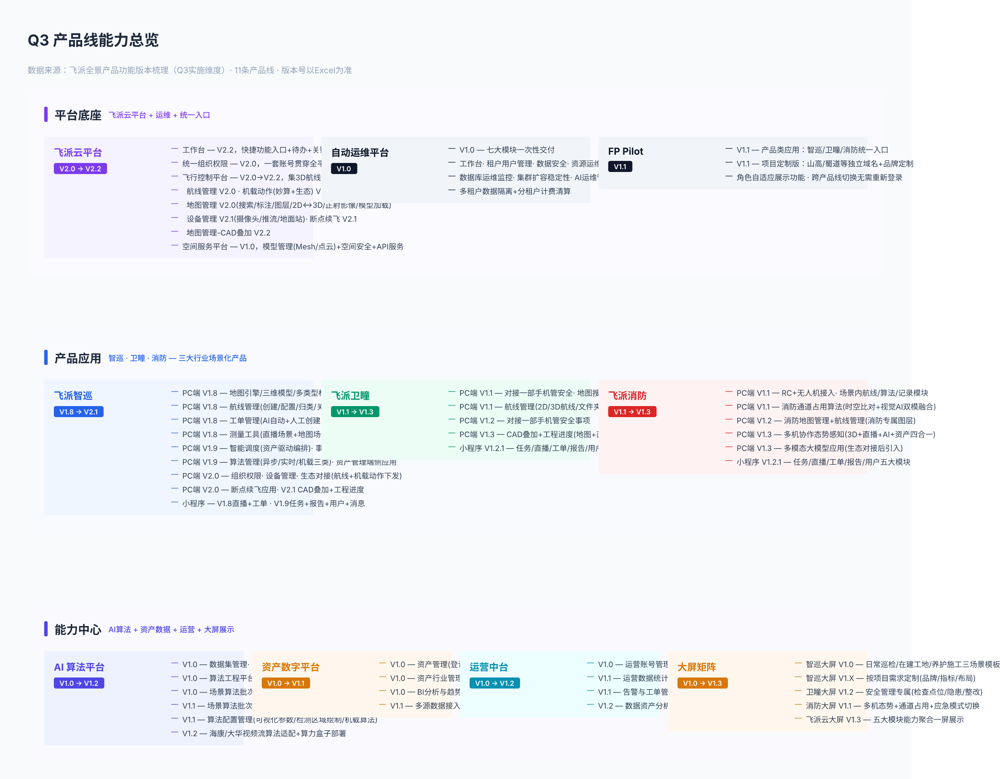

---

## 二、Q3 版本路线图

> 13条产品线 × 3个月的版本交付节奏总览

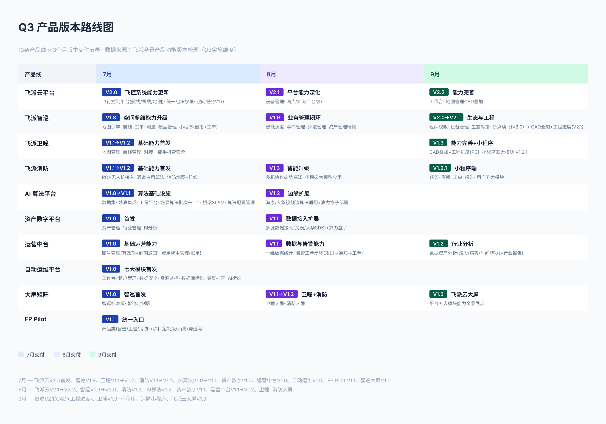

---

## 三、飞派智巡

> 核心巡检产品线，覆盖 PC 端与小程序端，Q3 从 V1.8 空间多维能力升级演进至 V2.0 完整生态闭环。

---

### V1.8 空间多维能力升级（7月交付）

#### 地图与模型管理

> 上线智巡 PC 端地图引擎与三维模型展示能力。

| 版本归属 | V1.8 |
|---------|------|
| 交付月份 | 7月 |
| 优先级 | P0 |

##### 前置依赖

- 空间服务平台 V1.0 提供三维模型数据服务
- 飞派云平台 V2.0 提供地图基础能力

##### 功能说明

构建智巡 PC 端统一地图能力，支持地图搜索（标注、设备、模型、照片检索）、多类型标注（单点、线状、面状、圆形标注）、图层与工具条（2D/3D 切换、3D 视角、正射影像显隐）。同步上线三维模型管理，支持 Mesh、点云等空间模型在地图场景中的加载与展示，为巡检场景提供高精度空间可视化底座。


##### 操作流程

1. 打开智巡 PC 端，左侧菜单进入「地图管理」，系统默认加载当前项目区域地图
2. 顶部搜索框输入设备编号、地名或标注名称，地图自动定位到目标位置
3. 工具栏选择标注类型（点/线/面/圆），在地图上点击或拖拽完成标注
4. 右侧图层面板切换 2D/3D 视角，打开正射影像叠加，对比现场实际情况
5. 切换到「三维模型」标签页，加载 Mesh 或点云模型，模型直接叠加在地图场景中

##### 核心流程

```


地图引擎加载 → 搜索定位（标注/设备/模型/照片）
    → 创建多类型标注（点/线/面/圆）
    → 图层叠加（2D↔3D切换、正射影像显隐控制）
    → 三维模型加载（Mesh/点云）→ 场景交互展示
```

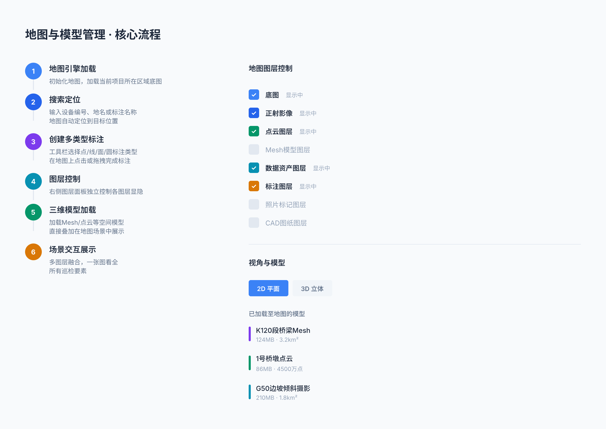

##### 业务价值

- 多维度地图标注能力支撑复杂业务场景
- 三维模型叠加展示增强现场感知

##### 业务目标

- 一张图看全所有巡检要素（设备、标注、模型、照片），不用来回切换系统
- 支持点、线、面、圆四种标注方式，覆盖日常巡检所有标记场景
- 三维模型直接叠在地图上展示，桥墩、边坡等复杂结构一目了然

##### 配图

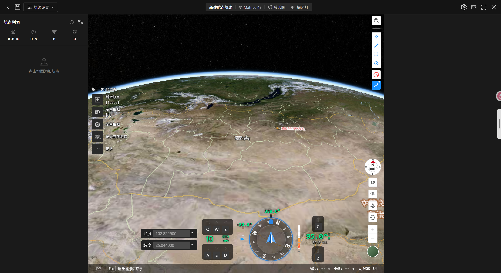

---

#### 航线管理

> 支持巡逻航线全生命周期管理，实现航线资产化。

| 版本归属 | V1.8 |
|---------|------|
| 交付月份 | 7月 |
| 优先级 | P0 |

##### 前置依赖

- 地图与模型管理（地图引擎）
- 飞派云平台 V2.0 航线管理能力

##### 功能说明

提供巡逻航线的创建、编辑与管理能力，支持文件夹分类管理，航线操作涵盖复制、移动、下载、锁定及组织内分享。支持航线拼接能力，可将多条航线合并为复合航线。航线支持关联资产数据，实现"航线—资产"绑定，为后续智能调度与自动化巡检提供数据基础。


##### 操作流程

1. 在地图模块中，点击「新建航线」，输入航线名称，选择巡逻类型
2. 在地图上依次点击设置航点，右侧面板配置每个航点的飞行高度、速度、机头朝向
3. 将航线拖入对应的文件夹分类，按项目或区域归档
4. 选中航线点击「关联资产」，勾选这条航线覆盖的资产对象，完成绑定
5. 右键航线选择「分享」，设置分享范围（整个组织或指定人员）
6. 勾选多条航线，点击「拼接」，系统自动合并为一条复合航线

##### 核心流程

```


创建航线 → 参数配置（航点/高度/速度/机型）
    → 文件夹归类管理
    → 关联资产数据（资产绑定）
    → 航线操作（复制/移动/下载/锁定/分享）
    → 多航线拼接（复合航线）→ 下发至无人机
```

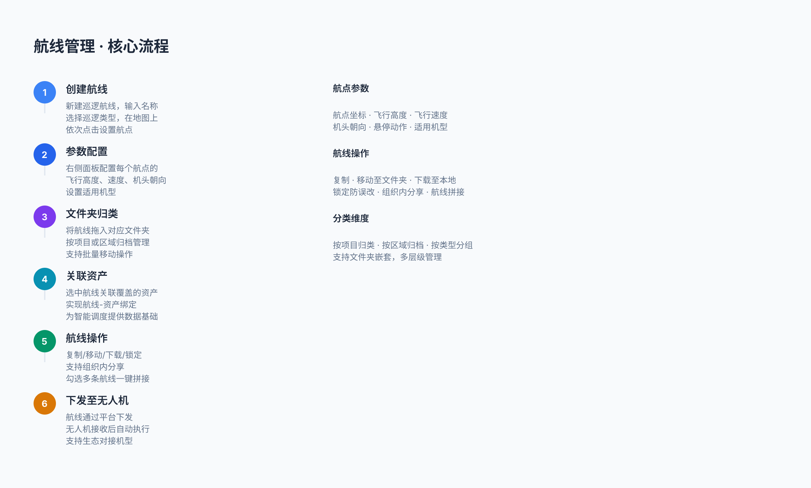

##### 业务价值

- 航线统一管理与复用，减少重复规划
- 航线与资产关联，巡检目标更精准
- 航线分享机制提升团队协作效率

##### 业务目标

- 巡检队长自己就能在系统里创建和编辑航线，不用每次都找技术人员
- 航线按文件夹分门别类，一个项目几十条航线也能管清楚
- 航线可以在组织内分享，A 项目踩好的航线 B 项目直接用，不用重复规划
- 多条航线拼成一条复合航线，一次飞完覆盖更大范围

##### 配图

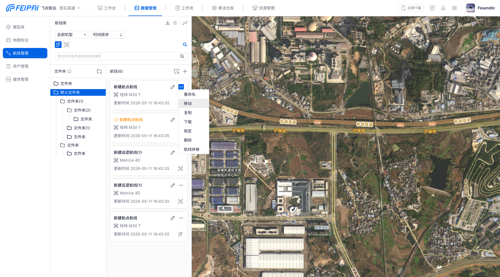

---

#### 工单管理

> 构建完整的巡检工单流转体系。

| 版本归属 | V1.8 |
|---------|------|
| 交付月份 | 7月 |
| 优先级 | P0 |

##### 前置依赖

- 统一组织权限（飞派云平台 V2.0）

##### 功能说明

上线智巡工单管理模块，丰富工单搜索字段，支持自动创建与手工创建两种工单生成方式。工单详情关联异常信息，字段展示更加完整。支持工单转派、按组织角色流转以及完整流程记录，实现从发现异常到处置闭环的全流程跟踪。


##### 操作流程

1. 巡检过程中 AI 识别到异常，系统自动弹出工单创建窗口，预填异常截图和位置信息
2. 也可以在工单列表页点击「新建工单」，手动填写异常描述、上传照片
3. 工单自动按路段归属分配到对应养护班组，班组负责人在自己账号下看到待处理工单
4. 点击工单进入详情，看到完整的异常信息：位置、截图、AI 识别结果、历史同类工单
5. 现场处理完成后，在工单中填写处置措施、上传处理后照片，提交审核
6. 审核通过后工单自动关闭，整个流转过程的时间、人员、操作全部记录在案

##### 核心流程

```


异常触发（AI识别/人工上报）
    → 自动创建工单 / 手动创建工单
    → 工单详情（关联异常信息/位置/截图）
    → 按组织角色转派分配
    → 现场处置执行
    → 提交处置结果 → 审核关闭 → 流程记录归档
```

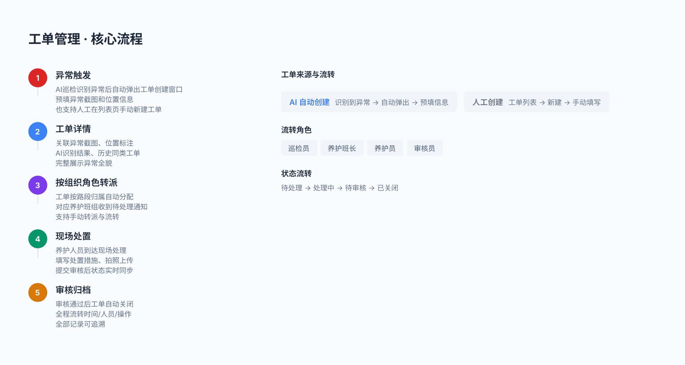

##### 业务价值

- 巡检异常到处置的完整闭环
- 组织角色驱动的工单流转更贴合实际业务
- 工单可追溯，便于复盘与管理

##### 业务目标

- AI 识别到异常自动生成工单，不用人工盯着屏幕逐帧找问题
- 工单按组织角色自动分配到对应负责人，谁负责哪个路段谁就收到对应工单
- 从发现异常到处理完成的每一步都有记录，出了问题能追溯到人、时间、操作

##### 配图

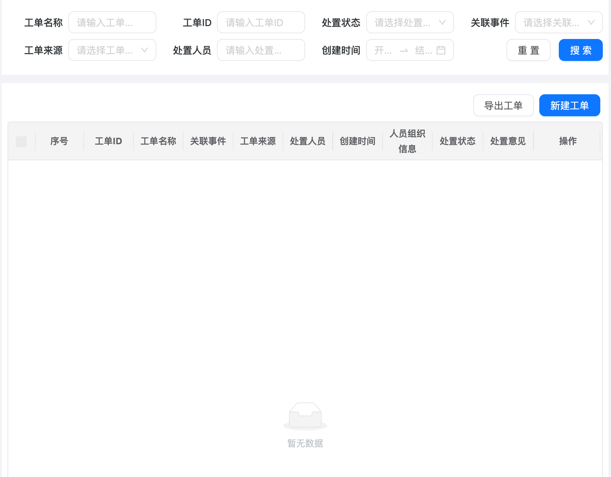

---

#### 测量工具

> 提供独立的测量工具，覆盖直播与地图场景。

| 版本归属 | V1.8 |
|---------|------|
| 交付月份 | 7月 |
| 优先级 | P1 |

##### 前置依赖

- 地图引擎（地图场景测量）
- 直播能力（直播场景测量）

##### 功能说明

上线独立测量工具模块，支持在直播画面与地图视图两种场景下进行距离、面积等空间测量操作。为巡检人员在远程查看现场时提供定量分析能力，辅助判定病害规模、施工范围等。


##### 操作流程

1. 在直播画面或地图视图中，点击工具栏「测量」按钮，展开测量面板
2. 选择测量类型：距离（多点连线）或面积（多边形围合）
3. 在画面上依次点击标记测量点，系统实时显示当前测量的长度或面积数值
4. 测量完成后，点击「保存」，测量结果和截图一起存入项目记录

##### 核心流程

```


选择测量场景（直播画面 / 地图视图）
    → 选择测量类型（距离 / 面积）
    → 画面中打点标记测量范围
    → 实时计算并显示结果
    → 结果保存 / 导出
```

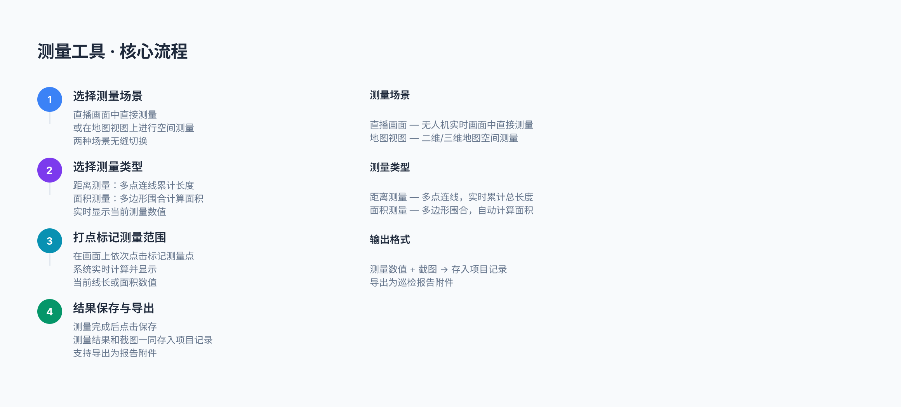

##### 业务价值

- 远程即可完成空间测量
- 直播+地图双场景覆盖，使用更灵活

##### 业务目标

- 看直播画面就能直接量距离、算面积，不用飞到现场拿尺子量
- 地图上和直播画面里都能测量，两种场景切换无缝

##### 配图

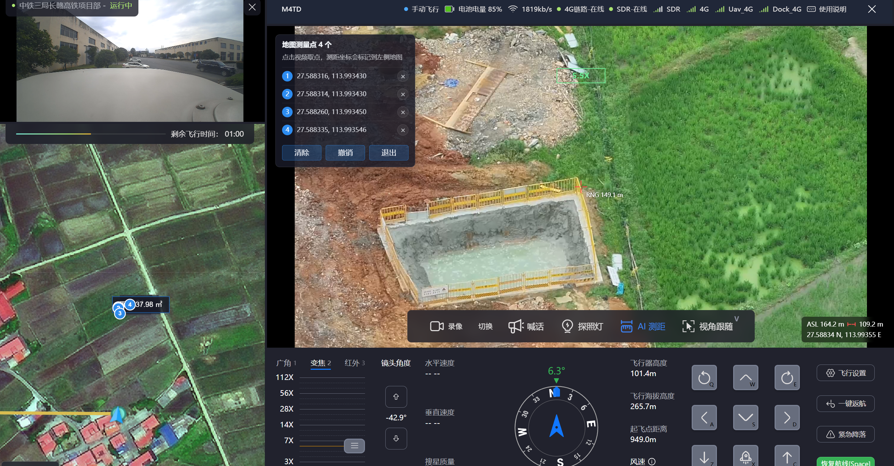

---

#### 智巡小程序 — 直播

> 小程序端多路直播功能完善与分享能力上线。

| 版本归属 | V1.8 |
|---------|------|
| 交付月份 | 7月 |
| 优先级 | P1 |

##### 前置依赖

- 飞派云平台直播推流能力
- 微信小程序基础框架

##### 功能说明

智巡小程序端完善多路直播操作功能，支持同时查看多路无人机/摄像头视频流。新增直播分享能力，用户可将直播画面分享给组织内成员或外部协作方，提升远程协作效率。


##### 操作流程

1. 微信打开智巡小程序，底部 Tab 点击「直播」，看到当前项目下所有在线直播流
2. 点击任意一路直播进入全屏播放，上滑可切换到另一路画面
3. 点击「多路同屏」，选择 2 路或 4 路同时播放，一屏看多个机位
4. 点击右上角「分享」，生成链接发送到微信群，接收方点击即可查看（无需登录）

##### 核心流程

```


进入直播列表（按项目/场景筛选）
    → 选择直播流 → 多路同时播放
    → 直播分享（组织内/外部协作方）
    → 接收方点击分享链接 → 鉴权验证 → 进入直播查看
```

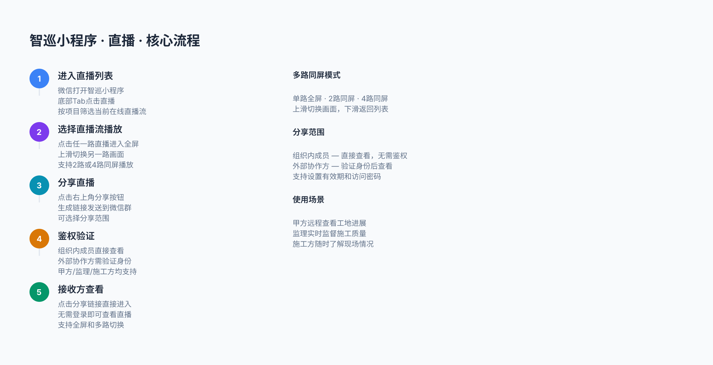

##### 业务价值

- 移动端随时随地查看巡检直播
- 一键分享降低沟通成本

##### 业务目标

- 手机上就能同时看多路无人机画面，不用坐在指挥中心盯着大屏
- 直播链接一键转发到微信群，甲方、监理、施工方都能实时看到现场情况

##### 配图

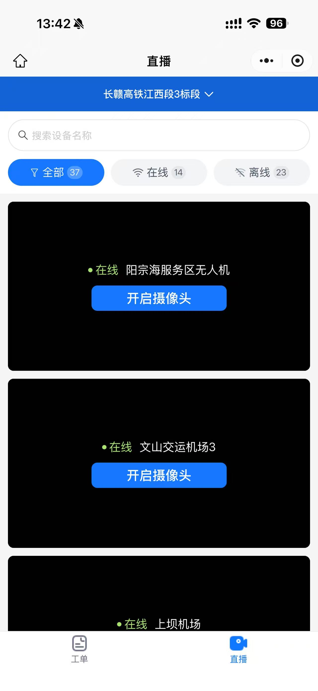

---

#### 智巡小程序 — 工单

> 小程序端工单能力与 PC 端同步。

| 版本归属 | V1.8 |
|---------|------|
| 交付月份 | 7月 |
| 优先级 | P1 |

##### 前置依赖

- PC 端工单管理模块
- 统一组织权限

##### 功能说明

智巡小程序端工单功能与 PC 端保持同步，支持按项目场景及组织权限匹配工单的查看与处理。现场人员可通过小程序快速创建、处理工单，实现移动化巡检闭环。


##### 操作流程

1. 小程序首页点击「工单」，列表按项目自动筛选，只显示当前项目相关的工单
2. 点击工单卡片查看详情：异常描述、位置、AI 标注截图、当前处理人
3. 到达现场后点击「开始处理」，对照异常信息进行处置
4. 处置完成后填写处理说明，拍照上传处理后照片，点击「提交」
5. 提交后 PC 端实时更新状态，审核人员看到后确认关闭

##### 核心流程

```


查看工单列表（按项目/组织维度筛选）
    → 工单详情查看（关联异常信息）
    → 现场处置（填写处理结果/拍照上传）
    → 提交 → 状态同步至 PC 端
```

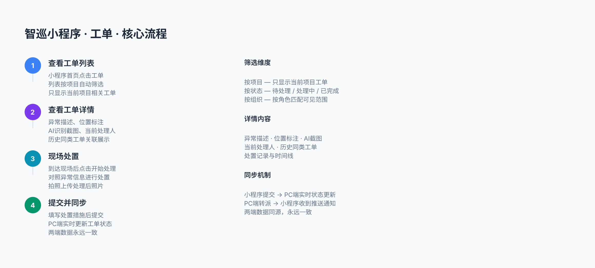

##### 业务价值

- 移动化工单处理，现场响应更及时
- 与 PC 端数据同步，体验一致

##### 业务目标

- 现场巡检人员用手机就能处理工单，拍完照直接提交，不用回到办公室开电脑
- 小程序和 PC 端数据实时同步，两端看到的工单状态永远一致

##### 配图

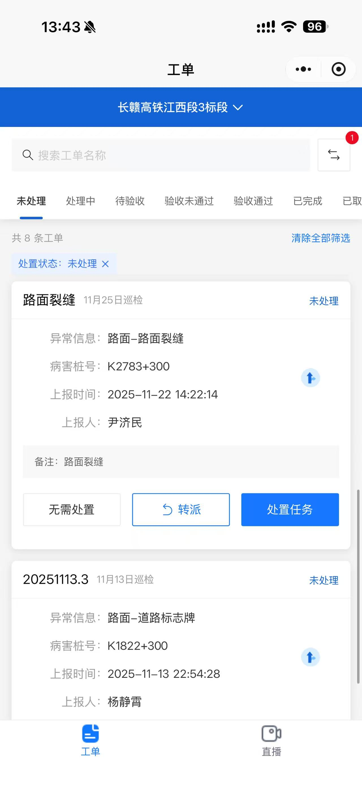

---

### V1.9 业务管理闭环（8月交付）

#### 智能调度-完整版

> 基于资产能力的智能巡检调度引擎上线。

| 版本归属 | V1.9 |
|---------|------|
| 交付月份 | 8月 |
| 优先级 | P0 |

##### 前置依赖

- 航线管理（航线-资产绑定数据）
- 资产管理（资产数字平台 V1.0）
- 设备管理（设备在线状态）

##### 功能说明

新增智能调度能力，依据资产数据（位置、数字资产、巡检频率等）自动编排巡检任务，支持任务分配至合适的无人机/设备，优化巡检资源利用。结合航线与机载能力，实现从任务生成、分配、执行到结果回收的半自动化巡检闭环。


##### 操作流程

1. 进入「智能调度」，系统已按资产巡检周期自动生成本周任务建议列表
2. 调度员查看每项建议：系统推荐了哪条航线、哪架无人机、什么时间段执行
3. 确认无误后批量点击「下发」，任务自动推送到对应飞手的 APP 上
4. 在监控面板查看各任务执行进度：已下发、飞行中、已完成，异常任务标红提示

##### 核心流程

```


读取资产数据（位置/类型/巡检频率）
    → 智能编排算法（匹配航线+设备+时间窗口）
    → 自动生成巡检任务
    → 分配至无人机/设备
    → 执行巡检（航线飞行+AI识别）
    → 结果回收 → 任务完成确认 → 数据入库
```

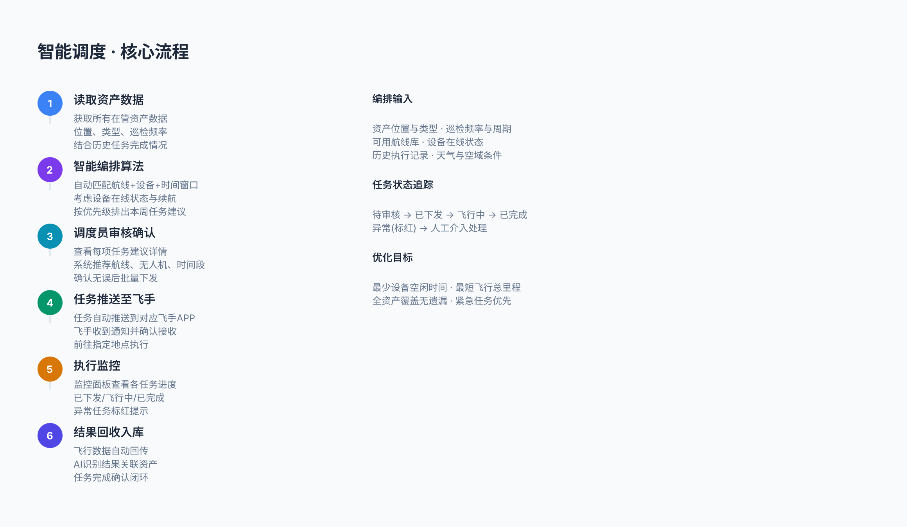

##### 业务价值

- 巡检任务自动编排，减少人工调度
- 资源利用率提升，降低运营成本
- 为全自动化巡检奠定基础

##### 业务目标

- 系统根据资产位置和巡检周期自动排出任务计划，调度员只需审核确认，不用每天手工排班
- 任务自动匹配最近的可用无人机，资源不闲置、不冲突

##### 配图

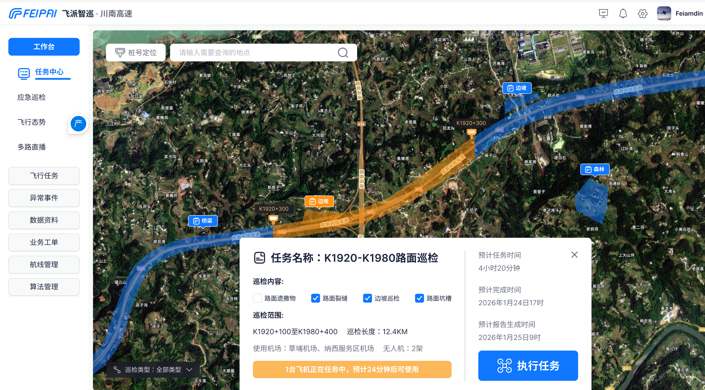

---

#### 事件管理

> 构建巡检事件的统一管理与分析体系。

| 版本归属 | V1.9 |
|---------|------|
| 交付月份 | 8月 |
| 优先级 | P0 |

##### 前置依赖

- 工单管理（事件-工单关联）
- AI 算法平台 V1.0（识别结果作为事件源）

##### 功能说明

上线事件管理模块，丰富事件详情字段，支持事件多维度统计分析、趋势分析以及历史事件数据关联。用户可关注特定事件，查看关注事件的详情、趋势、图形对比与图像联动，形成事件驱动的巡检管理闭环。


##### 操作流程

1. 左侧菜单进入「事件中心」，默认按时间倒序展示所有事件，顶部可按类型/等级/时间段筛选
2. 点击任一事件查看详情：异常截图、AI 识别结果、位置标注、关联的历史同类事件
3. 对重要事件点击「关注」，后续该事件有更新自动推送通知
4. 在统计分析页切换维度：按事件类型看分布、按路段看密度、按时间看趋势变化

##### 核心流程

```


事件采集（AI识别触发/人工上报/设备告警）
    → 事件详情（类型/等级/位置/时间/关联图像）
    → 多维度统计分析（按类型/时间/区域）
    → 趋势分析（同比/环比）
    → 历史事件关联 → 关注事件追踪
    → 事件联动（图像对比/工单触发）
```

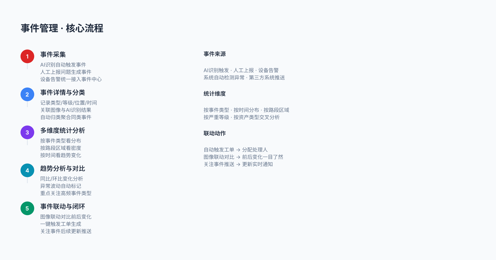

##### 业务价值

- 事件全生命周期管理，不遗漏关键异常
- 历史事件关联提升问题追溯效率

##### 业务目标

- 所有巡检异常统一收口到事件中心，不用在工单、告警、AI结果多个页面之间来回翻
- 同类事件自动聚合，同一根因的异常不会重复出好几次，减少处置工作量
- 事件关联历史数据，一眼看出是偶发还是反复出现的老问题

##### 配图

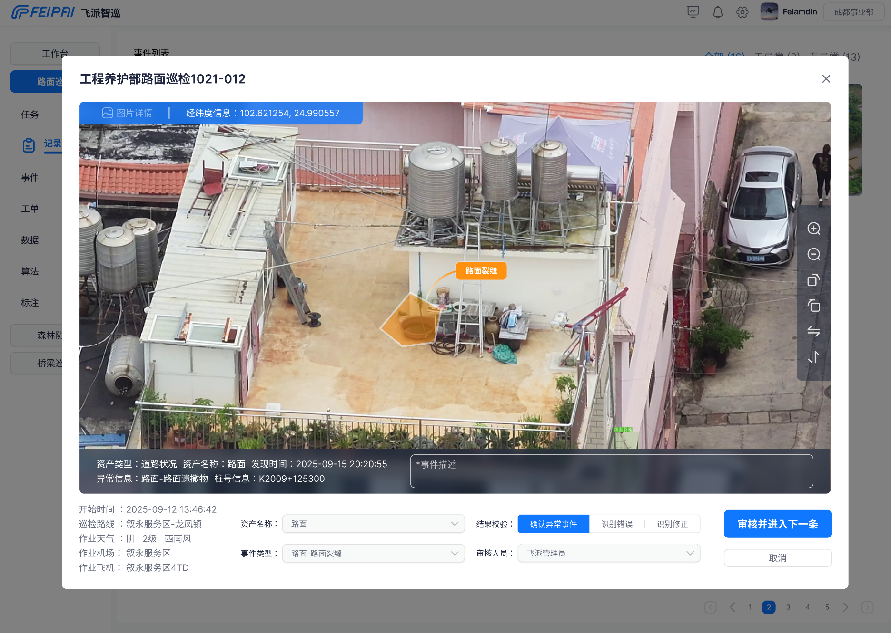

---

#### 算法管理（端侧应用）

> 异步/实时/机载三类算法在智巡端的统一应用。

| 版本归属 | V1.9 |
|---------|------|
| 交付月份 | 8月 |
| 优先级 | P0 |

##### 前置依赖

- AI 算法平台 V1.0（算法工程平台、场景算法模型）
- 飞派云平台 V2.0 机载能力

##### 功能说明

智巡 PC 端上线算法管理模块，将飞派云 AI 算法平台产出的异步算法、实时算法、机载算法统一接入智巡应用端。用户可在巡检流程中直接调用对应算法进行分析，结果实时回传并展示。


##### 操作流程

1. 在巡检任务中点击「算法分析」，系统根据当前场景自动推荐适用的算法列表
2. 选择算法类型：实时算法分析当前直播画面，异步算法处理已录制的视频片段
3. 对于需要机载处理的场景，点击「下发至机载」，算法指令直接推送到无人机上的妙算设备
4. 分析完成后，结果自动回传并标注在地图和视频画面上，红色框标记异常区域

##### 核心流程

```


选择巡检场景 → 选择算法类型（异步/实时/机载）
    → 配置算法参数 → 启动算法分析
    → 分析过程实时监控
    → 结果回传展示 → 结果关联至事件/工单
```

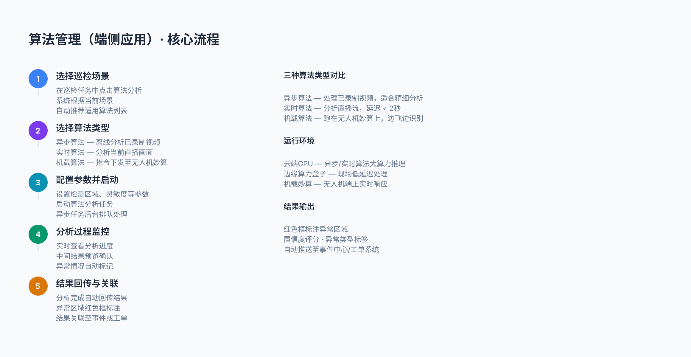

##### 业务价值

- 算法能力在业务端即开即用
- 三类算法统一入口，降低使用复杂度

##### 业务目标

- 算法不只是在后台跑，巡检人员在业务端就能直接调用，看到什么问题就点什么算法
- 异步、实时、机载三种算法一个入口切换，不用管算法跑在云端还是飞机上

##### 配图

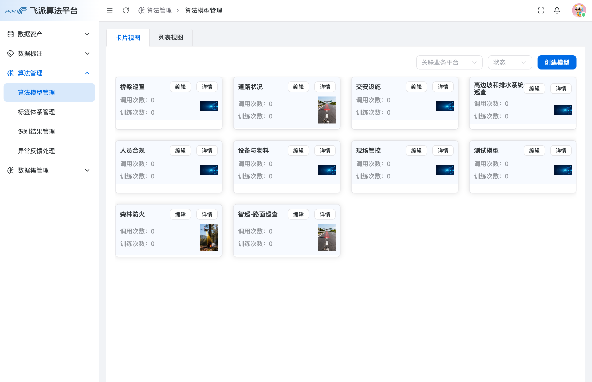

---

#### 资产管理（端侧应用）

> 高速公路资产结构化数据在智巡端的应用展示。

| 版本归属 | V1.9 |
|---------|------|
| 交付月份 | 8月 |
| 优先级 | P1 |

##### 前置依赖

- 资产数字平台 V1.0（资产结构化数据、病害库）

##### 功能说明

将飞派云资产数字平台的资产结构化数据（资产模板、在管资产、资产标注、编码配置、病害库）在智巡 PC 端进行应用展示。巡检人员在执行任务时可实时查看关联资产信息与历史病害记录。


##### 操作流程

1. 执行巡检任务时，飞行画面右侧自动弹出「资产信息」面板
2. 面板显示当前位置周边有哪些资产：路段、桥梁、隧道、边坡，按资产树层级展开
3. 点击任一资产查看详情：编码、属性、历史巡检记录、历史病害列表
4. 发现新病害时，直接在面板中点击「新增病害」，关联到当前资产并拍照上传

##### 核心流程

```


巡检任务执行中 → 定位当前位置
    → 加载周边资产信息（资产树/属性/编码）
    → 查看资产历史病害记录
    → 关联当前巡检发现 → 更新病害库
```

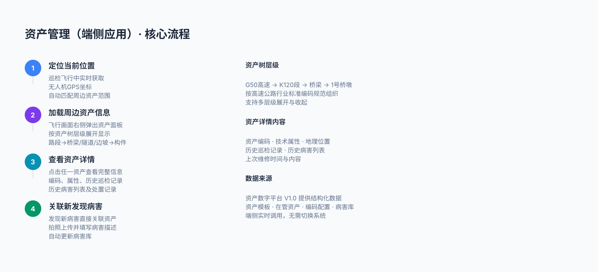

##### 业务价值

- 巡检过程与资产数据实时联动
- 历史病害一目了然，辅助现场判断

##### 业务目标

- 飞无人机的同时就能看到下面是什么资产、之前有过什么病害，不用飞完回来再查资料
- 资产数字平台的数据在巡检业务端直接可用，不用在两个系统之间来回切换

##### 配图

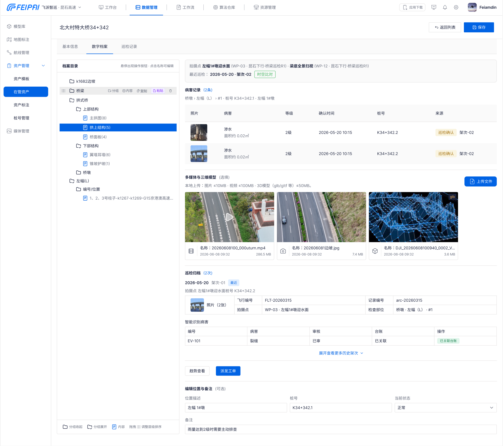

---

#### 组织/人员管理

> 智巡组织权限体系上线，支持多组织协作。

| 版本归属 | V1.9 |
|---------|------|
| 交付月份 | 8月 |
| 优先级 | P1 |

##### 前置依赖

- 飞派云平台 V2.0 统一组织权限

##### 功能说明

智巡产品线独立组织管理能力上线，涵盖组织权限管控、加入组织（邀请链接/分享方式）、激活机制（审核与激活）、退出组织等完整功能。支撑多项目、多团队在智巡平台上的协作与数据隔离。


##### 操作流程

1. 管理员在「组织管理」中创建组织，设置组织名称和层级（总公司/分公司/项目部）
2. 在组织下添加角色（管理员、巡检队长、飞手、养护员），为每个角色勾选功能权限
3. 点击「邀请成员」，生成邀请链接或二维码，发到工作群
4. 成员扫码填写信息提交申请，管理员在审批列表通过后，成员账号自动激活
5. 成员离职或换项目时，在组织中将该成员移除，其账号自动失去该组织的数据访问权限

##### 核心流程

```


创建/管理组织 → 设置角色与权限
    → 邀请成员（生成邀请链接/分享）
    → 成员申请加入 → 管理员审核
    → 激活账号 → 按角色分配权限
    → 成员退出 → 权限回收 → 数据访问控制
```

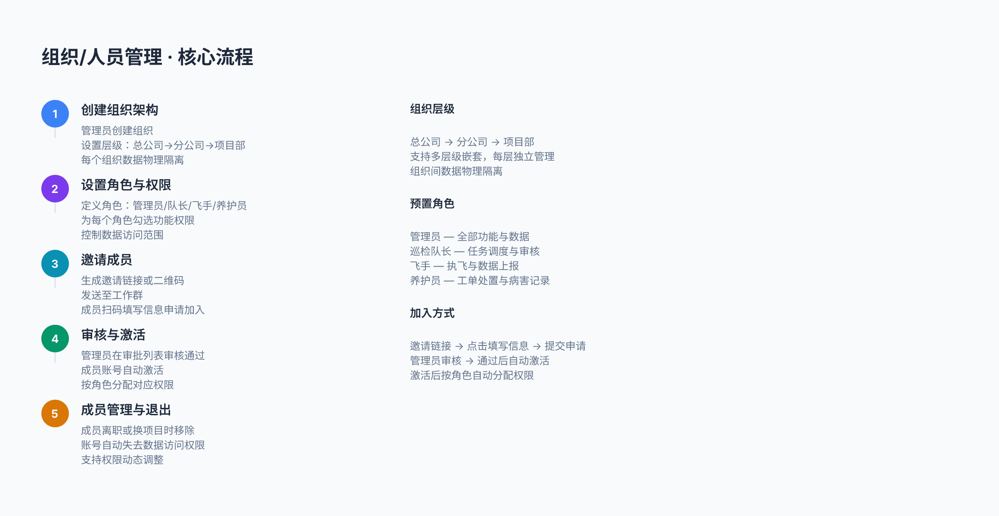

##### 业务价值

- 多组织协作有据可依
- 审核激活机制保障数据安全
- 与飞派云组织权限体系协同

##### 业务目标

- 一个项目对应一个组织，项目数据物理隔离，A 项目的人看不到 B 项目的数据
- 通过邀请链接就能加入组织，管理员审批后自动激活，不用后台手工建账号

##### 配图

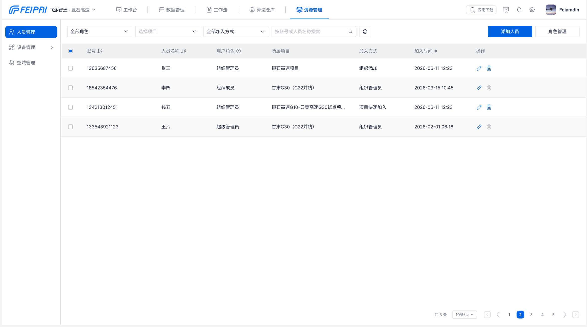

---

#### 设备管理

> 智巡端设备统一管理能力上线。

| 版本归属 | V1.9 |
|---------|------|
| 交付月份 | 8月 |
| 优先级 | P1 |

##### 前置依赖

- 飞派云平台 V2.1 设备管理（设备数据底座）

##### 功能说明

智巡 PC 端新增设备管理模块，覆盖固定摄像头管理、推流设备管理、地面站管理等设备类型。支持设备注册、状态监控、推流配置，实现巡检相关硬件设备的统一管控。


##### 操作流程

1. 进入「设备管理」，左侧设备树按类型分组：固定摄像头、推流设备、地面站
2. 点击「注册设备」，选择设备类型，填写编号、位置、技术参数
3. 注册完成后，设备卡片显示当前状态：绿色在线、灰色离线、红色故障
4. 对推流设备点击「配置推流」，输入 RTMP 地址，保存后直播模块自动出现该设备的视频流

##### 核心流程

```


设备注册（类型/编号/位置/参数）→ 设备接入验证
    → 状态监控（在线/离线/异常）
    → 推流配置（RTMP/RTSP 地址绑定）
    → 关联巡检任务 → 任务执行时自动调用设备
```

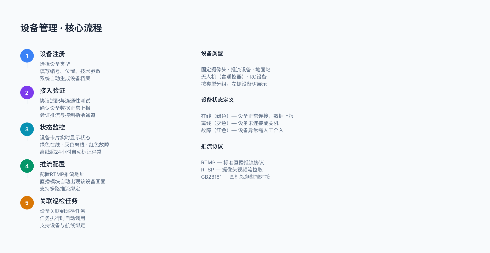

##### 业务价值

- 巡检设备一站式管理
- 设备状态实时可见，运维更高效

##### 业务目标

- 无人机、摄像头、地面站统一在一个页面管理，设备在线离线一眼看清
- 推流配置不用找运维后台改，业务端直接绑定 RTMP 地址

##### 配图

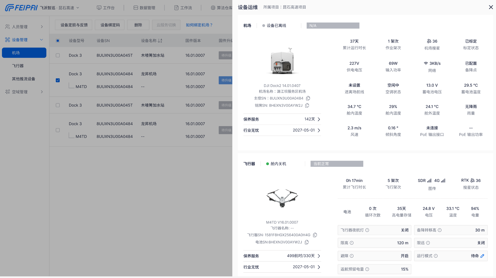

---

#### 断点续飞

> 无人机断点续飞能力在智巡端落地。

| 版本归属 | V1.9 |
|---------|------|
| 交付月份 | 8月 |
| 优先级 | P1 |

##### 前置依赖

- 飞派云平台 V2.1 断点续飞（平台级能力）
- 航线管理

##### 功能说明

支持无人机在执行巡逻航线过程中，因电量不足、信号中断等原因中断飞行后，更换电池或恢复信号后从断点位置继续执行剩余航线，避免重复飞行，提升巡检效率。


##### 操作流程

1. 无人机飞行中电量低于阈值或信号中断，系统自动记录当前断点位置和剩余航线
2. 飞手在遥控器上看到「可断点续飞」提示，确认后无人机自动返航
3. 更换电池后重新起飞，系统提示「检测到未完成任务，是否从断点继续」，点击确认
4. 无人机自动飞到断点位置，继续执行剩余航线，完成后数据合并为一次完整飞行记录

##### 核心流程

```


无人机执行航线 → 触发中断条件（低电量/信号丢失）
    → 自动记录断点（GPS坐标/已飞航点/剩余航线）
    → 无人机返航 → 更换电池/恢复信号
    → 重新起飞 → 读取断点 → 从断点继续执行
    → 完成剩余航线 → 数据合并上报
```

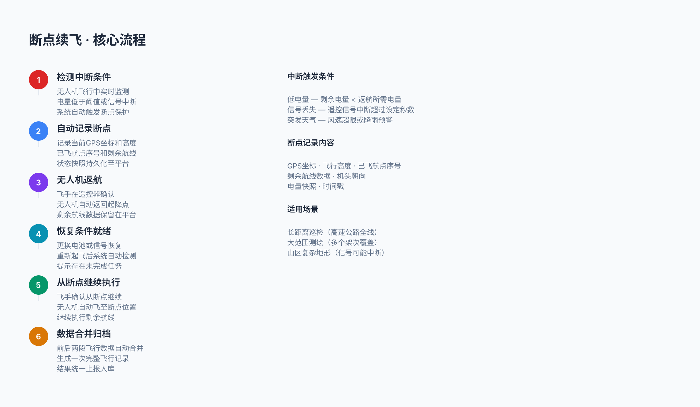

##### 业务价值

- 避免重复飞行，节省作业时间
- 为巡逻航线功能铺垫
- 长距离巡检场景实用性大幅提升

##### 业务目标

- 无人机没电了、信号断了，换完电池回来能从断点接着飞，不用重头来一遍
- 长距离巡检场景（如整条高速公路）实用性大幅提升，原来分两次飞的现在一次搞定

##### 配图


---

#### 生态对接 — 巡逻航线与机载动作

> 完成生态对接后的端侧能力整合落地。

| 版本归属 | V1.9 |
|---------|------|
| 交付月份 | 8月 |
| 优先级 | P0 |

##### 前置依赖

- 大疆妙算算法集成（AI 算法平台 V1.0）
- 航线管理

##### 功能说明

在生态对接（大疆妙算等）完成后，将巡逻航线与机载动作能力在智巡端进行整合落地。用户在智巡端可基于生态对接的无人机平台，直接下发航线与机载动作指令，实现"规划—下发—执行"的完整链路。


##### 操作流程

1. 在智巡端规划好航线并配置机载动作（如到达某航点自动拍照、变焦）
2. 点击「下发至无人机」，系统通过生态对接接口将航线+动作指令打包发送
3. 无人机接收后自动开始执行，飞行中机载 AI 实时处理画面
4. 执行状态和 AI 识别结果实时回传智巡端展示

##### 核心流程

```


智巡端规划航线 → 配置机载动作参数
    → 一键下发至无人机（通过生态对接接口）
    → 无人机接收指令 → 执行航线+机载动作
    → 执行状态实时回传 → 执行结果展示
```

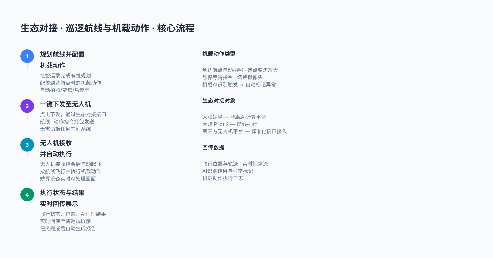

##### 业务价值

- 生态对接成果在业务端可用
- 航线下发与机载执行一体化

##### 业务目标

- 在智巡端规划好的航线和机载动作，一键下发到大疆无人机，中间不用切换任何系统
- 大疆妙算集成的成果直接在业务端可用，不是停留在技术 demo 阶段

---

### V2.0 生态完善（9月交付）

#### CAD 叠加与工程进度

> 地图场景与直播场景中的 CAD 叠加与工程进度管理。

| 版本归属 | V2.0 |
|---------|------|
| 交付月份 | 9月 |
| 优先级 | P1 |

##### 前置依赖

- 地图引擎（V1.8）
- 直播能力（V1.8）
- 飞派云平台 V2.1 地图管理—CAD 叠加

##### 功能说明

智巡端上线 CAD 图纸在地图与直播场景中的叠加显示能力，支持设计图纸与现场实景的同屏对比。同步上线工程进度管理功能，覆盖直播场景与地图场景，支持按时间节点跟踪施工进展，实现工程进度可视化。


##### 操作流程

1. 在地图管理页面上传 CAD 图纸文件（DWG/DXF），系统自动做地理配准
2. 地图上打开 CAD 图层，调整透明度，对比图纸和实景的偏差
3. 直播画面中同样可以叠加 CAD，一边看无人机画面一边对照设计图
4. 在工程进度中录入各节点的计划时间和实际完成时间，系统生成进度对比图

##### 核心流程

```


导入 CAD 图纸 → 地理配准（对齐地图坐标）
    → 选择叠加场景（地图/直播）
    → CAD 图纸透明度/显隐控制
    → 设计图与实景同屏对比 → 标记偏差
    → 工程进度节点录入 → 进度可视化（计划 vs 实际）
```

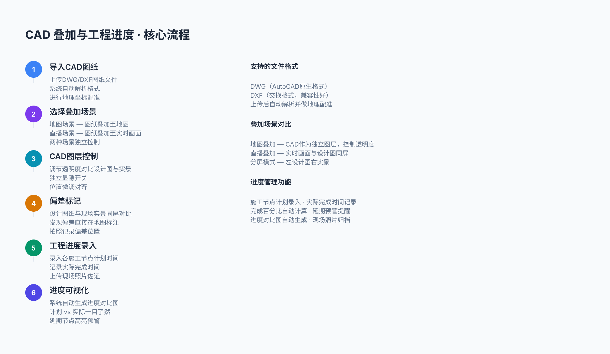

##### 业务价值

- CAD 与实景对比辅助工程验收
- 工程进度可视化，管理更直观

##### 业务目标

- 把设计院的 CAD 图纸直接叠到实景地图和直播画面上，设计长什么样、现场做成什么样，同屏对比一目了然
- 工程进度按时间节点可视化展示，甲方问干到哪了直接打开系统给他看

---

#### 智巡小程序 — 任务中心

> 小程序端任务查看与管理。

| 版本归属 | V2.0 |
|---------|------|
| 交付月份 | 9月 |
| 优先级 | P1 |

##### 前置依赖

- PC 端智能调度（V1.9）
- PC 端任务管理体系

##### 功能说明

智巡小程序端上线任务模块，支持按项目场景及组织维度进行任务列表展示与任务详情查看。现场人员可通过小程序随时掌握巡检任务安排与执行状态。


##### 操作流程

1. 小程序底部 Tab 点击「任务」，顶部可按项目、状态（待执行/进行中/已完成）筛选
2. 点击任务卡片查看详情：航线名称、飞行时间窗口、指定无人机、关联资产
3. 到达现场后点击「开始执行」，任务状态自动更新，PC 端同步看到
4. 飞行完成后点击「提交结果」，上传飞行数据和截图

##### 核心流程

```


进入任务中心 → 按项目/组织/状态筛选任务列表
    → 查看任务详情（航线/设备/时间/执行要求）
    → 接收任务 → 开始执行 → 状态更新
    → 任务完成确认
```

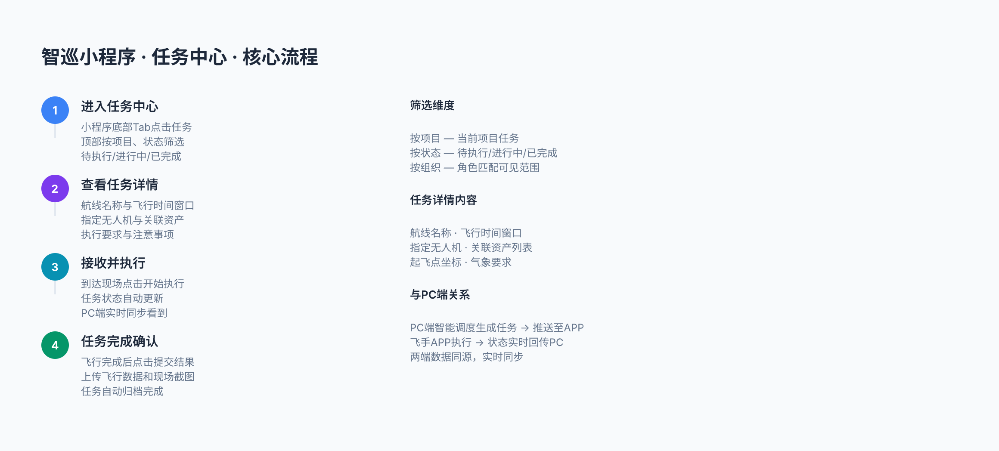

##### 业务价值

- 移动端随时查看巡检任务
- 按组织维度筛选，信息聚焦

##### 业务目标

- 飞手在手机上就能看到今天要飞哪些任务，不用跑到电脑前看排班表
- 任务按组织维度筛选，只看到自己相关的，信息不冗余

##### 配图

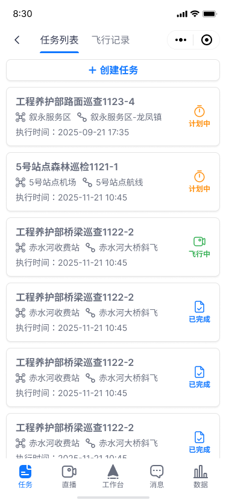

---

#### 智巡小程序 — 报告中心

> 小程序端巡检报告查看与下载。

| 版本归属 | V2.0 |
|---------|------|
| 交付月份 | 9月 |
| 优先级 | P1 |

##### 前置依赖

- PC 端巡检报告生成能力
- 微信小程序文件下载能力

##### 功能说明

智巡小程序端上线报告中心，支持按项目场景与任务维度查看巡检报告，并提供报告下载能力。用户无需登录 PC 即可在移动端查看与分享巡检成果。


##### 操作流程

1. 小程序点击「报告」，列表按项目和任务自动归类
2. 点击报告卡片在线预览：巡检数据、异常统计、AI 识别截图、处置记录
3. 点击「下载」保存 PDF 到手机，或直接「分享」转发到微信群

##### 核心流程

```


进入报告中心 → 按项目/任务筛选报告列表
    → 查看报告详情（巡检数据/异常/图片/结论）
    → 下载报告（PDF/Word）→ 分享至协作方
```

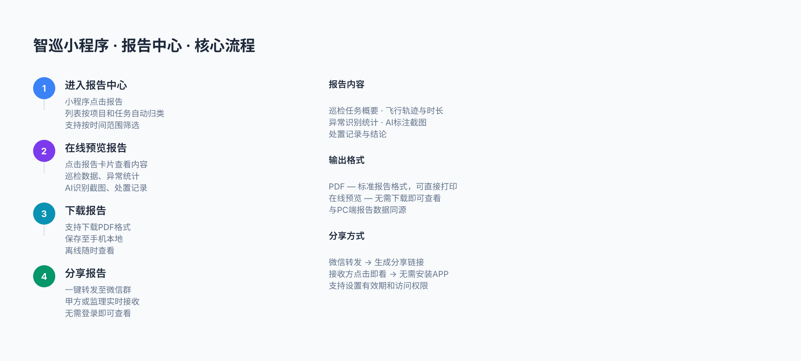

##### 业务价值

- 移动端便捷查看巡检报告
- 报告分享降低协作门槛

##### 业务目标

- 巡检报告手机上就能看、能下载、能转发，甲方要报告直接微信发过去
- 和 PC 端报告数据同源，手机上看到的和电脑上完全一样

##### 配图

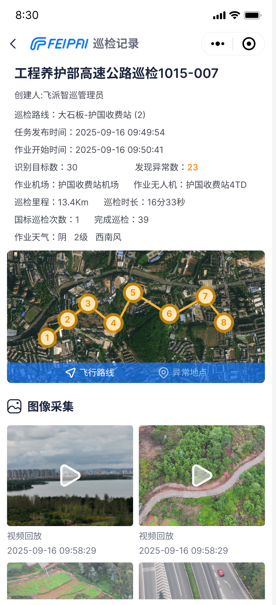

---

#### 智巡小程序 — 消息中心

> 小程序端统一消息通知。

| 版本归属 | V2.0 |
|---------|------|
| 交付月份 | 9月 |
| 优先级 | P1 |

##### 前置依赖

- PC 端消息体系
- 运营中台告警能力（V1.1）

##### 功能说明

智巡小程序端上线消息中心，聚合系统消息、告警消息、工单消息等多种消息类型，支持消息详情查看。确保用户通过移动端也能及时接收巡检相关的关键通知。


##### 操作流程

1. 小程序右上角铃铛图标显示未读消息数，点击进入消息中心
2. 消息按类型分栏：告警消息、工单消息、系统通知
3. 收到「AI 识别到路面裂缝」告警，点击消息直接跳转到工单详情页
4. 阅读后消息自动标记已读，已处理的消息归档

##### 核心流程

```


消息推送触发（系统/告警/工单）
    → 小程序消息聚合展示（按类型/时间）
    → 查看消息详情 → 点击跳转至相关页面
    → 消息已读/未读状态管理
```

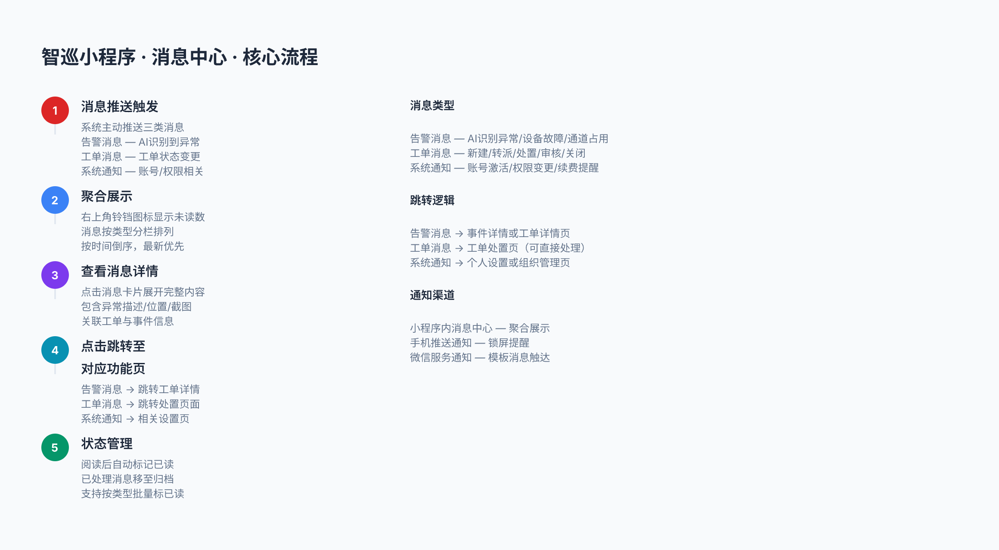

##### 业务价值

- 关键消息移动端实时触达
- 多类型消息统一管理

##### 业务目标

- 告警、工单、系统通知聚合在一个入口，手机上弹提醒，不会漏掉重要消息
- 点消息直接跳转到对应功能页，不用在菜单里翻找

##### 配图

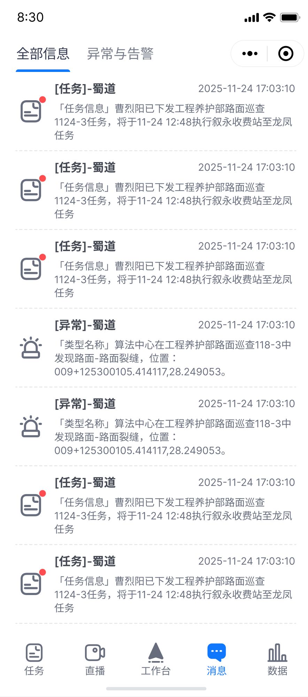

---

## 四、飞派云平台

> Q3 全新产品线，承载飞行管控、统一权限、设备管理等平台级能力，是飞派全产品线的技术底座。Q3 从 V2.0 首发演进至 V2.1 能力深化。

---

### V2.0 飞行管控首发（7月交付）

#### 飞行控制平台 — 航线与机载能力

> 飞行控制平台核心能力首发，涵盖航线管理、机载动作与地图管理。

| 版本归属 | V2.0 |
|---------|------|
| 交付月份 | 7月 |
| 优先级 | P0 |

##### 前置依赖

- 空间服务平台 V1.0（三维地图与模型数据）
- 大疆妙算算法集成（AI 算法平台 V1.0）

##### 功能说明

飞派云飞行控制平台 V2.0 首次上线，核心能力包括：航线管理（巡逻航线创建、文件夹管理、航线复制/移动/下载/锁定/分享、航线拼接、关联资产数据）；机载动作能力（基于大疆妙算+生态的机载算法集成与动作执行）；地图管理（搜索、多类型标注、2D/3D 切换、正射影像显隐）。为无人机巡检提供完整的飞行管控底座。


##### 操作流程

1. 登录飞派云平台，进入「飞行控制」，左侧为项目列表，右侧为地图+航线面板
2. 在地图上规划航线、配置机载动作参数
3. 航线存入文件夹管理，通过组织权限控制谁能看、谁能编辑
4. 航线通过 API 向上层应用（智巡/卫瞳/消防）暴露，各应用端可直接调用

##### 核心流程

```


平台初始化 → 加载地图引擎
    ├── 航线管理：创建航线 → 参数配置 → 文件夹管理 → 航线操作 → 关联资产 → 下发
    ├── 机载能力：算法集成 → 动作配置 → 指令下发 → 执行监控
    └── 地图管理：搜索定位 → 多类型标注 → 图层切换 → 模型加载
```

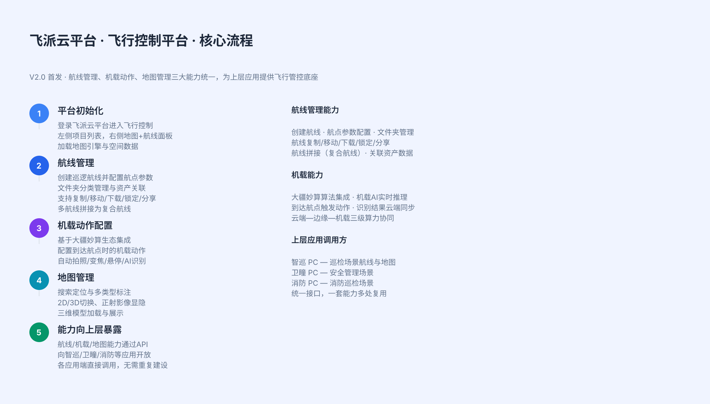

##### 业务价值

- 统一的飞行管控平台，降低多项目管理复杂度
- 机载能力实现"云—边"协同，巡检更智能
- 航线资产化提升巡检标准化水平

##### 业务目标

- 一个平台管控所有项目的无人机飞行，航线、机载动作、地图统一管理
- 上层应用（智巡、卫瞳、消防）共用同一套飞行管控能力，不用每个产品线重复建设

##### 配图

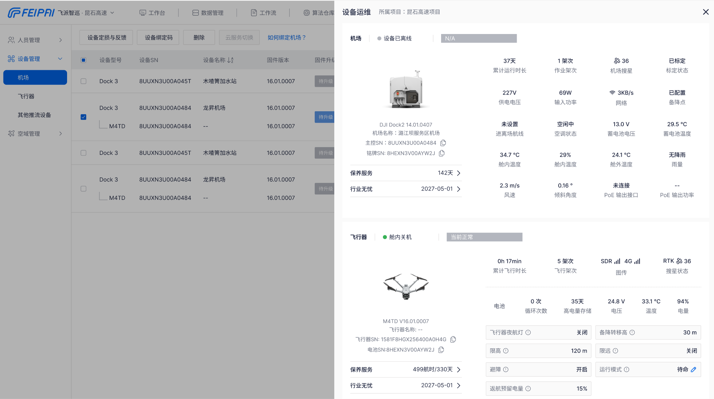

---

#### 统一组织权限

> 打通飞派云全平台组织权限体系。

| 版本归属 | V2.0 |
|---------|------|
| 交付月份 | 7月 |
| 优先级 | P0 |

##### 前置依赖

- 无（平台底座能力）

##### 功能说明

构建飞派云平台统一的组织权限管理能力，实现跨产品模块的组织架构打通与权限统一管控。支持多层级的组织架构管理、角色定义与权限分配，为后续多租户场景及各产品线的权限互通奠定基础。


##### 操作流程

1. 管理员在飞派云后台「组织权限」中创建组织架构（总公司→分公司→项目部）
2. 定义角色模板（管理员、队长、飞手、养护员），为每个角色勾选可访问的产品和功能
3. 导入成员并分配角色，成员用手机号登录 FP Pilot 或各产品 PC 端，权限自动匹配
4. 调整权限只需在后台修改角色配置，所有成员的权限实时更新

##### 核心流程

```


创建组织 → 配置组织层级（多级嵌套）
    → 定义角色模板（管理员/操作员/观察员...）
    → 分配权限（功能权限/数据权限/接口权限）
    → 成员导入/邀请 → 角色绑定
    → 鉴权：请求 → 验证身份 → 校验角色权限 → 放行/拦截
```

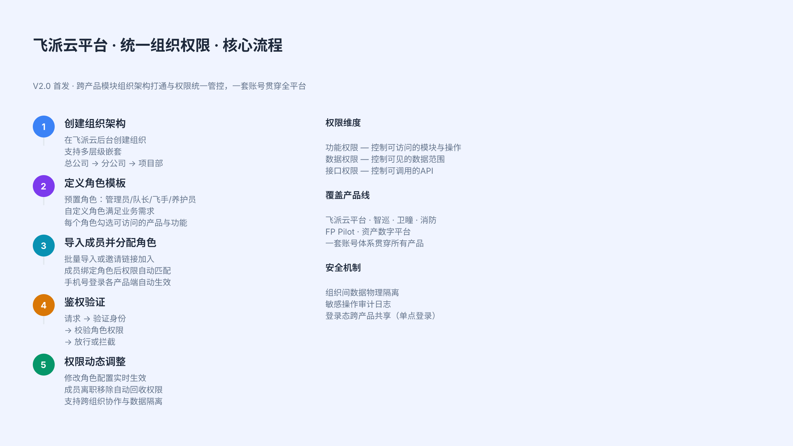

##### 业务价值

- 一套账号体系贯穿全平台
- 权限统一管控降低管理成本
- 支撑多项目、多组织业务扩展

##### 业务目标

- 一套账号登录所有飞派产品（智巡、卫瞳、消防、飞派云），不用每个系统各注册一遍
- 权限在平台层统一配置，下面所有产品线自动生效，改一处全平台同步

##### 配图

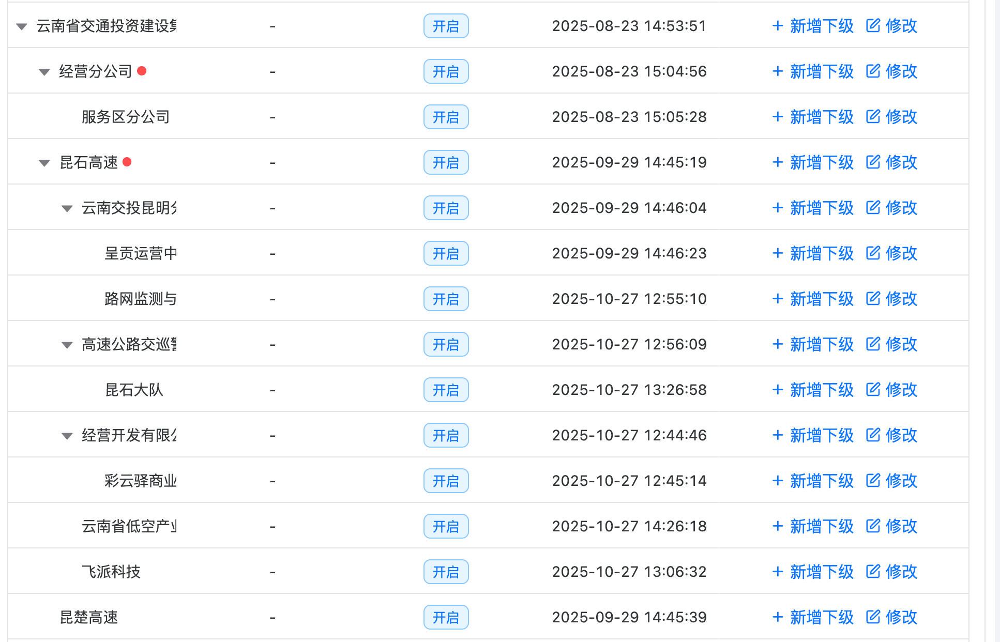

---

### V2.1 平台能力深化（8月交付）

#### 飞派云工作台

> 飞派云统一工作台与快捷入口上线。

| 版本归属 | V2.1 |
|---------|------|
| 交付月份 | 8月 |
| 优先级 | P0 |

##### 前置依赖

- 飞派云平台 V2.0（各子模块已上线）
- 统一组织权限

##### 功能说明

构建飞派云平台整体工作台，聚合各产品模块的快捷功能入口，为用户提供统一的登录后首页。工作台按角色展示常用功能、待办事项与关键指标，降低多模块切换的操作成本。


##### 操作流程

1. 登录飞派云平台，默认进入工作台首页
2. 顶部显示待办事项数量（待审核工单、待分配任务）
3. 中部为快捷功能卡片：飞行控制、设备管理、AI 算法、资产数字等，点击直接跳转
4. 底部展示关键指标：在线无人机数、今日飞行时长、本周异常统计

##### 核心流程

```


用户登录 → 身份鉴权 → 读取角色配置
    → 加载角色对应的功能卡片
    → 展示：常用功能入口 + 待办事项 + 关键指标
    → 点击快捷入口 → 跳转至对应模块
```

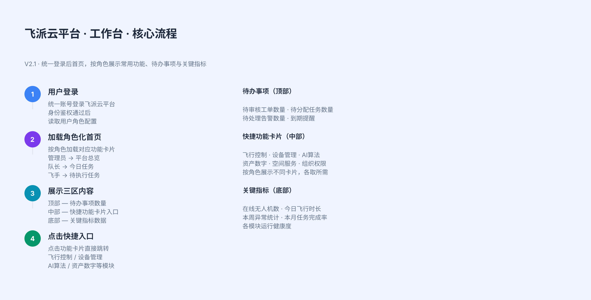

##### 业务价值

- 一站式工作入口，降低平台使用门槛
- 角色化展示提升操作效率

##### 业务目标

- 登录飞派云后的第一屏，所有常用功能一键直达，不用记住每个模块的菜单位置
- 按角色展示不同内容：管理员看到平台总览，飞手看到今日任务，各取所需

---

#### 设备管理

> 飞派云平台设备管理能力上线。

| 版本归属 | V2.1 |
|---------|------|
| 交付月份 | 8月 |
| 优先级 | P0 |

##### 前置依赖

- 飞派云平台 V2.0

##### 功能说明

飞派云飞行控制平台新增设备管理模块，覆盖固定摄像头管理、推流设备管理、地面站管理。为上层应用（智巡、卫瞳、消防）提供统一的设备数据服务与管控能力。


##### 操作流程

1. 进入飞派云「设备管理」，所有设备按类型（无人机/摄像头/地面站）分组展示
2. 点击「注册设备」，填写型号、编号、采购日期、技术参数
3. 设备卡片实时显示在线状态，离线超过 24 小时自动标记异常
4. 设备数据通过 API 向上层应用开放，智巡、卫瞳、消防直接读取设备列表

##### 核心流程

```


设备注册（类型/编号/位置/技术参数）
    → 设备接入验证（协议适配）
    → 设备状态监控（在线/离线/异常告警）
    → 设备数据服务（向上层应用提供 API）
    → 设备维护记录（维修/保养/更换）
```

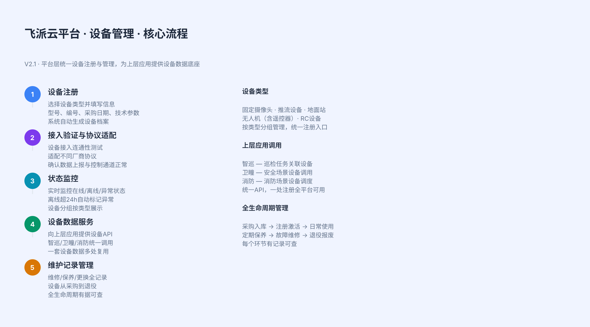

##### 业务价值

- 设备统一注册与管理
- 为多产品线提供设备数据底座

##### 业务目标

- 飞派云平台层统一注册和管理所有设备，智巡、卫瞳、消防各产品线共用同一套设备数据
- 设备从采购入库到退役报废全生命周期有据可查

##### 配图

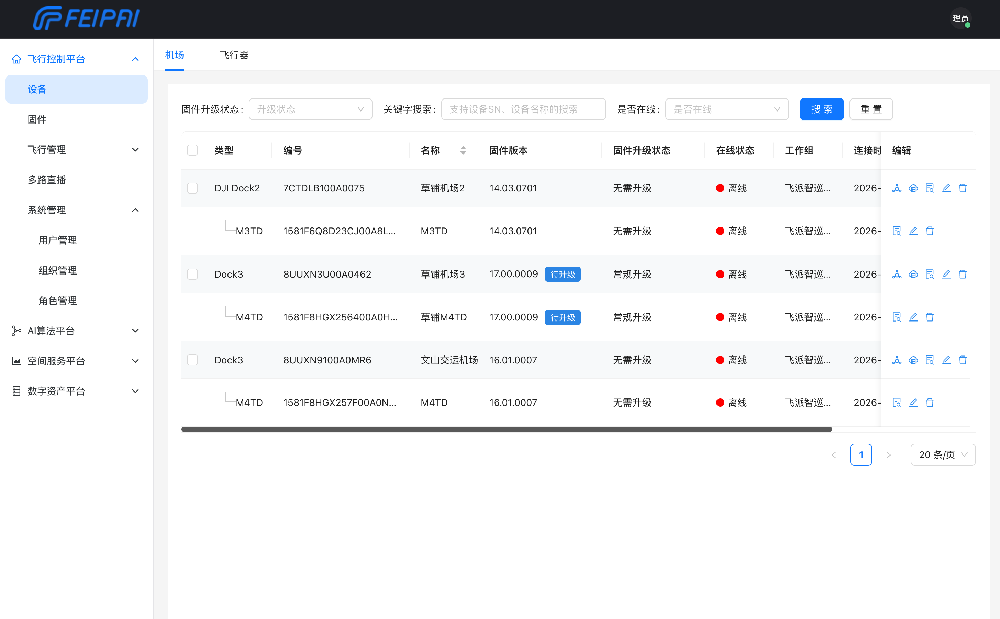

---

#### 断点续飞

> 飞行控制平台层级的断点续飞能力。

| 版本归属 | V2.1 |
|---------|------|
| 交付月份 | 8月 |
| 优先级 | P1 |

##### 前置依赖

- 飞行控制平台 V2.0（航线管理）

##### 功能说明

在飞派云飞行控制平台层面实现断点续飞能力，支持巡逻航线中断后自动记录断点，恢复飞行后从断点继续。能力向智巡等上层应用开放。


##### 操作流程

1. 飞派云平台侧记录每次飞行的实时状态（GPS、航点序号、电量、时间戳）
2. 检测到中断（低电量/信号丢失），自动生成断点记录并持久化
3. 上层应用查询断点数据，恢复飞行时平台下发剩余航线

##### 核心流程

```


飞行过程中检测中断条件 → 自动记录状态快照（GPS/航点/电量/时间）
    → 状态持久化至平台 → 向应用端暴露断点数据
    → 恢复飞行时 → 应用端查询断点 → 从断点继续执行
```

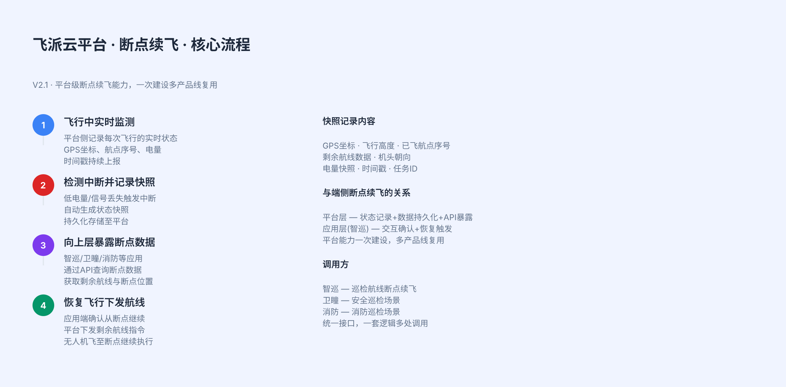

##### 业务价值

- 平台级能力一次建设，多产品线复用
- 提升长航线巡检的可靠性

##### 业务目标

- 断点续飞做成平台级能力，智巡、卫瞳、消防都能调用，不用每个产品线各开发一遍
- 一次建设，多产品线复用

##### 配图


---

#### 地图管理 — CAD 叠加

> 飞派云地图新增 CAD 图纸叠加显示能力。

| 版本归属 | V2.1 |
|---------|------|
| 交付月份 | 8月 |
| 优先级 | P1 |

##### 前置依赖

- 飞派云平台 V2.0（地图管理）

##### 功能说明

飞派云地图管理新增 CAD 图纸的显示/隐藏功能，支持将工程 CAD 图纸叠加到地图场景中，实现设计图纸与现场实景的同屏对比，辅助施工进度核查与质量验收。


##### 操作流程

1. 在飞派云「地图管理」上传 CAD 文件，系统自动解析并做地理配准
2. 配准后的 CAD 存储为 WMS/WMTS 图层服务
3. 各应用端（智巡/卫瞳）通过图层服务加载 CAD，控制透明度和显隐

##### 核心流程

```


CAD 文件上传 → 格式解析与地理配准
    → 存储至空间数据库
    → 地图场景加载 CAD 图层（WMS/WMTS 服务）
    → 透明度/显隐控制
    → 与实景影像叠加对比
```

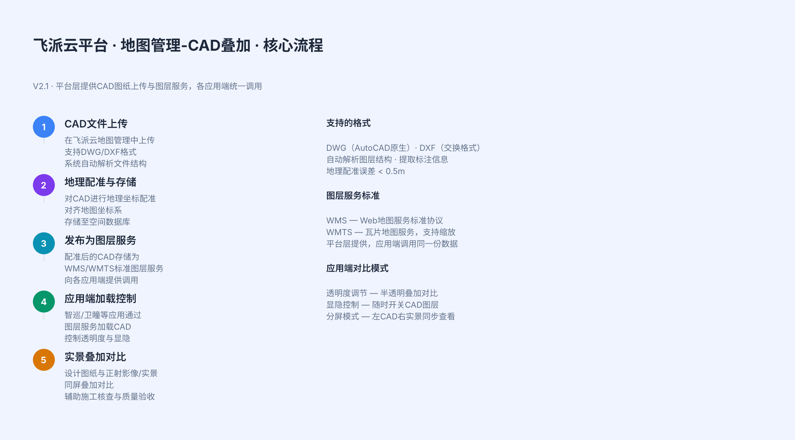

##### 业务价值

- CAD 与实景同屏对比，提升工程核查效率
- 施工偏差一目了然

##### 业务目标

- CAD 图纸作为地图的一个图层，和卫星图、正射影像一样可以随时开关
- 平台层提供 CAD 服务，各应用端调用同一套 CAD 数据，不用重复上传

---

#### 多源数据接入与算力盒子

> 接入海康、大华等第三方视频源，部署边缘算力。

| 版本归属 | V2.1 |
|---------|------|
| 交付月份 | 8月 |
| 优先级 | P1 |

##### 前置依赖

- 设备管理（设备注册与协议适配）
- AI 算法平台 V1.1（边缘侧算法适配）

##### 功能说明

资产数字平台新增多源数据接入能力，支持海康、大华等主流视频监控厂商的数据接入，实现多源视频流的结构化融合。同步部署算力盒子，在边缘侧完成视频流 AI 分析，降低云端算力压力与带宽成本。


##### 操作流程

1. 在设备管理中注册海康/大华摄像头，填写 RTSP 地址和设备凭证
2. 在现场部署算力盒子（小型边缘服务器），通过网络接入摄像头视频流
3. 算力盒子加载 AI 模型，对视频流实时推理，结果回传飞派云
4. 云端统一管理多个算力盒子的运行状态和模型版本

##### 核心流程

```


第三方设备注册（海康/大华 SDK 对接）
    → 视频流接入（RTSP/GB28181 协议适配）
    → 视频流结构化（统一转码/时序对齐）
    → 部署算力盒子 → 边缘侧加载 AI 模型
    → 边缘实时推理 → 结果回传云端 → 报警联动
```

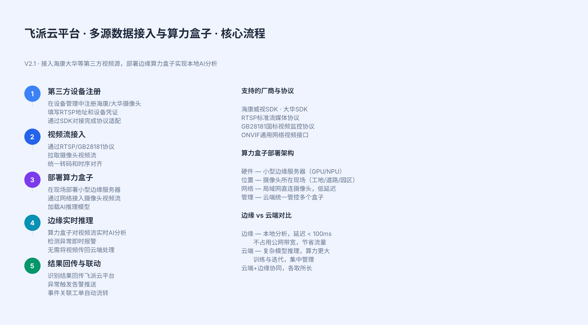

##### 业务价值

- 利旧现有监控设备，降低建设成本
- 边缘算力降低云端负载与延迟

##### 业务目标

- 利旧现有的海康、大华摄像头，不用全部换新也能接入 AI 分析
- 算力盒子部署在现场，视频不用传回云端再分析，延迟从秒级降到毫秒级

---

#### 海康/大华视频流适配

> 针对第三方视频流的专属算法适配。

| 版本归属 | V2.1 |
|---------|------|
| 交付月份 | 8月 |
| 优先级 | P1 |

##### 前置依赖

- 多源数据接入与算力盒子
- AI 算法平台 V1.0（场景算法模型）

##### 功能说明

AI 算法平台完成针对海康、大华视频流的专属算法模型开发与适配，结合算力盒子实现边缘侧实时 AI 识别，覆盖在建工地、养护施工、消防通道等场景。


##### 操作流程

1. 采集海康/大华摄像头的视频样本，标注训练数据
2. 在 AI 算法平台上对模型做针对性微调（适配摄像头分辨率和帧率）
3. 将优化后的模型转换成算力盒子可加载的格式（ONNX/TensorRT）
4. 部署到算力盒子并验证：工地安全帽检测、消防通道占用识别等场景

##### 核心流程

```


采集海康/大华视频流样本 → 数据预处理（分辨率/帧率适配）
    → 算法模型微调（针对特定摄像头参数优化）
    → 模型转换（ONNX/TensorRT 边缘侧部署格式）
    → 部署至算力盒子 → 实时推理验证
    → 覆盖场景验证（在建工地/养护施工/消防通道）
```

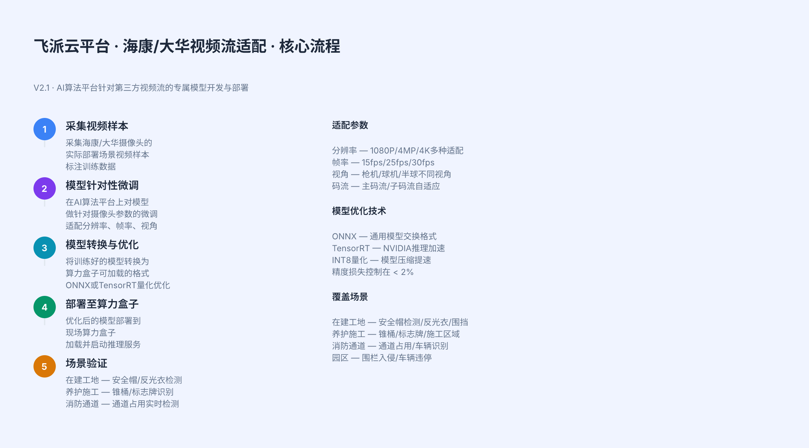

##### 业务价值

- 第三方摄像头接入即可获得 AI 能力
- 边缘计算降低带宽与延迟

##### 业务目标

- 海康大华摄像头接进来就能跑 AI 识别，不用单独采购智能摄像头
- 适配后的算法模型部署在算力盒子上，本地分析本地出结果

---

## 五、飞派卫瞳

> 安全管理场景产品线，Q3 从 V1.0 基础能力首发逐步扩展至 V1.5 能力完善与移动端交付。

---

### V1.0 基础能力首发（7月交付）

#### 卫瞳地图与航线能力建设

> 卫瞳产品线基础能力首发。

| 版本归属 | V1.0 |
|---------|------|
| 交付月份 | 7月 |
| 优先级 | P0 |

##### 前置依赖

- 飞派云平台 V2.0（地图引擎、航线管理、统一权限）
- 空间服务平台 V1.0

##### 功能说明

卫瞳 PC 端首批能力上线：地图管理（搜索、多类型标注、2D/3D 切换、正射影像显隐）、航线管理（支持 2D/3D 航线规划、文件夹管理、航线复制/移动/下载/锁定/分享）。同时完成与"一部手机管安全"事项的对接集成，打通安全管理业务场景。


##### 操作流程

1. 打开卫瞳 PC 端，默认加载地图，顶部搜索框可搜索安全点位和检查记录
2. 工具栏支持点/线/面标注，标注类型适配安全场景（隐患点、整改区域、重点监控区）
3. 切换 3D 视角查看地形，打开正射影像辅助判断
4. 规划安全巡检航线，关联到「一部手机管安全」平台的任务清单

##### 核心流程

```


卫瞳 PC 端初始化 → 加载地图引擎
    ├── 地图搜索定位 → 多类型标注 → 2D/3D切换 → 正射影像显隐
    ├── 航线规划（2D/3D）→ 文件夹管理 → 航线操作 → 分享
    └── 对接"一部手机管安全"→ 数据互通 → 安全场景联动
```

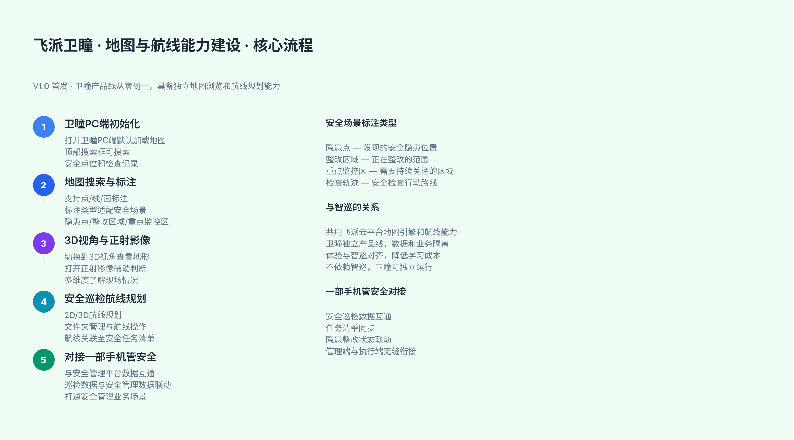

##### 业务价值

- 卫瞳产品线具备独立的空间化巡检能力
- 搭配 3D 航线和地图服务，业务落地更直接

##### 业务目标

- 卫瞳产品线从零到一，具备独立的地图浏览和航线规划能力，不依赖智巡
- 对接「一部手机管安全」，打通安全管理场景，巡检数据和安全管理数据互通

##### 配图


---

### V1.5 能力扩展与移动端（9月交付）

#### CAD 叠加与工程进度

> 卫瞳场景 CAD 叠加与工程进度管理。

| 版本归属 | V1.5 |
|---------|------|
| 交付月份 | 9月 |
| 优先级 | P1 |

##### 前置依赖

- 卫瞳 V1.0（地图与航线能力）
- 飞派云平台 V2.1（CAD 叠加能力）

##### 功能说明

卫瞳 PC 端新增 CAD 图纸叠加显示与工程进度管理能力，覆盖直播场景与地图场景。支持安全管理场景中的施工进度跟踪与设计图纸对比核查。


##### 操作流程

1. 在卫瞳地图中加载 CAD 图层（引用飞派云平台已上传的图纸）
2. 调整透明度和位置，对比设计图与实景
3. 在工程进度中录入安全检查节点，跟踪整改完成情况

##### 核心流程

```


导入 CAD 图纸 → 地理配准
    → 选择叠加场景（地图/直播）
    → CAD 与实景同屏对比 → 偏差标记
    → 工程进度节点录入 → 进度可视化展示
```

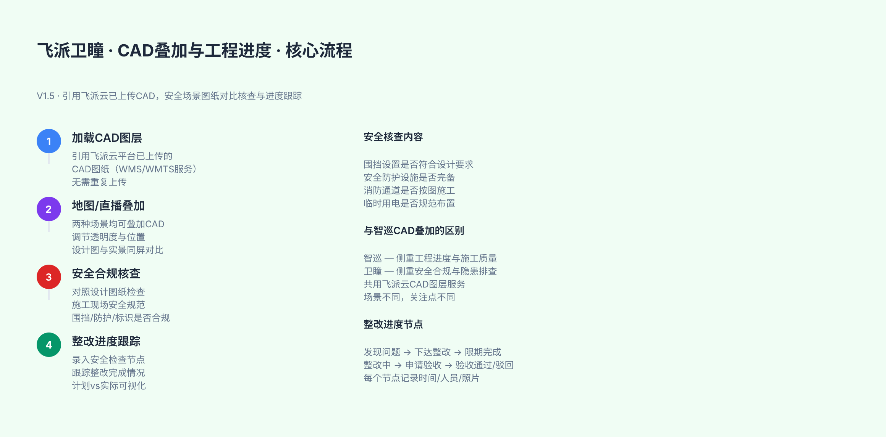

##### 业务价值

- 安全管理场景获得工程进度可视化能力
- 与智巡能力对齐，产品体验统一

##### 业务目标

- 安全管理场景也能用 CAD 叠加和进度管理，和智巡体验一致
- 安全检查时可以对照设计图纸看施工现场是否符合规范

---

#### 卫瞳小程序端

> 卫瞳小程序端基础能力一次性交付。

| 版本归属 | V1.5 |
|---------|------|
| 交付月份 | 9月 |
| 优先级 | P0 |

##### 前置依赖

- 卫瞳 PC 端 V1.0（数据与业务接口）
- 智巡小程序 V1.8（复用小程序框架与组件）
- 微信小程序基础框架

##### 功能说明

卫瞳小程序端集中上线五大模块：任务（按项目场景与组织维度查看）、直播（多路直播与分享）、工单（与 PC 端同步，按场景与权限匹配）、报告中心（按场景与任务查看/下载报告）、用户中心（个人信息管理与安全设置）。卫瞳移动端能力实现从零到一。


##### 操作流程

1. FP Pilot 或微信小程序中选择「卫瞳」，进入安全管理专属界面
2. 底部五个 Tab：任务、直播、工单、报告、我的
3. 各模块操作逻辑和智巡小程序一致，只是数据和场景切换到安全领域

##### 核心流程

```


小程序启动 → 鉴权登录 → 进入首页
    ├── 任务：列表查看 → 详情 → 状态更新
    ├── 直播：多路播放 → 分享
    ├── 工单：查看/创建 → 处置 → 提交
    ├── 报告：列表 → 预览 → 下载/分享
    └── 用户：信息管理 → 安全设置
```

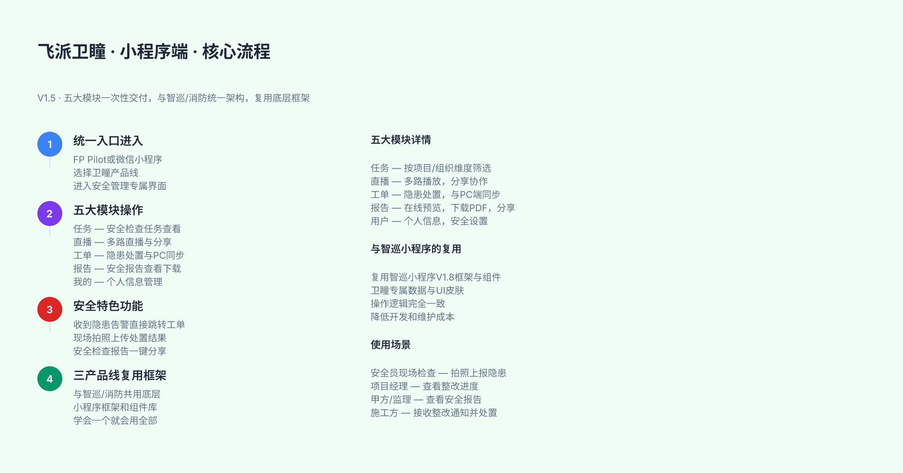

##### 业务价值

- 卫瞳产品线移动端能力补齐
- 与智巡小程序体验一致，降低学习成本

##### 业务目标

- 安全管理人员用手机就能查看任务、看直播、处理工单、下载报告
- 和智巡小程序共用底层框架，用户学会一个就会用全部

---

## 六、飞派消防

> 消防巡检场景产品线，Q3 从 V1.0 基础能力首发，经 V1.3 智能升级（多机协作、态势感知、多模态大模型），到小程序端交付，形成完整的消防巡检产品闭环。

---

### V1.0 基础能力首发（7月交付）

#### RC 与无人机能力接入

> 消防场景 RC 设备与无人机能力融合。

| 版本归属 | V1.0 |
|---------|------|
| 交付月份 | 7月 |
| 优先级 | P0 |

##### 前置依赖

- 飞派云平台 V2.0（飞行控制、推流能力）
- 大疆妙算算法集成（AI 算法平台 V1.0）

##### 功能说明

消防产品线首批能力上线：RC 设备支持推流至多路直播与大屏，发布任务时支持选择 RC 设备类型；场景内新增航线、算法、记录三大模块，覆盖消防巡检核心业务流程。


##### 操作流程

1. 消防场景中，注册 RC 设备并配置推流地址
2. 发布巡检任务时，设备类型可选择「无人机」或「RC 设备」
3. 执行任务时，RC 设备和无人机画面同时推流到多路直播和大屏
4. 场景内切换航线模块规划路线、算法模块识别异常、记录模块查看历史

##### 核心流程

```


RC 设备注册 → 推流配置（RTMP 地址）
    → 发布巡检任务 → 选择 RC 设备类型
    → 场景内操作：
        ├── 航线模块：消防场景航线规划与执行
        ├── 算法模块：调用消防场景 AI 算法
        └── 记录模块：巡检过程数据记录与回放
    → 推流至多路直播/大屏
```

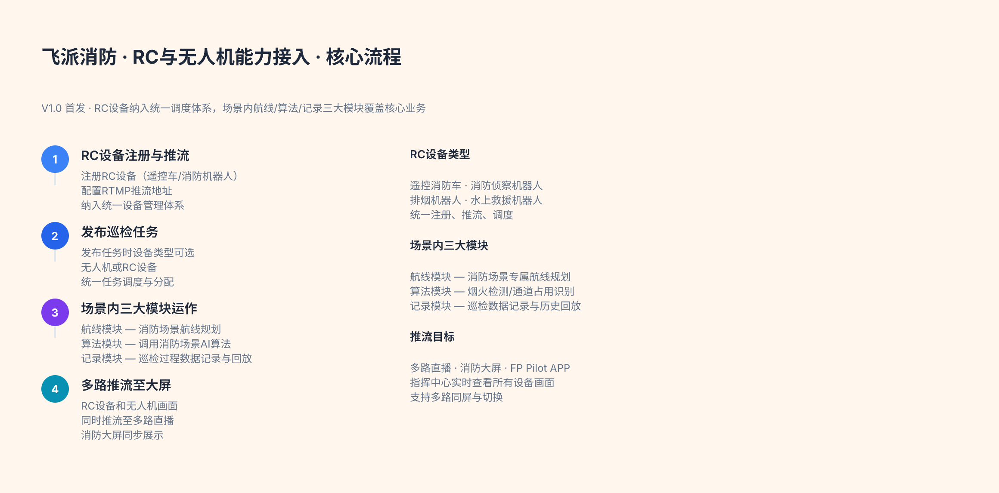

##### 业务价值

- RC 设备纳入统一巡检调度体系
- 消防场景具备完整的巡检工具链

##### 业务目标

- RC 设备（遥控车、消防机器人）和无人机统一调度，消防场景的工具都接进来了
- 消防巡检从零到一，场景内航线、算法、记录三大模块覆盖核心业务流程

##### 配图

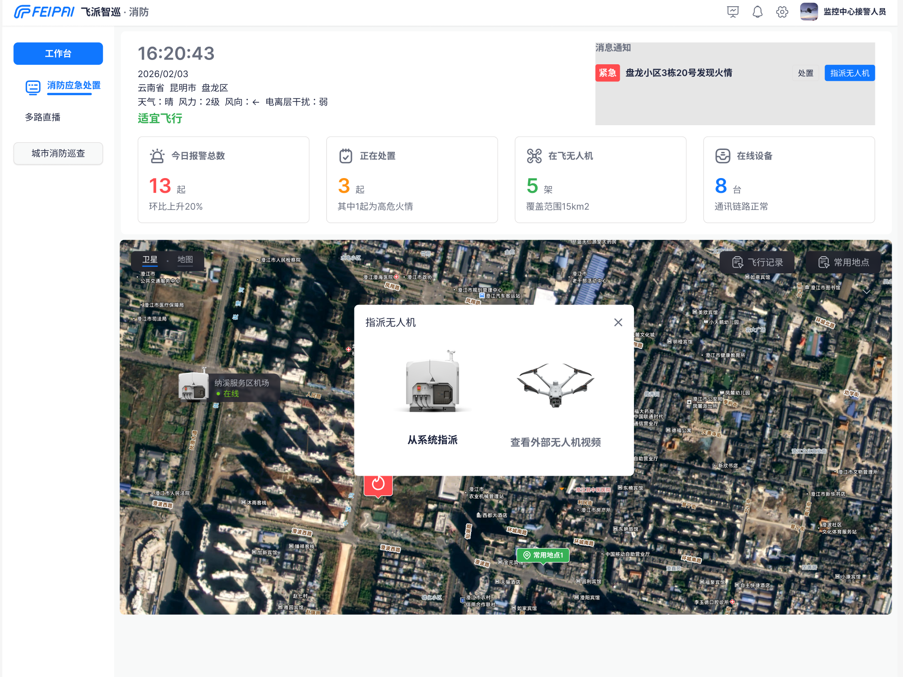

---

#### 消防通道占用算法升级

> 时空比对 + 视觉算法双模识别通道占用。

| 版本归属 | V1.0 |
|---------|------|
| 交付月份 | 7月 |
| 优先级 | P0 |

##### 前置依赖

- AI 算法平台 V1.0（消防模型算法—可见光）
- 时空比对基础方案

##### 功能说明

消防通道占用算法全面升级：在原有时空比对方案基础上，新增视觉算法支持——通过视频流实时识别通道占用情况，输出占用置信度。双模融合提升通道占用的检出率与准确率。


##### 操作流程

1. 消防通道摄像头视频流接入 AI 算法平台
2. 系统同时跑两路分析：时空比对检测画面中新增的静止物体，视觉 AI 识别是否为车辆
3. 两路结果融合判断：都是正面结果才触发告警，一条不确定则降级为提醒
4. 告警推送到消防大屏和相关人员的手机

##### 核心流程

```


视频流接入 → 双模并行分析：
    ├── 时空比对：前后帧差分 → 背景建模 → 占用区域检测
    └── 视觉算法：目标检测 → 分类识别 → 置信度评估
    → 双模结果融合（加权/投票）→ 占用判定
    → 触发告警 → 生成通道占用事件 → 推送通知
```

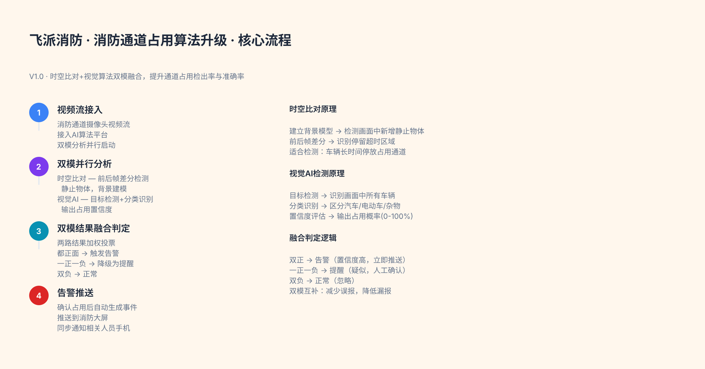

##### 业务价值

- 双模识别降低误报与漏报
- 实时视频流分析，响应更及时

##### 业务目标

- 通道占用识别从单模升级到双模（时空比对+视觉AI），误报减少、漏报也减少
- 实时视频流分析，车一停到消防通道上几秒内就出告警

---

#### 消防地图与航线管理

> 消防场景专属地图与航线能力上线。

| 版本归属 | V1.0 |
|---------|------|
| 交付月份 | 7月 |
| 优先级 | P1 |

##### 前置依赖

- 飞派云平台 V2.0（地图引擎、航线管理）

##### 功能说明

消防产品线补齐地图与航线管理能力，包括：地图搜索与多类型标注、2D/3D 切换与正射影像、消防场景专属图层；航线管理支持 2D/3D 航线规划与全生命周期管理。


##### 操作流程

1. 消防场景地图默认加载专属图层：消防栓位置、逃生通道、重点防火区域边界
2. 标注时可选消防专属标注类型：火源点、蔓延方向、隔离带
3. 航线规划支持快速模式：点击目标点，系统自动生成最短路径航线

##### 核心流程

```


消防场景地图加载 → 专属图层叠加（消防栓/逃生通道/重点区域）
    → 多类型标注 → 2D/3D 切换
    → 消防航线规划（2D/3D 航线）
    → 航线管理（创建/编辑/复制/分享）
    → 下发至无人机
```

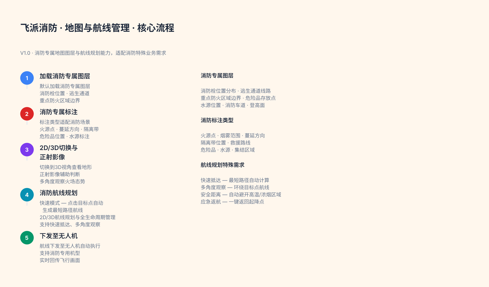

##### 业务价值

- 消防场景拥有独立的地图与航线工具
- 专属图层适配消防业务需求

##### 业务目标

- 消防有自己专属的地图图层（消防栓、逃生通道、重点防火区域），和普通巡检地图分开
- 消防场景的航线规划考虑到消防特殊需求（快速抵达、多角度观察）

##### 配图

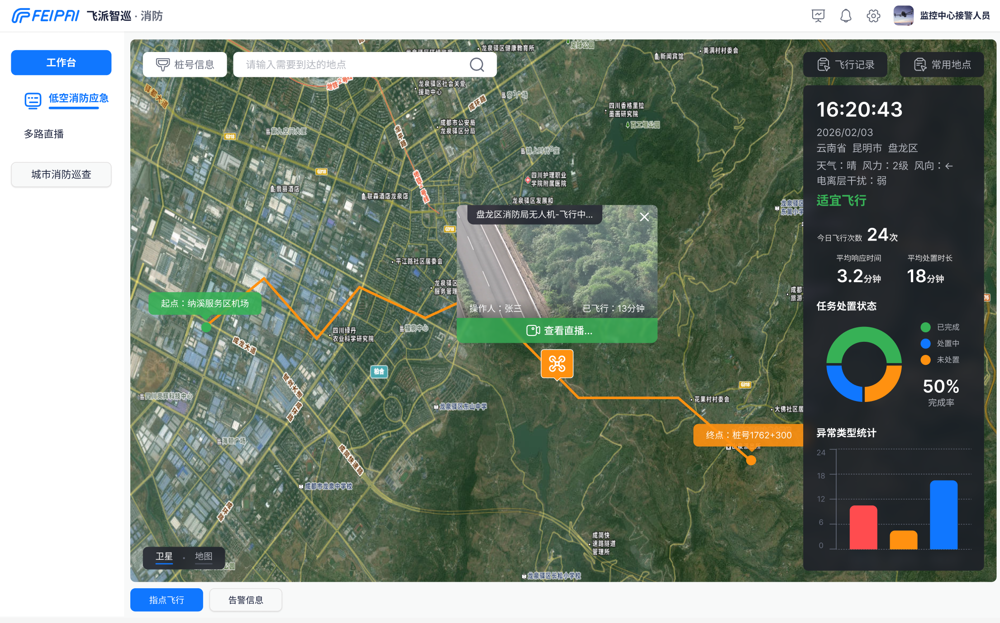

---

### V1.3 智能升级（8月交付）

#### 多机协作与态势感知

> 3D、直播、AI、数据资产整合的多维态势感知。

| 版本归属 | V1.3 |
|---------|------|
| 交付月份 | 8月 |
| 优先级 | P0 |

##### 前置依赖

- 消防 V1.0（RC 接入、地图航线）
- AI 算法平台 V1.0（消防场景算法）
- 资产数字平台 V1.0

##### 功能说明

消防产品线上线多机协作与态势感知能力，将 3D 地图、多路直播、AI 识别结果、数据资产等多维信息整合至统一态势展示界面。支持多架无人机协同作业时的实时位置、画面与识别结果同步展示，为消防指挥提供全面的现场感知。


##### 操作流程

1. 消防指挥中心打开态势感知大屏，左侧 3D 地图展示所有在线无人机实时位置和飞行轨迹
2. 右侧多路直播面板同步播放各无人机画面，点击任意一路放大查看
3. 中部 AI 识别面板实时标注每路画面中的检测结果（火点、烟雾、通道占用）
4. 指挥员点击地图上任意无人机图标，画面和 AI 结果自动切换到该机位

##### 核心流程

```


多架无人机同时起飞 → 实时位置上报
    → 态势界面整合展示：
        ├── 3D 地图：多机位置/轨迹实时渲染
        ├── 多路直播：各机位视频流同步播放
        ├── AI 识别：各画面实时标注（火点/烟雾/通道占用）
        └── 数据资产：叠加消防设施/重点区域
    → 指挥调度 → 任务协同 → 态势更新
```

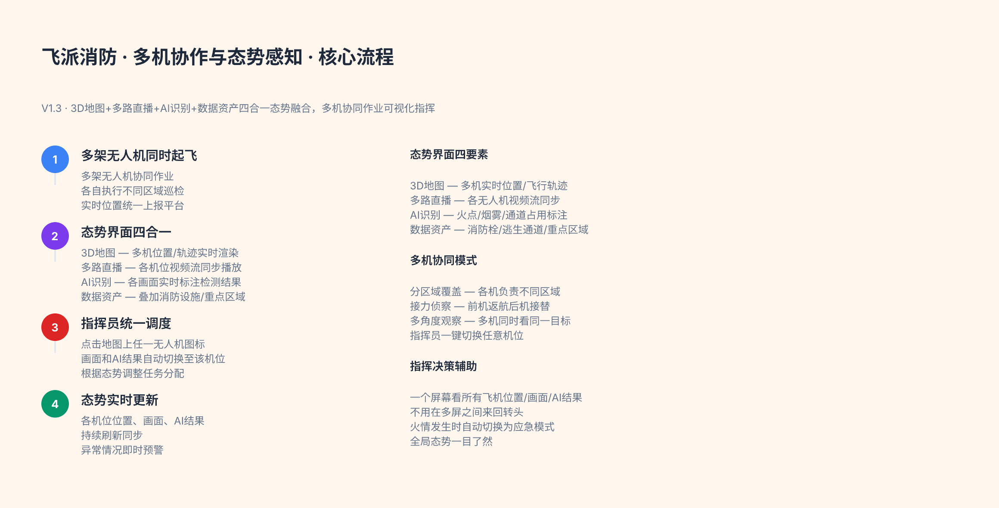

##### 业务价值

- 多机协同作业可视化，指挥更高效
- 多维信息融合提升态势判断准确性

##### 业务目标

- 多架无人机同时飞，指挥中心在一个屏幕上看到所有飞机的位置、画面和 AI 识别结果
- 3D 地图+直播+AI+资产四合一，指挥员不用在多个屏幕之间来回转头

##### 配图

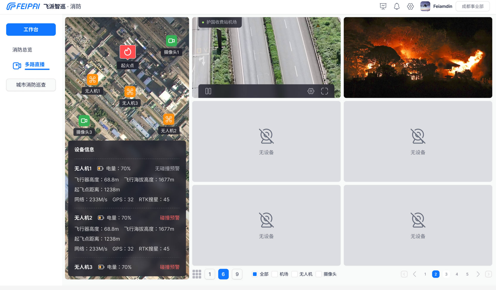

---

#### 多模态大模型应用

> 生态对接后引入多模态大模型能力。

| 版本归属 | V1.3 |
|---------|------|
| 交付月份 | 8月 |
| 优先级 | P1 |

##### 前置依赖

- 生态大模型对接完成
- AI 算法平台 V1.0

##### 功能说明

在生态对接完成后，将多模态大模型能力引入消防场景。利用大模型的视觉理解与语义分析能力，对消防巡检中的复杂场景（如烟雾形态、火势蔓延趋势等）进行更高层次的智能分析与预警。


##### 操作流程

1. 无人机巡检画面输入多模态大模型
2. 大模型综合分析：画面内容+地理位置+气象数据，输出风险评估和预警建议
3. 结果推送到态势大屏，用自然语言描述当前态势和趋势

##### 核心流程

```


消防巡检画面输入 → 多模态大模型推理
    → 场景理解（烟雾形态识别/火势趋势分析/风险等级评估）
    → 语义分析（生成自然语言描述与预警建议）
    → 结果推送至态势界面 → 指挥决策辅助
```

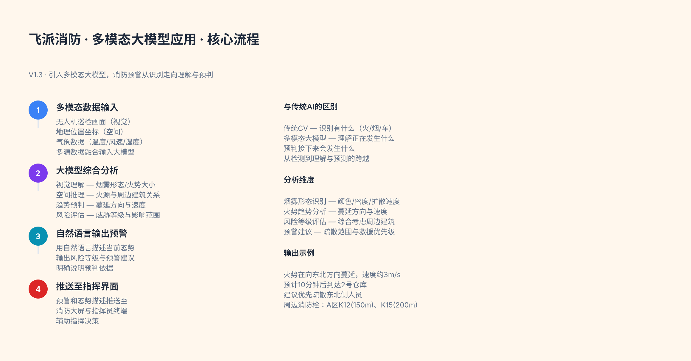

##### 业务价值

- 大模型提升复杂场景的智能分析能力
- 消防预警从"识别"走向"理解"

##### 业务目标

- 不只是识别「有没有火」，而是判断「火势在蔓延、方向是东北、预计 10 分钟后到仓库」
- 大模型把消防预警从看到什么报什么提升到预判接下来会发生什么

---

### V1.3 小程序端（9月交付）

#### 消防小程序端

> 消防小程序端基础能力一次性交付。

| 版本归属 | V1.3 |
|---------|------|
| 交付月份 | 9月 |
| 优先级 | P0 |

##### 前置依赖

- 消防 PC 端 V1.0（数据与业务接口）
- 智巡小程序 V1.8（复用小程序框架）
- 微信小程序基础框架

##### 功能说明

消防小程序端集中上线五大模块：任务、直播、工单、报告中心、用户中心，与智巡、卫瞳小程序保持统一架构与交互体验。消防场景的移动端巡检能力从零到一。


##### 操作流程

1. 选择消防产品线进入，底部五个 Tab：任务、直播、工单、报告、我的
2. 收到火情告警后直接跳转到直播画面，实时查看现场火势
3. 工单中记录处置措施，拍照上传处理结果

##### 核心流程

```


小程序启动 → 鉴权登录 → 进入首页
    ├── 任务：列表查看 → 详情 → 状态更新
    ├── 直播：多路播放 → 分享
    ├── 工单：查看/创建 → 处置 → 提交
    ├── 报告：列表 → 预览 → 下载/分享
    └── 用户：信息管理 → 安全设置
```

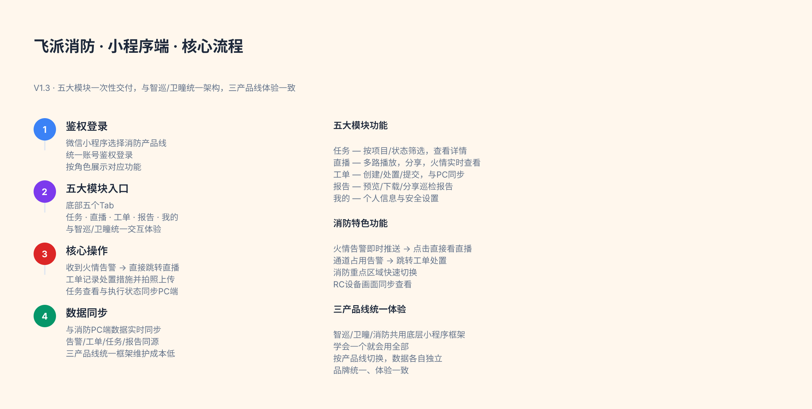

##### 业务价值

- 消防巡检移动化，现场响应更及时
- 三产品线统一的小程序体验

##### 业务目标

- 消防巡检移动化，现场消防员用手机就能接收任务、查看火情、上报情况
- 三产品线小程序体验统一，学会一个就会用三个

---

## 七、空间服务平台

> 飞派云平台空间数据基础设施，Q3 V1.0 首发，提供三维模型管理与空间安全能力。

---

### V1.0 首发（7月交付）

#### 模型管理与空间安全

> 空间服务平台首次上线，提供三维模型管理与空间安全基础能力。

| 版本归属 | V1.0 |
|---------|------|
| 交付月份 | 7月 |
| 优先级 | P0 |

##### 前置依赖

- 无（平台基础设施）

##### 功能说明

空间服务平台 V1.0 首发，核心包括两大模块：模型管理（支持 Mesh、点云等三维空间模型的上传、管理、可视化）；空间管理（面向空间数据的安全管控能力）。为飞派云平台提供空间数据基础设施。


##### 操作流程

1. 上传三维模型文件（OSGB/OBJ/LAS 等格式），系统自动格式转换和坐标校准
2. 模型入库后生成缩略图和元数据（面积、采集时间、分辨率）
3. 设置模型的访问权限：哪些组织、哪些角色可以查看和下载
4. 上层应用通过 API 调用模型服务，加载到各自的地图场景中

##### 核心流程

```


模型管理：
    上传三维模型（Mesh/点云）→ 格式校验与转换
    → 模型入库存储 → 空间索引构建
    → 可视化加载 → 模型浏览与交互
空间安全：
    空间数据分级分类 → 访问权限管控
    → 数据加密存储 → 操作审计日志
    → 对外 API 鉴权
```

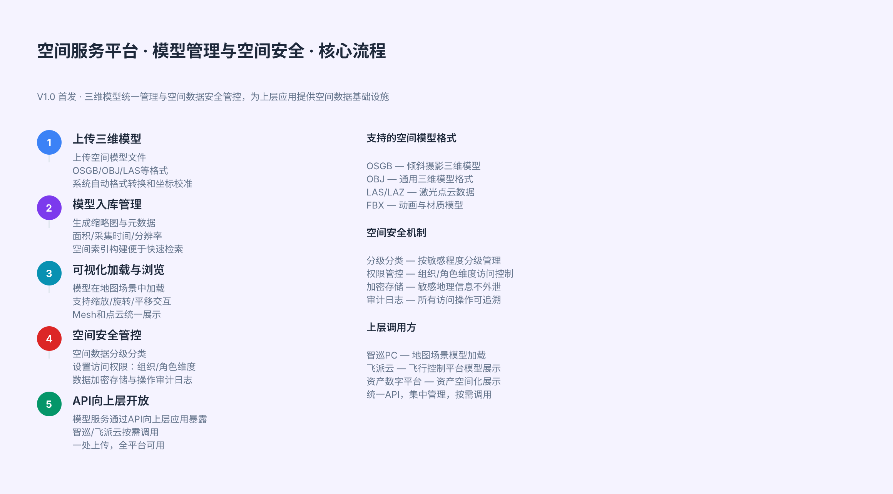

##### 业务价值

- 统一的三维模型管理入口
- 空间数据安全可控
- 为上层应用提供空间数据服务

##### 业务目标

- 所有项目的三维模型（Mesh、点云）集中存储、统一管理，上层应用按需调用
- 空间数据有权限管控和加密存储，敏感地理信息不外泄

##### 配图

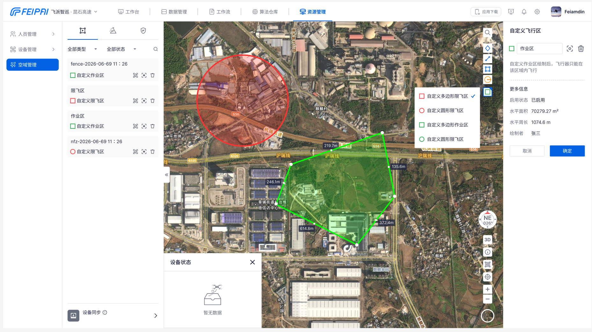

---

## 八、资产数字平台

> 面向高速公路行业的资产数字化管理平台，Q3 V1.0 首发，覆盖资产全生命周期管理与 BI 分析。

---

### V1.0 首发（7月交付）

#### 资产管理

> 面向高速公路场景的资产结构化全流程管理。

| 版本归属 | V1.0 |
|---------|------|
| 交付月份 | 7月 |
| 优先级 | P0 |

##### 前置依赖

- 空间服务平台 V1.0（空间数据基础）
- 飞派云平台 V2.0 统一组织权限

##### 功能说明

构建面向高速公路行业的资产数字化管理能力，涵盖资产结构化管理（按路段、设施类型等多维度组织资产树）、资产模板管理、在管资产总览、资产地图标注、资产编码配置及病害库管理。实现从资产登记、编码、标注到病害关联的全流程数字化。


##### 操作流程

1. 在资产数字平台中选择资产模板（路段/桥梁/隧道/边坡），填写资产属性
2. 系统按行业编码规范自动生成资产唯一编码
3. 在地图上标注资产位置，将资产挂到对应的资产树下（如：G50高速→K120段→桥梁→1号桥墩）
4. 巡检发现病害时，在病害库中选择资产对象关联，病害记录和资产绑定

##### 核心流程

```


资产登记 → 选择资产模板 → 填写属性信息
    → 资产编码（按行业编码规范自动生成）
    → 地图标注（关联空间坐标）
    → 纳入资产树（按路段/设施类型组织）
    → 病害关联（巡检发现 → 绑定资产 → 记录至病害库）
    → 资产总览（全量资产统计与查询）
```

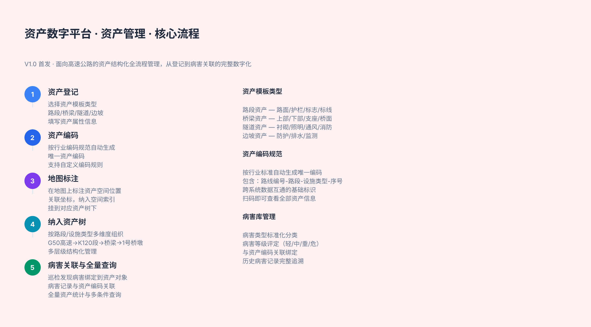

##### 业务价值

- 高速公路资产一键数字化
- 标准化病害库支撑巡检与养护决策
- 资产编码统一，跨系统数据互通

##### 业务目标

- 高速公路的每一个路灯、每一段护栏、每一个桥墩都有数字档案，扫码就能看到全部信息
- 资产和病害关联，哪个资产出过什么问题、修过几次，历史记录一清二楚

##### 配图

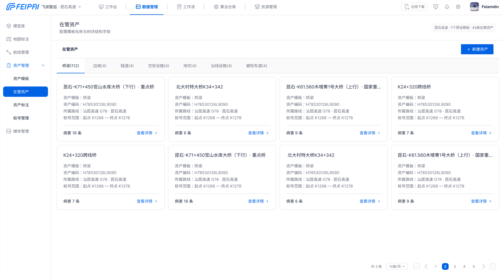

---

#### 资产行业管理

> 支持按行业类型的个性化资产字段管理。

| 版本归属 | V1.0 |
|---------|------|
| 交付月份 | 7月 |
| 优先级 | P1 |

##### 前置依赖

- 资产管理（基础资产结构）

##### 功能说明

在通用资产管理能力之上，增加行业维度管理，支持按不同资产行业类型（高速公路、铁路、园区等）进行个性化字段配置与管理，保障同一平台适配多行业资产差异。


##### 操作流程

1. 在「行业管理」中新建行业类型（如「铁路」），配置行业专属字段
2. 选择字段类型（文本/数字/下拉/日期）和是否必填
3. 将字段模板绑定到资产模板，注册资产时自动展示对应行业的字段

##### 核心流程

```


创建行业类型 → 配置行业专属字段（字段名/类型/校验规则）
    → 绑定资产模板 → 行业字段生效
    → 资产注册时按行业类型展示对应字段
    → 支持动态新增/修改行业字段配置
```

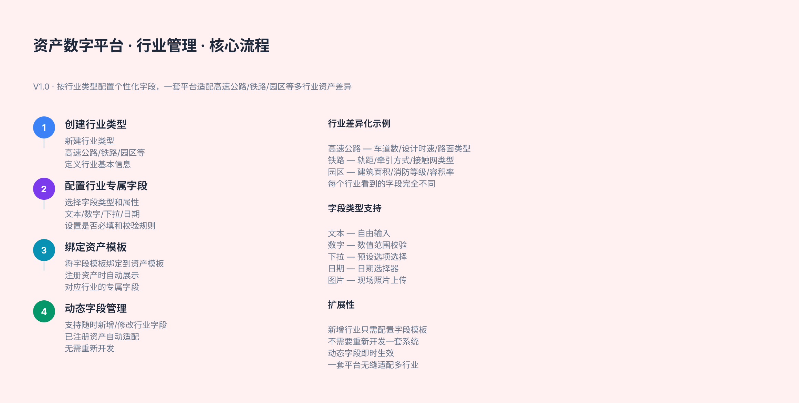

##### 业务价值

- 一套平台适配多行业资产管理
- 灵活字段配置降低定制成本

##### 业务目标

- 一套资产管理平台，高速公路能用、铁路能用、园区也能用，每个行业看到的字段不一样
- 新增一个行业只需配置字段模板，不用重新开发一套系统

##### 配图

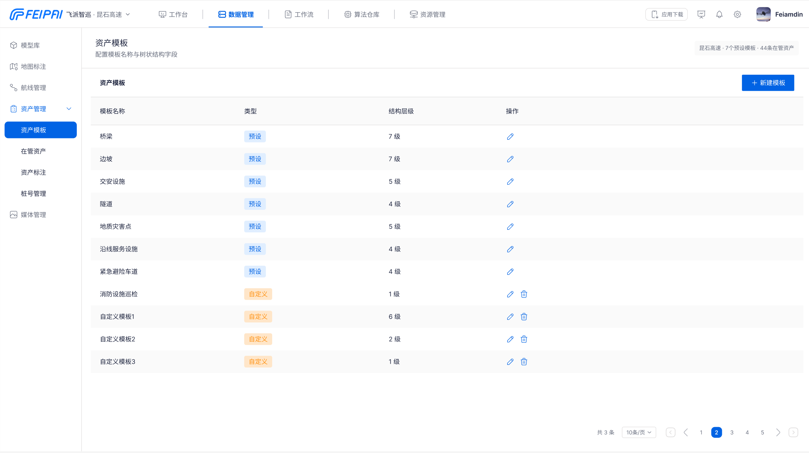

---

#### 资产数字 BI 分析

> 资产数据可视化分析与趋势洞察。

| 版本归属 | V1.0 |
|---------|------|
| 交付月份 | 7月 |
| 优先级 | P1 |

##### 前置依赖

- 资产管理（资产基础数据）
- 运营中台 V1.0（数据统计基础）

##### 功能说明

基于已结构化的资产数据，提供资产维度的 BI 分析与趋势分析能力。支持按路段、资产类型、时间等多维度进行数据统计与可视化展示，帮助管理者从宏观层面掌握资产状况与变化趋势。


##### 操作流程

1. 打开 BI 分析看板，顶部选择分析维度：按路段、按资产类型、按时间
2. 默认展示资产总览：在管资产总数、完好率、病害总数、待处理工单数
3. 切换到趋势分析：近 12 个月病害数量变化曲线，标记异常波动月份
4. 切换到热力图：地图上按路段着色显示病害密度，红色区域重点关注

##### 核心流程

```


数据源接入（资产数据/病害数据/巡检数据）
    → 数据清洗与聚合
    → 多维度分析：
        ├── 按路段：资产分布/病害密度/完好率
        ├── 按类型：设施统计/使用寿命/维修频率
        └── 按时间：同比/环比趋势
    → 可视化图表渲染 → 分析报告生成
```

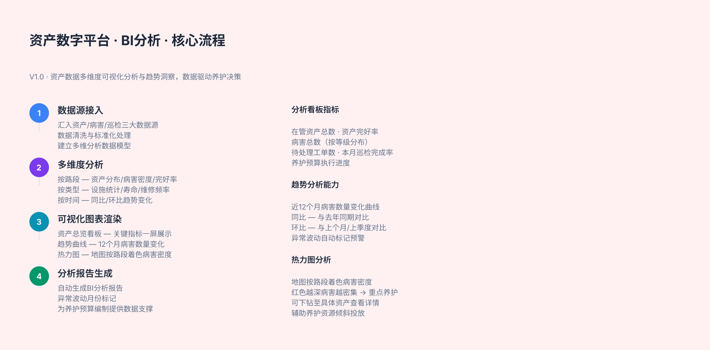

##### 业务价值

- 资产状况一屏总览
- 数据驱动养护决策
- 趋势分析辅助预算规划

##### 业务目标

- 资产状况从凭经验判断变成看数据说话，管理者打开 BI 看板就知道哪些路段该修了
- 病害趋势分析辅助养护预算编制，钱花在刀刃上

##### 配图

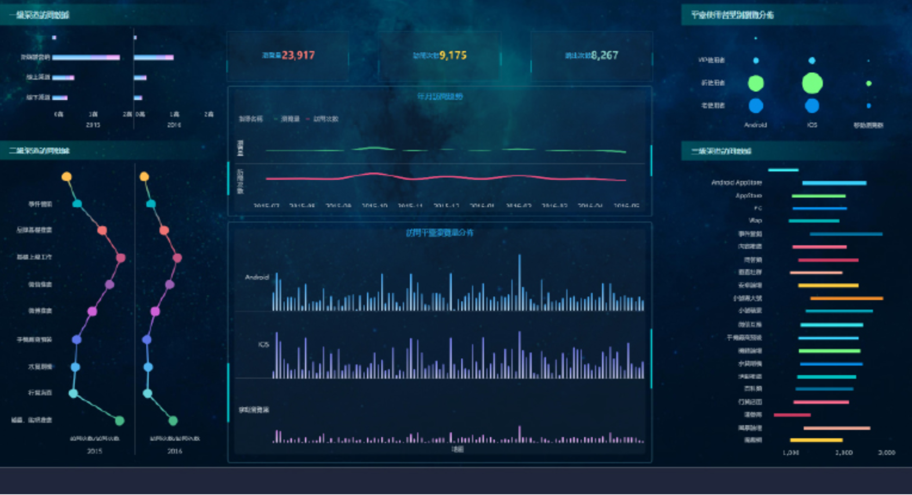

---

## 九、AI 算法平台

> 飞派 AI 能力中台，Q3 从 V1.0 算法基础设施（数据集、妙算集成、工程平台、5+ 场景算法首发）演进至 V1.1 边缘扩展（第三方视频流适配）。

---

### V1.0 算法基础设施（7月交付）

#### 数据集管理

> 训练数据集统一管理，支撑算法迭代。

| 版本归属 | V1.0 |
|---------|------|
| 交付月份 | 7月 |
| 优先级 | P0 |

##### 前置依赖

- 无（算法平台基础能力）

##### 功能说明

提供训练数据集的统一管理能力，支持数据集创建、标注、版本管理，为各场景模型算法的训练与迭代提供标准化的数据基础。


##### 操作流程

1. 创建数据集，上传图片/视频/点云数据
2. 在线标注工具对图片进行标注（框选/分类/分割）
3. 标注完成审核通过后，发布为正式版本（v1.0）
4. 后续补充数据后发布新版本（v1.1），历史版本保留可回溯

##### 核心流程

```


创建数据集 → 数据上传（图片/视频/点云）
    → 数据标注（分类/检测/分割）
    → 标注审核 → 数据集版本发布
    → 版本管理（v1/v2... → 追溯与回滚）
    → 数据集导出（对接模型训练管线）
```

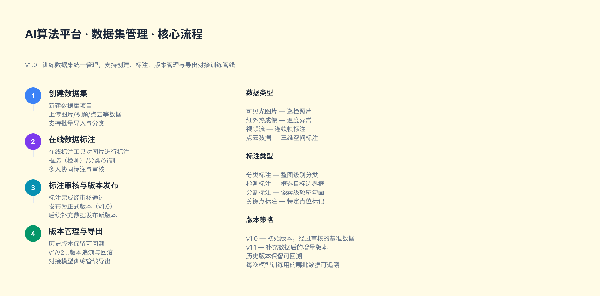

##### 业务价值

- 训练数据集中管理，提升算法研发效率
- 数据集版本化支撑模型迭代追溯

##### 业务目标

- 训练数据集中管控，算法工程师不用在个人电脑上各自存一份数据
- 数据集版本化管理，每次模型训练用了哪批数据可追溯

##### 配图

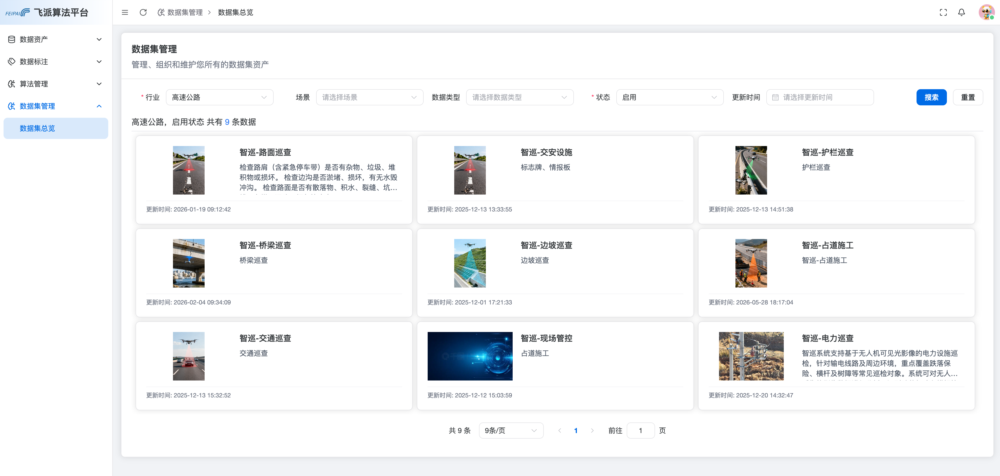

---

#### 大疆妙算算法集成

> 完成大疆妙算平台的算法集成，实现机载 AI 能力。

| 版本归属 | V1.0 |
|---------|------|
| 交付月份 | 7月 |
| 优先级 | P0 |

##### 前置依赖

- 场景算法模型（批次一/二）
- 大疆妙算 SDK

##### 功能说明

完成大疆妙算平台的算法适配与集成，将飞派自研算法部署至无人机机载计算平台，实现前端实时 AI 识别能力，支撑机载动作触发等自动化场景。


##### 操作流程

1. 算法工程师将训练好的模型转换为妙算平台支持的格式
2. 通过算法工程平台将模型部署到妙算设备
3. 无人机飞行时，摄像头画面进入妙算实时推理，识别结果叠加在画面上
4. 识别到目标后触发预设机载动作（悬停/拍照/变焦）

##### 核心流程

```


算法模型训练完成 → 模型转换（适配妙算平台格式）
    → 模型部署至妙算设备 → 集成测试
    → 无人机飞行中：
        摄像头采集 → 妙算实时推理 → 识别结果输出
        → 触发机载动作（拍照/悬停/变焦）
        → 结果同步至云端
```

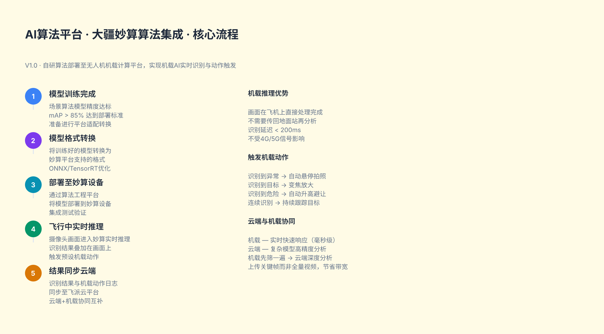

##### 业务价值

- 机载 AI 实时识别，降低数据传输延迟
- 云端算法与机载算法协同，场景覆盖更全

##### 业务目标

- 自研算法跑在大疆飞机的机载电脑上，画面在飞机上就处理完了，不用传回地面站再分析
- 云端算法做复杂分析，机载算法做实时响应，两边协同

---

#### 算法工程平台

> 算法工程化管理能力上线，覆盖模型版本、实时算法、算力调度。

| 版本归属 | V1.0 |
|---------|------|
| 交付月份 | 7月 |
| 优先级 | P0 |

##### 前置依赖

- 场景算法模型开发（批次一）
- 算力平台基础设施

##### 功能说明

算法工程平台 V1.0 上线，核心能力包括：实时算法管理（面向项目的算法启停与监控）、模型版本管理（工程化模型版本登记与切换）、算法基础能力管理（AI 分析结果通过配置化方式自动上报至报警中心）、算力平台业务上线。后续 V1.1 将补充算法配置管理（可视化参数调优、检测区域绘制）、机载算法管理及国产化算法适配。


##### 操作流程

1. 算法工程师上传训练好的模型，填写版本号、适用场景、性能指标
2. 管理员审核通过后，选择部署目标（云端 GPU/边缘算力盒子/机载妙算）
3. 部署完成后在监控面板查看运行状态：QPS、延迟、准确率
4. 配置 AI 结果路由规则：识别到裂缝→自动推送到事件中心→触发告警

##### 核心流程

```


模型训练输出 → 工程化登记（版本号/适用场景/性能指标）
    → 部署至算力平台 → 按项目启用/停用算法
    → 实时算法监控（QPS/延迟/准确率）
    → AI 分析结果 → 配置化路由 → 自动上报报警中心
    → 模型版本切换（灰度→全量）
```

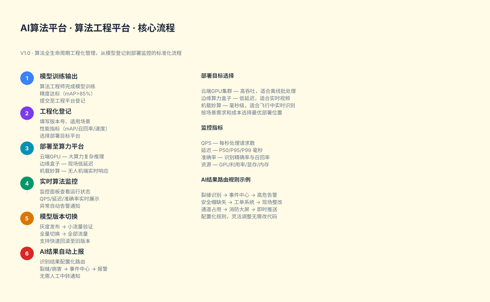

##### 业务价值

- 算法从研发到上线全流程工程化管理
- 算法结果自动联动报警，减少人工中转
- 检测区域可配置提升识别精准度

##### 业务目标

- 算法从实验室到生产环境有标准流程：训练完成→版本登记→部署→监控，每一步都可控
- AI 识别结果自动推送到报警中心，识别到异常不需要人工中转通知

---

#### 场景算法模型开发（批次一）

> 完成四大核心场景的算法模型首发。

| 版本归属 | V1.0 |
|---------|------|
| 交付月份 | 7月 |
| 优先级 | P0 |

##### 前置依赖

- 数据集管理
- 算法训练基础设施（GPU 集群）

##### 功能说明

完成首批场景算法模型开发与交付，覆盖：在建工地模型算法（公路场景、铁路场景）、养护施工模型算法（公路场景）、桥梁模型算法、消防模型算法（可见光）。为各产品线的 AI 巡检能力提供算法支撑。


##### 操作流程

1. 针对每个场景采集训练数据（工地、养护、桥梁、消防各数万张）
2. 标注团队完成数据标注，算法工程师选型和训练
3. 模型精度达标后（mAP>85%），提交至算法工程平台登记和部署
4. 部署后在真实场景中跑验证，收集 badcase 用于下一轮迭代

##### 核心流程

```


数据采集 → 数据标注 → 数据集构建
    → 模型选型 → 训练迭代 → 精度验证
    → 场景算法交付：
        ├── 在建工地（公路）：安全帽/反光衣/围挡/基坑
        ├── 在建工地（铁路）：軌道/接触网/施工机械
        ├── 养护施工（公路）：锥桶/标志牌/施工区域
        ├── 桥梁：裂缝/锈蚀/支座位移
        └── 消防（可见光）：烟/火/通道占用/消防设施
    → 模型部署至算法工程平台
```

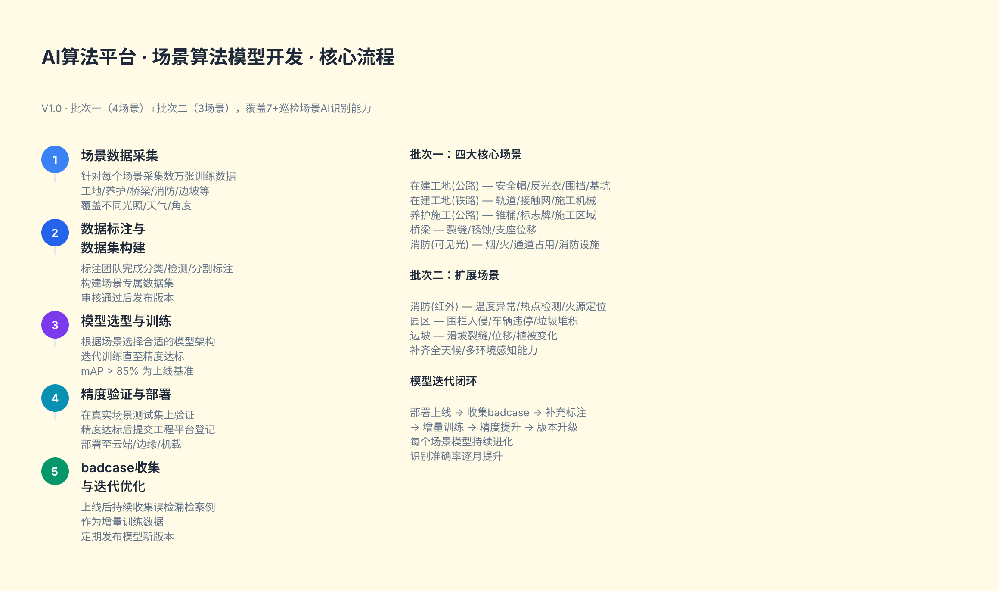

##### 业务价值

- 四大核心巡检场景具备 AI 识别能力
- 算法模型持续迭代，识别准确率不断提升

##### 业务目标

- 四大巡检场景（工地、养护、桥梁、消防）具备 AI 自动识别能力，无人机飞一遍问题自动标记
- 每个场景至少覆盖核心识别目标（如工地：安全帽、围挡；桥梁：裂缝、锈蚀）

---

#### 场景算法模型开发（批次二）

> 扩展至消防红外、园区、边坡等场景。

| 版本归属 | V1.0 |
|---------|------|
| 交付月份 | 7月 |
| 优先级 | P0 |

##### 前置依赖

- 场景算法批次一
- 红外波段数据采集

##### 功能说明

第二批场景算法模型交付，覆盖：消防模型算法（红外波段）、园区模型算法、边坡模型算法（升级优化）。进一步扩展 AI 算法的场景覆盖范围，尤其是消防红外算法的加入补齐了消防场景的关键感知能力。


##### 操作流程

1. 采集红外波段数据（消防场景），园区和边坡数据
2. 分别训练模型：消防红外（温度异常检测）、园区（围栏/入侵/违停）、边坡（裂缝/位移）
3. 精度验证达标后部署至算法工程平台

##### 核心流程

```


数据采集（红外/园区/边坡）→ 数据标注
    → 模型训练：
        ├── 消防红外：温度异常/热点检测/火源定位
        ├── 园区：围栏/入侵/车辆违停/垃圾堆积
        └── 边坡：滑坡裂缝/位移/植被变化
    → 精度验证 → 模型部署 → 场景覆盖验证
```


##### 业务价值

- 消防场景具备可见光+红外双模识别
- 园区与边坡场景算法覆盖，拓宽业务边界

##### 业务目标

- 消防场景补齐红外识别能力（夜间/浓烟环境下可见光失效，红外仍能工作）
- 园区和边坡场景算法覆盖，产品线可销售的行业场景又多了三个

---

#### 桥梁专项检查（SLAM 方案）

> 基于 SLAM 技术的桥梁专项检查解决方案。

| 版本归属 | V1.0 |
|---------|------|
| 交付月份 | 7月 |
| 优先级 | P1 |

##### 前置依赖

- 空间服务平台 V1.0
- 桥梁模型算法（批次一）

##### 功能说明

针对桥梁场景推出基于 SLAM（即时定位与地图构建）的专项检查方案，解决桥梁底部、桥墩等 GPS 受限环境下的自主巡检问题。结合三维建模与 AI 识别，实现桥梁结构病害的精准检测与定位。


##### 操作流程

1. 无人机飞到桥底，GPS 信号丢失，自动切换到 SLAM 模式（视觉+激光定位）
2. 无人机在桥底自主导航，按预设路径拍摄桥梁结构照片
3. 拍摄的照片和 SLAM 坐标绑定，AI 识别到的病害自动标注在三维模型对应位置
4. 检测完成后生成桥梁病害分布图，每个病害点都能在三维模型上点击查看

##### 核心流程

```


无人机进入桥底（GPS 受限区域）
    → SLAM 实时定位建图（视觉/激光里程计）
    → 自主路径规划与避障
    → 拍摄桥梁结构图像 → 实时回传
    → AI 识别（裂缝/锈蚀/剥落）→ 病害定位（关联 SLAM 坐标）
    → 三维重建 → 病害标注至三维模型
```

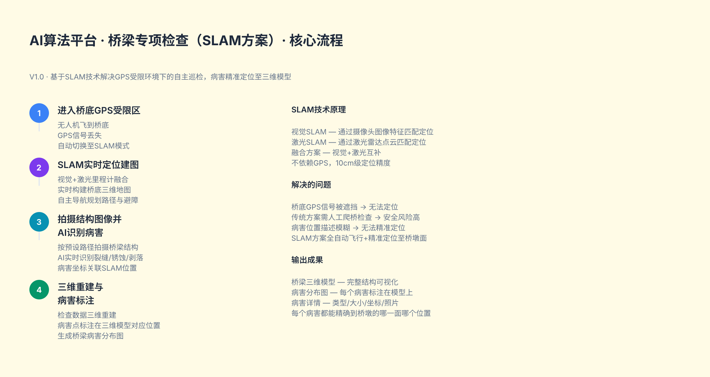

##### 业务价值

- 解决桥梁复杂结构的巡检难题
- SLAM 技术突破 GPS 受限场景
- 提升桥梁养护的数字化水平

##### 业务目标

- 解决桥梁底部 GPS 信号被遮挡的问题，无人机在桥底也能自主定位和飞行
- 桥梁病害能精准定位到桥墩的哪个面、哪个位置，不是模糊的「大概在第三个桥墩附近」

---

## 十、自动运维平台

> 飞派云平台运维底座，Q3 V1.0 首发，七大核心模块一次性交付。

---

### V1.0 首发（7月交付）

#### 七大核心模块

> 飞派云平台运维能力体系首发上线。

| 版本归属 | V1.0 |
|---------|------|
| 交付月份 | 7月 |
| 优先级 | P0 |

##### 前置依赖

- 飞派云平台 V2.0 各模块部署上线

##### 功能说明

自动运维平台 V1.0 一次性交付七大核心模块：工作台（服务器与组件运行状态监控）、租户与用户管理（统一身份认证+多租户隔离+分租户计费清算）、数据安全机制、资源运维监控、数据库运维监控、集群与扩容服务稳定性保障、AI 运维管理。为飞派云全平台提供统一的运维底座。


##### 操作流程

1. 运维人员登录自动运维平台，工作台首页展示所有服务器和组件的运行状态
2. 红色标记异常服务，点击查看详情和日志
3. 租户管理页面管理所有租户的资源配额和计费
4. AI 运维模块自动检测日志异常，预测潜在故障，提前生成工单

##### 核心流程

```


工作台：服务器/组件状态实时采集 → 监控大盘展示 → 异常告警
租户管理：租户创建 → 资源配额分配 → 数据隔离 → 计费清算
数据安全：加密策略配置 → 访问审计 → 安全扫描
资源运维：CPU/内存/磁盘/网络监控 → 阈值告警 → 自动伸缩
数据库运维：慢查询监控 → 连接池管理 → 备份恢复
集群管理：节点状态监控 → 负载均衡 → 弹性扩容
AI 运维：日志异常检测 → 故障预测 → 自动工单
```

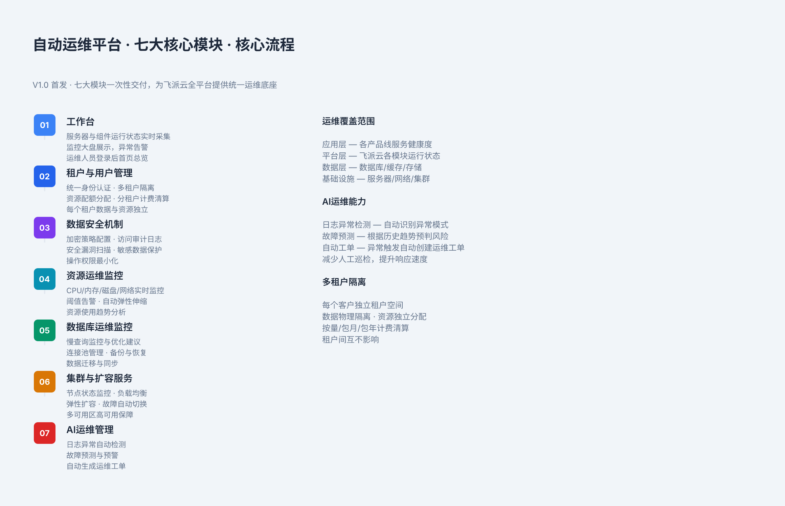

##### 业务价值

- 平台运维能力从无到有
- 多租户隔离保障数据安全
- AI 运维降低人工介入成本

##### 业务目标

- 平台上线后，服务器状态、租户用量、数据安全、资源消耗都有地方看了
- 出问题自动发现、自动告警、自动生成运维工单，减少人工巡检工作量

---

## 十一、运营中台

> 飞派云商业化运营底座，Q3 从 V1.0 基础运营（账号+费用）演进至 V1.1 数据与告警能力（统计+工单+行业分析）。

---

### V1.0 基础运营能力（7月交付）

#### 运营账号与费用管理

> 运营中台基础管理能力上线。

| 版本归属 | V1.0 |
|---------|------|
| 交付月份 | 7月 |
| 优先级 | P0 |

##### 前置依赖

- 飞派云平台 V2.0 统一组织权限

##### 功能说明

运营中台 V1.0 首发两大基础模块：运营账号管理（基于账号有效期机制，到期自动通知）和费用成本管理（覆盖客户全生命周期的多维度费用成本分析、账单管理），为商业化运营提供基础支撑。


##### 操作流程

1. 运营人员创建客户账号，设置有效期和资源配额
2. 到期前 7 天、3 天、当天自动发送续费通知（邮件+短信）
3. 费用管理页面按客户/产品/时间段查看消费明细
4. 月底自动生成账单，推送至客户邮箱

##### 核心流程

```


运营账号管理：
    创建运营账号 → 设置有效期 → 到期自动通知（邮件/短信/站内信）
    → 续费/停用处理 → 账号状态流转
费用成本管理：
    客户资源用量采集 → 费用计算（按量/包月/包年）
    → 账单生成 → 多维成本分析（按客户/产品/时间段）
    → 账单推送 → 缴费跟踪
```

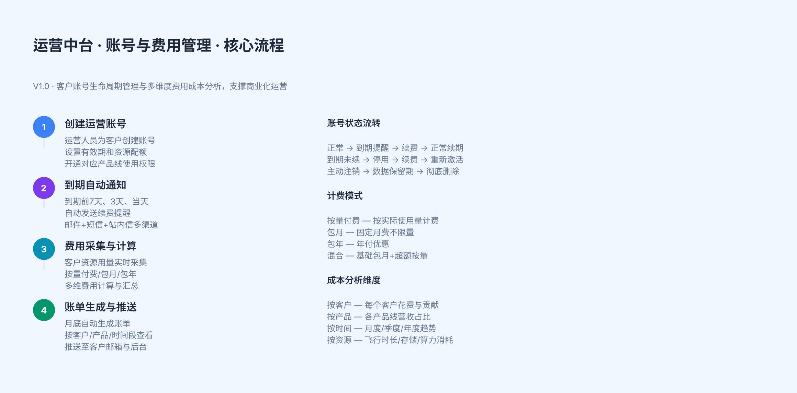

##### 业务价值

- 账号生命周期自动化管理
- 费用透明化支撑商业决策

##### 业务目标

- 客户账号到期自动提醒，该续费的时候系统主动通知，不用人工盯着合同台账
- 每个客户花了多少钱、用了多少资源，账单清清楚楚

---

### V1.1 数据与告警能力（8月交付）

#### 运营数据统计

> 全产品线运营数据统一汇聚与统计。

| 版本归属 | V1.1 |
|---------|------|
| 交付月份 | 8月 |
| 优先级 | P0 |

##### 前置依赖

- 各产品线数据上报接口
- 运营中台 V1.0

##### 功能说明

运营中台上线全产品线数据统计能力，覆盖任务数据、设备数据、资产数据、事件数据、飞行数据、采集数据、算法数据、报警数据、工单数据、用户数据十大维度。为运营团队提供全面的数据总览与分析基础。


##### 操作流程

1. 打开运营数据统计大盘，顶部选择时间范围（本月/本季度/本年）
2. 十大维度卡片依次展示：任务数、设备在线数、资产总量、事件数、飞行时长等
3. 点击任一卡片下钻到明细数据

##### 核心流程

```


各产品线数据上报 → 数据清洗与标准化
    → 十大维度数据汇聚：
        任务/设备/资产/事件/飞行/采集/算法/报警/工单/用户
    → 数据聚合计算（日/周/月/季）
    → 运营大盘展示 → 导出分析报表
```

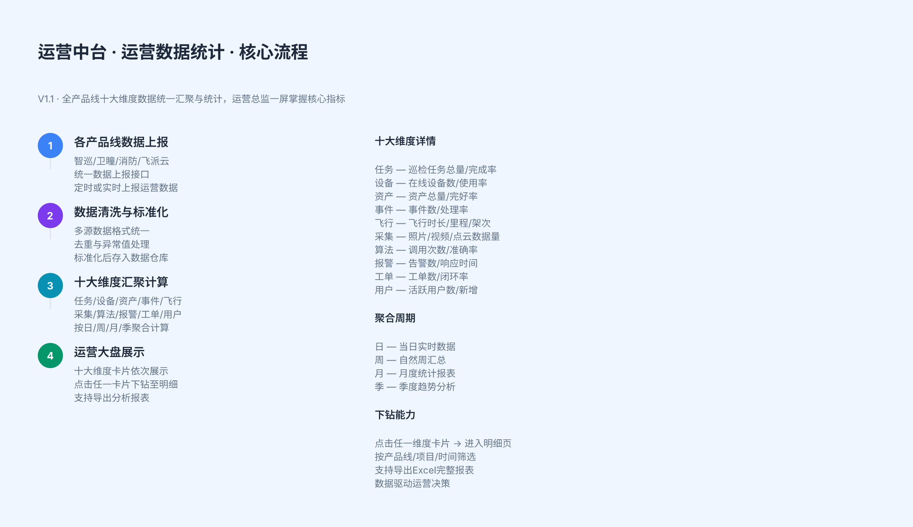

##### 业务价值

- 十大维度运营数据一屏总览
- 数据驱动运营决策

##### 业务目标

- 运营总监打开一个页面就看到全产品线的核心数据：飞了多少次、识别了多少异常、处理了多少工单
- 十大维度覆盖所有关键指标，不用分别找每个产品线要数据报表

---

#### 告警与工单管理

> 覆盖产品全生命周期的智能告警与工单闭环。

| 版本归属 | V1.1 |
|---------|------|
| 交付月份 | 8月 |
| 优先级 | P0 |

##### 前置依赖

- 运营中台 V1.0
- 运营数据统计

##### 功能说明

运营中台新增告警与工单管理能力：支持覆盖产品全生命周期的告警规则设置、多渠道智能告警通知，以及告警自动生成工单、工单流转与闭环管理。打通"告警→工单→处理→关闭"的完整链路。


##### 操作流程

1. 运营人员在告警规则页配置触发条件（如：CPU 超过 90% 持续 5 分钟）
2. 配置通知渠道和接收人（哪些告警发给运维、哪些发给运营）
3. 告警触发后自动创建运维工单，分配至运维人员
4. 处理完成后工单关闭，告警记录和工单记录关联存档

##### 核心流程

```


告警规则配置（阈值/条件/触发频率）
    → 数据监控 → 触发告警
    → 多渠道通知（短信/邮件/站内信/钉钉/企微）
    → 告警自动生成工单 → 分配处理人
    → 处理 → 提交结果 → 审核关闭
    → 告警-工单全流程记录
```

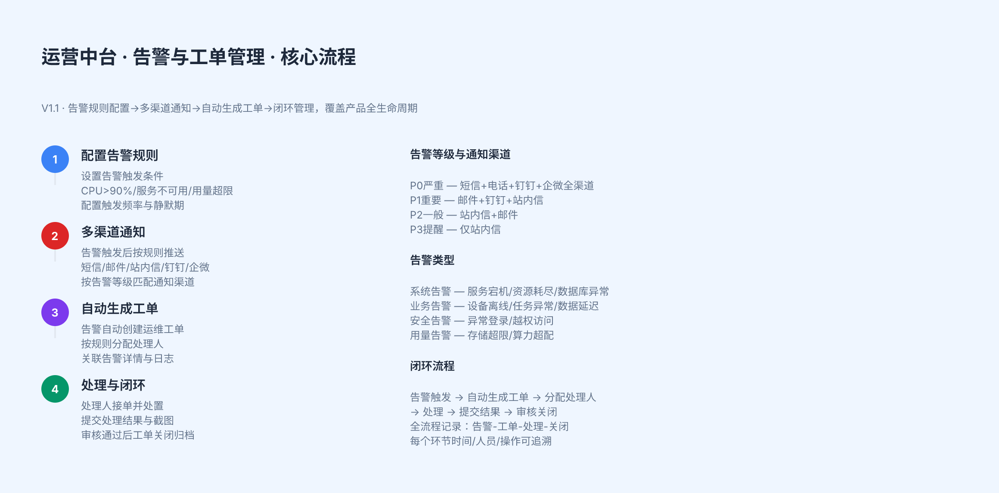

##### 业务价值

- 告警不遗漏，自动转工单
- 全生命周期闭环管理
- 多渠道通知保障响应及时性

##### 业务目标

- 平台任何模块出问题（服务挂了、用量超了、数据异常），都能自动告警并生成工单
- 多渠道通知（短信、邮件、钉钉、企微），确保关键告警一定有人看到

---

#### 数据资产分析

> 面向高速公路行业的深度数据资产分析。

| 版本归属 | V1.1 |
|---------|------|
| 交付月份 | 8月 |
| 优先级 | P1 |

##### 前置依赖

- 资产数字平台 V1.0
- 运营数据统计

##### 功能说明

运营中台上线数据资产分析模块，面向高速公路行业提供按路段维度、病害类型维度、时间趋势分析、区域热力图分析等多维分析能力。帮助行业客户从宏观层面掌握路产状态与变化趋势。


##### 操作流程

1. 选择分析范围（整条高速/某路段/某类资产）和时间段
2. 系统自动生成病害分布热力图，红色越深病害越密集
3. 查看趋势分析：本季度 vs 上季度病害数量变化、类型变化
4. 一键导出行业分析报告，发给业主或养护单位

##### 核心流程

```


数据汇聚（资产数据+巡检数据+病害数据+工单数据）
    → 多维度分析计算：
        ├── 路段维度：各路段资产完好率/病害密度排行
        ├── 病害类型：病害分布/高频病害/趋势变化
        ├── 时间趋势：月度/季度同比环比分析
        └── 区域热力：病害空间分布热力图
    → 可视化展示 → 分析报告生成
```

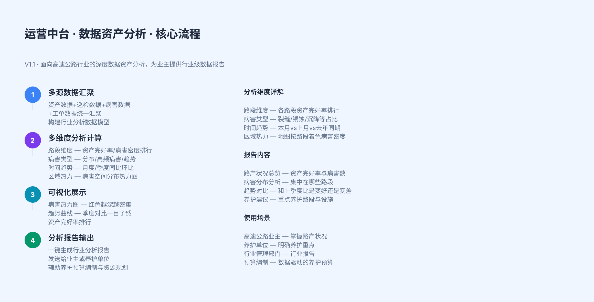

##### 业务价值

- 行业级数据分析支撑决策
- 病害时空分布可视化，辅助养护规划

##### 业务目标

- 面向高速公路业主提供行业级数据报告：路产状况怎么样、病害集中在哪段、和上季度比是变好还是变差
- 病害热力图直观展示问题路段分布，养护资源往红色区域倾斜

---

## 十二、大屏矩阵

> Q3 集中交付五大屏，形成覆盖全产品线的指挥监控大屏矩阵。8月交付智巡3屏+卫瞳+消防，9月交付飞派云大屏。

---

### V1.0 智巡/卫瞳/消防（8月交付）

#### 智巡大屏（标准版）

> 场景化标准大屏：日常巡检、在建工地、养护施工。

| 版本归属 | V1.0 |
|---------|------|
| 交付月份 | 8月 |
| 优先级 | P1 |

##### 前置依赖

- 智巡 PC 端 V1.9（地图/任务/事件/告警数据）
- 运营中台 V1.1（数据统计接口）

##### 功能说明

智巡标准类大屏上线，依据三大巡检场景（日常巡检、在建工地、养护施工）匹配定制化大屏布局。大屏聚合地图、直播、任务、告警、事件等核心数据，为指挥中心提供场景化的全局监控视图。


##### 操作流程

1. 大屏开机自动加载，左上角切换场景模板（日常/工地/养护）
2. 中心地图区域展示所有在线无人机位置和飞行轨迹
3. 右侧面板轮播：今日任务统计、实时告警列表、事件趋势图
4. 点击任意告警项，地图自动定位到告警位置，弹出详情

##### 核心流程

```


大屏初始化 → 加载场景模板（日常巡检/在建工地/养护施工）
    → 数据实时接入：
        ├── 地图区域：实时位置/轨迹/标注
        ├── 直播区域：当前执行任务直播画面
        ├── 任务面板：今日任务统计/执行状态
        ├── 告警面板：实时告警滚动/等级分布
        └── 事件面板：事件趋势/分类统计
    → 定时刷新 → 异常高亮提示
```

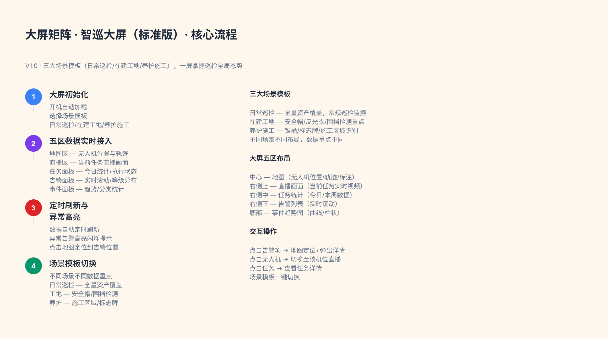

##### 业务价值

- 三大场景专属大屏，贴合业务需求
- 一屏掌握巡检全局态势

##### 业务目标

- 指挥中心一面大屏看清所有巡检动态，领导视察时一眼看到管了多少路、今天飞了多少架
- 三大场景各一套模板：日常巡检、在建工地、养护施工，不同场景不同重点

---

#### 智巡大屏（定制版）

> 按项目需求定制的专属大屏。

| 版本归属 | V1.0 |
|---------|------|
| 交付月份 | 8月 |
| 优先级 | P2 |

##### 前置依赖

- 智巡大屏（标准版）

##### 功能说明

在标准大屏基础上，支持按项目需求进行定制化大屏开发，适配不同客户的数据展示偏好与品牌风格，满足重大项目汇报与展示需求。


##### 操作流程

1. 和客户沟通大屏需求：重点关注哪些数据、品牌色和 Logo
2. 基于标准版模板调整布局、配色、指标
3. 部署至客户现场大屏设备，联调数据源

##### 核心流程

```


客户需求沟通 → 大屏布局设计 → 数据指标定制
    → 品牌风格适配（Logo/配色/字体）
    → 定制化开发 → 部署上线 → 客户验收
```

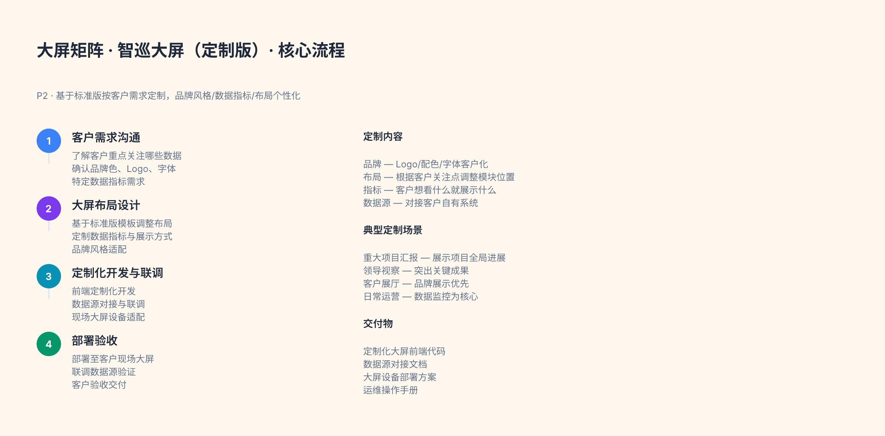

##### 业务价值

- 满足重大项目的个性化展示需求
- 提升客户交付体验

##### 业务目标

- 重大项目交付时，给客户定制一套大屏，打上客户的 Logo、用客户的配色
- 数据指标按客户关注点调整，客户想看什么就展示什么

---

#### 卫瞳大屏

> 卫瞳场景专属大屏。

| 版本归属 | V1.0 |
|---------|------|
| 交付月份 | 8月 |
| 优先级 | P1 |

##### 前置依赖

- 卫瞳 PC 端 V1.0
- 运营中台 V1.1

##### 功能说明

依据卫瞳安全管理场景需求，匹配专属大屏布局与数据展示。聚合安全管理相关的地图、任务、告警等核心信息，为安全管理指挥场景提供可视化支撑。


##### 操作流程

1. 大屏展示安全管理全局：检查点位地图、今日检查进度、隐患等级分布
2. 下方滚动展示最新隐患排查记录和整改状态
3. 点击隐患点，地图定位并弹出详情：谁发现的、什么时候、整改了没有

##### 核心流程

```


大屏初始化 → 加载安全管理场景模板
    → 数据实时接入：
        ├── 地图区域：安全管理点位/检查轨迹
        ├── 任务面板：安全检查任务统计
        ├── 告警面板：安全隐患告警滚动
        └── "一部手机管安全"数据联动
    → 定时刷新 → 异常高亮
```

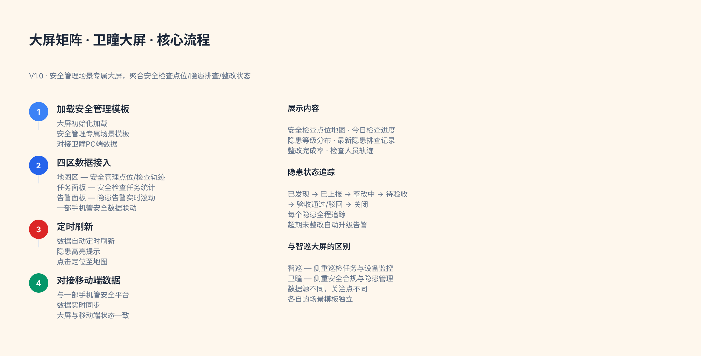

##### 业务价值

- 安全管理场景专属指挥视图
- 数据聚合提升响应速度

##### 业务目标

- 安全管理场景有自己的指挥大屏，安全检查点位、隐患排查进度、整改完成率全部可视化
- 对接「一部手机管安全」数据，大屏和移动端数据实时同步

---

#### 消防大屏

> 消防场景专属大屏。

| 版本归属 | V1.0 |
|---------|------|
| 交付月份 | 8月 |
| 优先级 | P1 |

##### 前置依赖

- 消防 PC 端 V1.3（多机协作+态势感知）
- 运营中台 V1.1

##### 功能说明

依据消防场景需求匹配专属大屏整体功能，聚合消防巡检、通道占用告警、多机态势感知等消防核心数据，为消防指挥中心提供统一的态势展示。


##### 操作流程

1. 大屏中心 3D 地图展示消防重点区域和无人机实时位置
2. 多机画面同步播放，AI 识别结果实时标注
3. 通道占用告警列表实时滚动，高优先级告警弹窗提醒
4. 火情发生时自动切换为应急模式：火点定位、蔓延趋势、周边资源一键展示

##### 核心流程

```


大屏初始化 → 加载消防场景模板
    → 数据实时接入：
        ├── 态势地图：多机位置/轨迹/3D渲染
        ├── 直播区域：多机画面同步播放
        ├── AI 识别面板：通道占用/烟火检测结果
        ├── 告警面板：消防告警实时滚动
        └── 设备面板：RC/无人机在线状态
    → 多源数据融合展示 → 指挥调度辅助
```

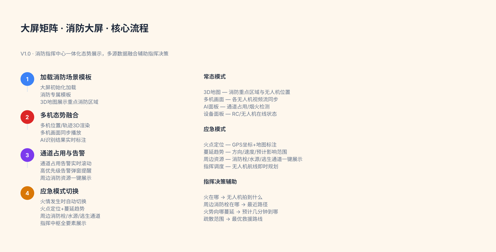

##### 业务价值

- 消防指挥场景一体化展示
- 多源数据融合辅助决策

##### 业务目标

- 消防指挥中心大屏聚合火灾监测、通道占用、多机态势所有信息
- 真发生火情时，大屏就是指挥中枢：火在哪、无人机拍到什么、周边消防栓在哪一目了然

---

### V1.0 飞派云大屏（9月交付）

#### 飞派云大屏

> 飞派云平台整体能力大屏展示。

| 版本归属 | V1.0 |
|---------|------|
| 交付月份 | 9月 |
| 优先级 | P1 |

##### 前置依赖

- 飞派云平台 V2.1
- 运营中台 V1.1

##### 功能说明

上线飞派云大屏，聚合展示飞派云平台整体能力，包括飞行管控、AI 算法、资产数字化、空间服务等模块的核心指标与运行状态，为飞派云平台的对外展示与内部运营监控提供可视化窗口。


##### 操作流程

1. 大屏展示飞派云五大核心模块：飞行管控、AI 算法、资产数字、空间服务、运维
2. 每个模块滚动展示关键指标：在线无人机数、算法调用量、资产总数、模型存储量
3. 底部实时滚动全平台告警和工单处理状态

##### 核心流程

```


大屏初始化 → 加载飞派云平台数据
    → 多模块数据聚合展示：
        ├── 飞行管控：在线无人机/执行中任务/飞行里程
        ├── AI 算法：算法调用量/识别准确率/模型版本
        ├── 资产数字：资产总量/病害统计/BI 趋势
        ├── 空间服务：模型存储量/API 调用量
        └── 平台运维：服务健康度/资源使用率/告警统计
    → 定时刷新 → 异常指标高亮
```

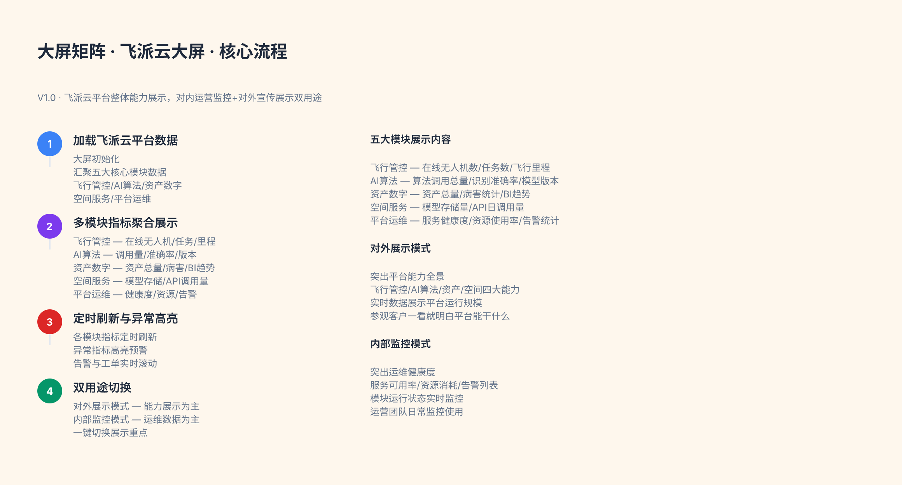

##### 业务价值

- 飞派云平台能力一屏展示
- 对内运营监控+对外宣传展示双用途

##### 业务目标

- 飞派云平台能力对外展示窗口，参观客户一看就明白这个平台能干什么
- 对内运营监控：平台各模块健康度、用户活跃度、资源消耗

---

## 十三、FP Pilot

> 统一移动端入口 APP，Q3 V1.1 上线，承载智巡、卫瞳、消防三大产品线及项目定制版本。

---

### V1.1 统一入口（7月交付）

#### 统一 APP 入口

> 统一 APP 入口，承载智巡、卫瞳、消防三大产品线。

| 版本归属 | V1.1 |
|---------|------|
| 交付月份 | 7月 |
| 优先级 | P0 |

##### 前置依赖

- 智巡小程序 V1.8
- 飞派云平台 V2.0 统一组织权限
- 各产品线后端服务就绪

##### 功能说明

FP Pilot APP V1.1 上线，作为统一移动端入口，承载产品类应用（智巡、卫瞳、消防）与项目类定制版本（山高版本、蜀道版本等，支持独立域名）。用户通过一个 APP 即可访问不同产品线与项目版本。


##### 操作流程

1. 下载 FP Pilot APP，手机号+验证码登录
2. 登录后自动识别账号权限，展示对应的产品线入口（智巡/卫瞳/消防）
3. 选择产品线进入对应功能界面
4. 项目定制版用户输入项目专属域名，进入定制版界面

##### 核心流程

```


APP 启动 → 统一鉴权登录 → 产品线选择
    ├── 产品类应用：智巡/卫瞳/消防（功能模块按权限展示）
    └── 项目定制版：独立域名 → 项目专属功能
    → 角色自适应（按组织权限展示对应功能）
    → 跨产品线切换（无需重新登录）
```

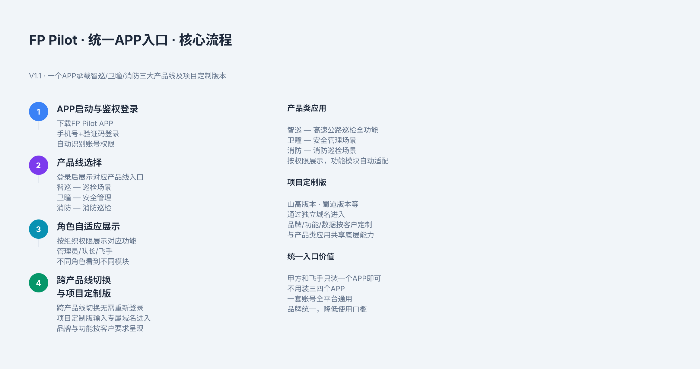

##### 业务价值

- 一个 APP 承载全产品线，降低用户使用门槛
- 项目独立域名满足定制化需求

##### 业务目标

- 甲方和飞手只装一个 APP 就能用所有飞派产品，不用装三四个 APP
- 项目定制版通过独立域名进入，品牌和功能都按客户要求来

##### 配图

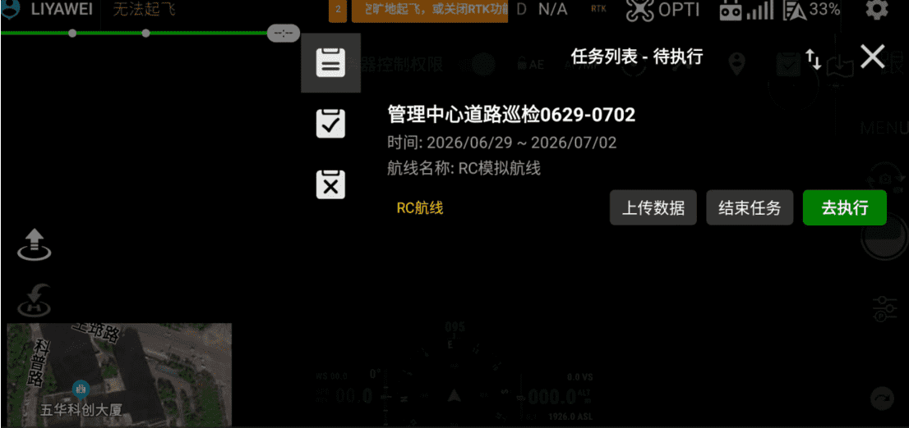

---

## 十四、Q3 重点建设方向

1. **飞行控制平台能力闭环** — 航线管理、机载动作、断点续飞、设备管理构成完整的无人机巡检管控底座，支撑多产品线复用。

2. **智能调度能力建设** — 从人工调度走向基于资产与规则的自动调度，为全自动化巡检奠定基础。

3. **AI 算法平台体系化** — 数据集→算法开发→工程化管理→端侧应用的全链路打通，覆盖 7+ 巡检场景算法模型。

4. **资产数字化能力建设** — 高速公路资产从结构化入库到 BI 分析再到端侧应用展示，形成资产数据全生命周期管理。

5. **空间服务能力建设** — 三维模型管理+空间安全+地图引擎，为上层应用提供统一的空间数据基础设施。

6. **智巡产品线深度完善** — PC 端从 V1.8 到 V2.0，小程序端从 0 到 1，覆盖地图、航线、工单、事件、智能调度、资产管理等完整业务闭环。

7. **卫瞳与消防业务能力成型** — 两条新产品线在 Q3 完成从基础能力到高级能力（态势感知、多机协作、多模态大模型）的阶梯式交付。

8. **大屏产品矩阵建立** — 智巡/卫瞳/消防/飞派云四大屏集中交付，形成覆盖全产品线的指挥监控大屏矩阵。

9. **运营中台能力建设** — 从账号与费用管理到全维度数据统计、告警工单闭环、行业数据分析，运营能力逐月递进。

10. **统一 APP 入口（FP Pilot）** — 承载智巡、卫瞳、消防三大产品线及项目定制版本，降低用户使用门槛，统一品牌入口。

---

## 附录：模块依赖关系矩阵

> 以下展示各模块之间的强/弱依赖关系，供排期与风险管理参考

| 上层模块 | 依赖模块 | 依赖类型 |
|---------|---------|---------|
| 智巡-航线管理 | 飞派云-飞行控制平台、智巡-地图管理 | 强依赖 |
| 智巡-智能调度 | 智巡-航线管理、资产数字-资产管理、智巡-设备管理 | 强依赖 |
| 智巡-算法管理 | AI 算法-算法工程平台、AI 算法-场景算法 | 强依赖 |
| 智巡-资产管理(端侧) | 资产数字-资产管理 | 强依赖 |
| 智巡-组织管理 | 飞派云-统一组织权限 | 强依赖 |
| 智巡-设备管理 | 飞派云-设备管理 | 强依赖 |
| 智巡-断点续飞 | 飞派云-断点续飞 | 强依赖 |
| 智巡-工单管理 | 飞派云-统一组织权限 | 强依赖 |
| 智巡-事件管理 | 智巡-工单管理、AI 算法-场景算法 | 强依赖 |
| 智巡-生态对接 | AI 算法-大疆妙算集成 | 强依赖 |
| 智巡-CAD叠加 | 飞派云-CAD叠加、智巡-地图管理 | 强依赖 |
| 卫瞳-地图航线 | 飞派云-飞行控制平台、空间服务 | 强依赖 |
| 卫瞳-CAD叠加 | 飞派云-CAD叠加 | 强依赖 |
| 卫瞳-小程序 | 智巡-小程序（框架复用） | 弱依赖 |
| 消防-RC接入 | 飞派云-飞行控制平台 | 强依赖 |
| 消防-通道占用算法 | AI 算法-消防算法模型 | 强依赖 |
| 消防-多机协作 | 消防-地图航线、AI 算法-场景算法 | 强依赖 |
| 消防-多模态大模型 | 生态大模型对接 | 强依赖 |
| 消防-小程序 | 智巡-小程序（框架复用） | 弱依赖 |
| 资产数字-资产管理 | 空间服务、飞派云-统一权限 | 强依赖 |
| 资产数字-BI分析 | 资产数字-资产管理 | 强依赖 |
| AI 算法-妙算集成 | AI 算法-场景算法模型 | 强依赖 |
| AI 算法-工程平台 | AI 算法-场景算法模型 | 强依赖 |
| AI 算法-海康大华适配 | 飞派云-多源数据接入 | 强依赖 |
| 大屏-智巡 | 智巡 PC V1.9、运营中台 V1.1 | 强依赖 |
| 大屏-卫瞳 | 卫瞳 PC V1.0、运营中台 V1.1 | 强依赖 |
| 大屏-消防 | 消防 PC V1.3、运营中台 V1.1 | 强依赖 |
| 大屏-飞派云 | 飞派云 V2.1、运营中台 V1.1 | 强依赖 |
| 运营中台-告警工单 | 运营中台-数据统计 | 强依赖 |
| 运营中台-数据分析 | 资产数字-资产管理、运营中台-数据统计 | 强依赖 |
| FP Pilot | 智巡/卫瞳/消防产品后端、飞派云-统一权限 | 强依赖 |

---

## 附录：核心业务端到端流程

### 高速公路巡检全流程

> 从资产入库到报告归档的端到端巡检闭环（8步）

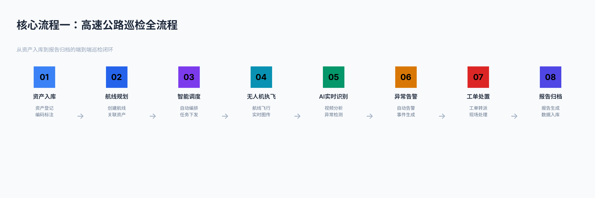

### 消防态势感知全流程

> RC设备推流到指挥调度闭环的多维态势感知链路（7步）

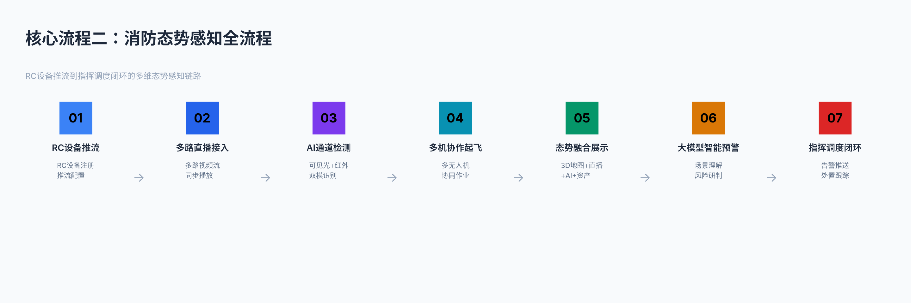

### AI 算法全链路

> 从数据采集到模型迭代的 AI 算法研发与工程化闭环（7步）

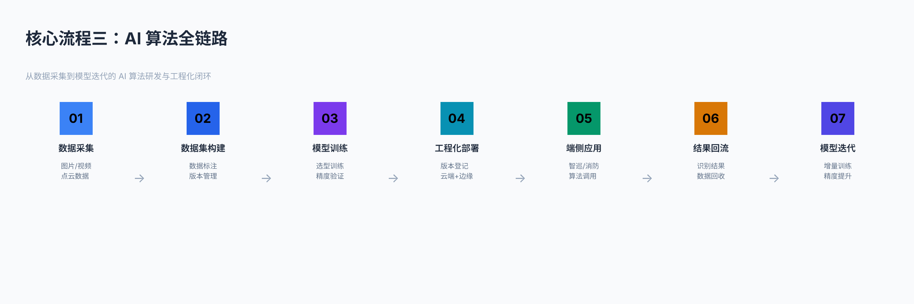
