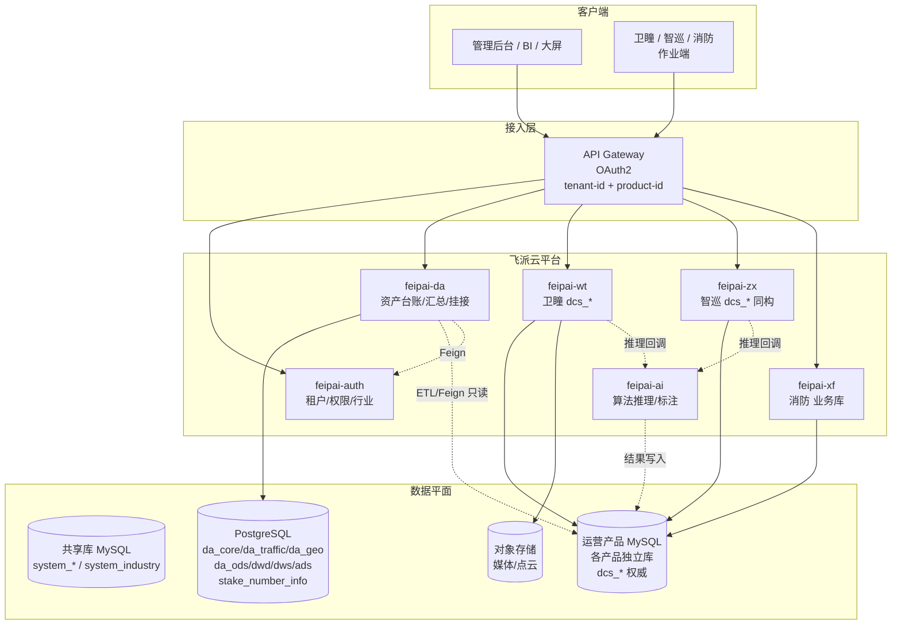
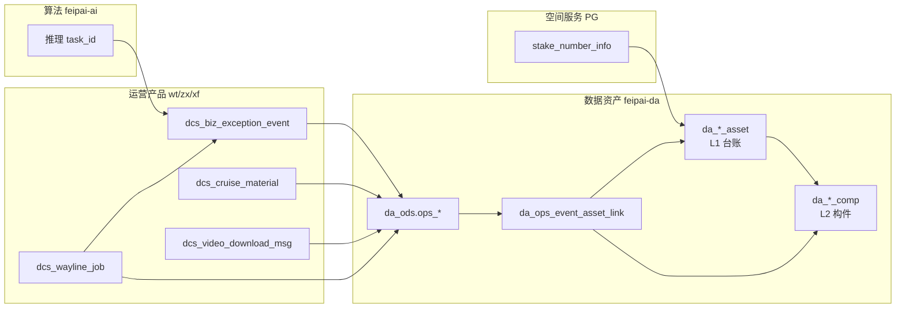
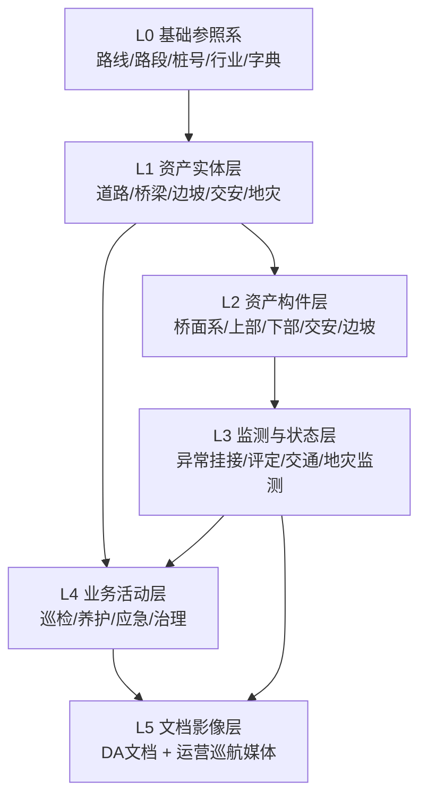
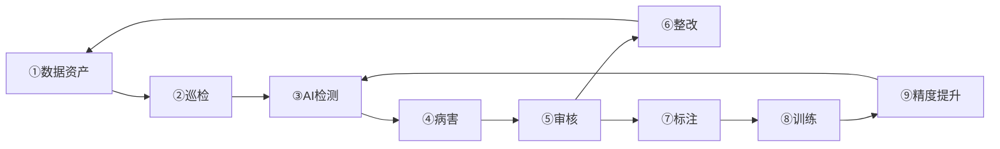

# 数据资产平台 — 系统架构设计

> **文档版本**：3.3  
> **编写日期**：2026-05-27  
> **适用范围**：高速公路统一资产管理与数据资产平台（道路、桥梁、边坡、交安设施、交通状况、地质灾害）  
> **关联需求**：[../需求文档](../需求文档/)  
> **关联设计**：[数据资产平台-详细设计说明书](./数据资产平台-详细设计说明书.md)（V3.8）  
> **关联架构**：[多租户多产品架构设计](../../multi-tenant-multi-product-design.md)、[多租户多产品详细设计](../../多租户多产品-详细设计说明书.md)  
> **关联产品**：[feipai-cloud-wt-server 详细设计](../sql/feipai-cloud-wt-server-详细设计.md)（卫瞳/智巡同构 `dcs_*`）  
> **状态**：待评审

---

## 修订记录

| 版本 | 日期 | 说明 |
|------|------|------|
| 1.0 | 2026-04-01 | 初稿：采集-治理-服务-展现通用架构 |
| 2.0 | 2026-05-20 | 结合需求文档完善领域架构；对齐飞派云多租户多产品体系 |
| 2.1 | 2026-05-20 | 分析存储改为 PostgreSQL；L0 对齐 `stake_number_info`；运营数据复用卫瞳已有能力 |
| 2.2 | 2026-05-20 | 与详细设计 V3.1 对齐；补充 MQI 分项、日常/经常双巡检 |
| **3.0** | **2026-05-27** | **与详细设计 V3.5 对齐**：运营产品方案 A（`ops_*` + `source_product_code`）；智巡/消防/算法集成边界；`da_ops_event_asset_link`；行业维度 `industry_id`；构件四级树与上/下部结构 |
| **3.1** | **2026-05-27** | **行业收窄（V3.6）**：`industry_id` 仅区分资产与检测算法；不纳入统一 Header 与数据权限过滤 |
| **3.2** | **2026-05-27** | **巡航多媒体 + 空间服务（V3.7）**：`dcs_video_download_msg` ODS；资产 `stake_info_id` ↔ `stake_number_info` |
| **3.3** | **2026-05-27** | **九阶业务闭环（V3.8）**：资产→巡检→AI→病害→审核→整改→标注→训练→精度提升 |

---

## 1. 背景与建设目标

### 1.1 业务背景

根据需求文档，平台需支撑业主**统一资产管理**与**多产品线运营数据融合**，覆盖：

| 领域 | 需求来源 | 核心能力 |
|------|----------|----------|
| 道路（路基路面） | 高速公路资产结构化数据清单 | 路段台账、路面/路基构件、MQI/PQI/SCI 评定、养护工程 |
| 桥梁 | 道路桥梁资产结构化数据说明、桥梁经常化巡检 | 分桥型构件分解（桥面系/上部/下部）、病害记录、技术状况评定、巡检闭环 |
| 边坡 | 高速公路资产结构化数据清单 | 边坡台账、风险等级、监测与治理 |
| 交安设施 | 高速公路资产结构化数据清单 | 标志/标线/护栏等构件化台账与检查 |
| 交通状况 | 交通状况管理数据结构 | 交通流、交通事件（GB/T 44416—2024）、运行态势 |
| 地质灾害 | 地质灾害点管理结构化数据清单 | 一患一档、监测预警、巡查应急、治理闭环 |
| 构件编码 | 轻量级解体式构件数据体系 | 分桥型构件编码 + RTK 自动映射 + AI 病害识别 |
| 数据关系 | 资产数据关系架构 | L0~L5 统一数据底座、「路线—路段—桩号」空间基准 |

**生态协同**（与详细设计 V3.5 一致）：

| 系统 | 产品 code | 在架构中的角色 |
|------|-----------|----------------|
| 飞派云 | `feipai-auth` | 租户、用户、组织、权限、行业主数据 `system_industry` |
| 数据资产 | `feipai-da` | **资产台账权威源**、汇总分析、跨域报表 |
| 飞派卫瞳 | `feipai-wt` | 航线/任务/异常/媒体（已上线，`dcs_*` 权威） |
| 飞派智巡 | `feipai-zx` | 与卫瞳 **同构 `dcs_*`**，方案 A 统一 ODS |
| 飞派消防 | `feipai-xf`（规划） | 独立业务库；119 火情等同构或扩展 ODS |
| 飞派算法 | `feipai-ai` | 推理/标注；结果写入运营产品异常表，DA 消费挂接 |

数据资产平台**不重复建设**各运营产品的航线、任务、异常审核、巡航媒体能力，而是通过 **空间键 + `source_product_code` + 挂接表** 将业务事实关联到 `da_*_asset` 台账。

### 1.2 建设目标

| 目标 | 说明 |
|------|------|
| 统一数据底座 | 以「路线—路段—桩号」为空间基准，整合资产实体、监测状态、业务活动、文档影像 |
| 全链路资产化 | 源系统与云侧数据经治理成为可检索、可血缘、可计量的数据资产 |
| 结构化 + 非结构化统一 | 台账/构件/病害等结构化数据与照片、视频、点云等统一元数据索引 |
| **九阶业务闭环** | 数据资产→巡检→AI 检测→病害→审核→整改→标注→算法训练→精度提升（详见详细设计 §13） |
| AI 与人工协同 | 算法推理 → 运营异常表 → DA 挂接构件 → 审核 → 样本回流训练 |
| 多形态展现 | 固定报表、自助 BI、运营大屏、专题统计同源不同视 |
| **多租户多产品** | 同一租户可开通卫瞳、智巡、消防、数据资产等；租户与产品正交 |
| **多行业** | 资产主表与检测算法配置含 `industry_id`；须 ∈ 租户 `industry_ids`；**非** Header/数据权限维度 |
| **存量桩号兼容** | 复用 PostgreSQL `stake_number_info` / `stake_verification`，多产品共用 |
| **运营数据复用** | 各产品 `dcs_*` 为权威源；DA 经 `da_ods.ops_*` 镜像 + `da_ops_event_asset_link` 挂接 |

### 1.3 非目标（本期可后置）

- 跨产品单库分布式强一致事务（采用最终一致性 + 幂等补偿）。
- 替换现有 OAuth2 / Spring Security 基础模型（在其上扩展声明）。
- 算法平台全量 SaaS 化（当前 S0，见项目管理规范；DA 仅消费推理结果）。
- 隧道、服务区、机电设施等扩展域（架构预留 L1 扩展点）。

---

## 2. 架构原则

| 原则 | 说明 |
|------|------|
| 租户与产品正交 | **租户**标识组织边界；**产品**标识业务域与数据源。DA 会话绑定 `feipai-da`，查询运营数据时带 `source_product_code`。 |
| 行业与租户联动 | 资产主表与检测算法配置含 **`industry_id`**，对齐 `system_industry`；写入须校验 ∈ 租户 `industry_ids`；**不**作为网关 Header 或数据权限过滤维度。 |
| 双库同语义 `tenant_id` | 共享库与 PostgreSQL `da_*` 中同一客户 `tenant_id` 一致。 |
| 空间基准统一 | `road_section_number` + `stake_number`/`pile_number` + `direction`；坐标以 `stake_number_info` 为准。 |
| 一基多脉 | L0 参照系 → L1 资产 → L2 构件 → L3 监测状态 → L4 业务活动 → L5 文档影像。 |
| 台账权威在 DA | `da_*_asset` / `da_*_comp` 为结构化资产权威；运营库不重复建资产主表。 |
| 运营不重复 | 航线/任务/异常/媒体归属各运营产品 `dcs_*`；DA 只做 ODS 镜像与挂接。 |
| 方案 A 统一 ODS | `da_ods.ops_*` + **`source_product_code`** 区分卫瞳/智巡/消防等，不按产品复制 ODS 表。 |
| 病害不双写 | 不在 DA 建 `da_*_defect`；以 `dcs_biz_exception_event` 为权威，DA 用 `da_ops_event_asset_link` 挂接。 |
| 展现层只读汇总 | BI/大屏经 `da_dws` / `da_ads` 与语义层出数，不直连 ODS 明细。 |
| 插件化扩展 | 新运营产品、新资产类型、新算法版本可灰度接入（配置 + Job 实例）。 |

---

## 3. 多租户多产品总体架构

### 3.1 逻辑视图



### 3.2 租户—产品—行业—数据隔离模型

| 维度 | 共享库（MySQL） | PostgreSQL（DA + 桩号） | 运营产品库（MySQL，按产品分库） |
|------|----------------|-------------------------|--------------------------------|
| 租户 `tenant_id` | 行级隔离 | `da_*` 行级；桩号按 `project_id`/租户映射 | `dcs_*` 含 `tenant_id` |
| 产品 `product_id` | 角色/菜单；`system_tenant_product` 开通 | DA API 会话 = `feipai-da` | 各产品独立会话（wt/zx/xf） |
| 行业 `industry_id` | `system_industry`；租户 `industry_ids` | 资产主表 + `da_comp_template`/`da_comp_defect_mapping` | 运营产品 `dcs_algorithm` 等可按行业配置 |
| 部门 `dept_id` | `system_dept` | `DeptDataPermissionRule` 过滤 | `dcs_*` 含 `dept_id` |
| 项目 `project_id` | — | 对齐 `stake_number_info.project_id` | 任务/养护项目维度 |
| Schema | — | `da_core`/`da_traffic`/`da_geo`/`da_ods`/`da_dwd`/`da_dws`/`da_ads` | 各产品独立 datasource |

**产品编码（`system_product`）**：

| code | 说明 | 与 DA 关系 |
|------|------|------------|
| `feipai-da` | 数据资产平台 | 本系统；资产台账权威 |
| `feipai-wt` | 飞派卫瞳 | `source_product_code=feipai-wt`；ETL 源库 |
| `feipai-zx` | 飞派智巡 | `source_product_code=feipai-zx`；同构 `dcs_*` |
| `feipai-xf` | 飞派消防（规划） | 扩展 `ops-integrations`；119 火情等 |
| `feipai-ai` | 飞派算法平台 | 不直连 DA 资产表；结果经运营异常表回流 |
| `feipai-auth` | 统一认证 | 租户/权限/行业/组织 |

### 3.3 与运营产品的职责边界（方案 A）

运营产品库内 **`dcs_*` 表结构一致**（卫瞳/智巡已确认）；DA 采用 **`da_ods.ops_*` + `source_product_code`**，不按产品复制 ODS 表。

| 能力 | 权威系统 | 数据资产平台做法 |
|------|----------|------------------|
| 航线库 / 航点 | 各产品 `dcs_wayline*` | **不建表**；仅存 `wayline_id` 引用 |
| 航线任务 | 各产品 `dcs_wayline_job` | **不建表**；`da_bridge_inspection_archive`：`source_product_code` + `ops_job_id` |
| 异常/病害 | 各产品 `dcs_biz_exception_event` | **不建表**；ETL → `da_ods.ops_exception_event`；`da_ops_event_asset_link` 挂接 |
| 巡航媒体 | 各产品 `dcs_cruise_material` | **不建表**；ETL → `da_ods.ops_cruise_material` 或 Feign |
| 机场多媒体推送 | 各产品 `dcs_video_download_msg` | **不建表**；ETL → `da_ods.ops_video_download_msg`（含 POS，供 RTK） |
| 空间服务桩号 | PG `stake_number_info` | **只读**；资产 `stake_info_id` 关联；`da_*_geom` 扩展几何 |
| 算法配置 | 各产品 `dcs_algorithm` 或 `feipai-ai` | 联邦查询；标签映射 `exception_event_type` |
| 桩号坐标 | PG `stake_number_info` | **只读共用**；禁止 DA 重复维护桩号主数据 |
| 资产/构件台账 | DA `da_*_asset` / `da_*_comp` | **权威**；运营事件通过挂接表关联 |
| 119 火情（消防） | `dcs_fire_119_incident`（产品库） | 规划 `ops_fire_incident` ODS 或扩展 `asset_domain=FIRE` 挂接 |

**新增运营产品接入步骤**：`system_tenant_product` 开通 → `feipai.da.ops-integrations` 增加 datasource → 注册 xxl-job 同步实例 → **无需新建 ODS 表结构**。

### 3.4 请求上下文

| 字段 | 传递方式 | 说明 |
|------|----------|------|
| `tenant-id` | HTTP Header / RPC / MQ | 强制；`TenantContextHolder` |
| `product-id` | 同上 | 当前会话产品；访问 DA API 时为 `feipai-da` |
| `project-id` | 可选 | 对齐 `stake_number_info.project_id` |
| `source-product-code` | DA 查询运营数据时 | `feipai-wt` / `feipai-zx` / `feipai-xf`；BFF 或 API 参数 |

**数据权限（AND 叠加）**：`tenant_id` + `dept_id`（`DeptDataPermissionRule`）+ 路段授权（`da_user_road_scope`）+ `project_id`。

**行业（非 Header）**：`industry_id` 仅存在于资产主表与检测算法配置；列表筛选等业务场景通过 **API 查询参数**（如 `industryId`）或关联资产取值，不参与上述数据权限 AND 链。

### 3.5 资产 ↔ 运营 ↔ 算法 关联模型



| 关联键 | 用途 |
|--------|------|
| `road_section_number` + `pile_number`/`stake_number` | 空间定位；对齐 `stake_number_info` |
| `source_product_code` + `source_event_id` | 定位运营库异常记录 |
| `source_product_code` + `ops_job_id` | 定位航线任务与归档 |
| `asset_id` + `comp_id` | DA 台账与构件实例 |
| `span_no` + `region_zone` | 桥梁三级定位（桥跨 + 上/中/下） |
| `task_id`（异常表） | 回溯算法推理任务 |

**自动挂接优先级**（详见详细设计 §7）：RTK 多边形 → 病害-构件对照 → 桩号+路段 → 人工 `PUT .../link`。

---

## 4. 领域逻辑架构（统一数据底座 L0~L5）



### 4.1 L0：基础参照系

| 类型 | 表/系统 | 说明 |
|------|---------|------|
| 存量桩号 | `stake_number_info`、`stake_verification` | **禁止重复建设**；多产品只读 |
| 路段扩展 | `da_road_section_ext` | `road_section_number` 为主键 |
| 路线 | `da_route` | `route_code`；含 `industry_id` |
| 组织权限 | `system_dept`（认证中心） | `dept_id` 数据权限 |
| 行业 | `system_industry`（认证中心） | `industry_id`；租户 `industry_ids` |
| 空间服务 | `stake_number_info`（PG public） | 资产 `stake_info_id`；路段 `road_section_number` |
| 字典 | `da_dict` + 各产品 `dcs_asset_exception_type` | 病害类型树按 `source_product_code` 读源库 |

### 4.2 L1：资产实体层

| 资产类型 | Schema/表 | 关键关联 |
|----------|-----------|----------|
| 道路 | `da_core.da_road_asset` | `road_section_number` |
| 桥梁 | `da_core.da_bridge_asset` | `bridge_code`；桥型；养护检查等级 |
| 边坡 | `da_core.da_slope_asset` | `slope_code`；风险等级 |
| 交安 | `da_core.da_ts_asset` | `facility_code` |
| 地灾 | `da_geo.da_geo_hazard` | `hazard_id`；一患一档 |

**资产基类公共字段**（与详细设计 §3.4 一致）：

`tenant_id, dept_id, project_id, road_section_number, maintain_org_id, effective_date, expire_date` + 审计字段；**资产主表**另含 `industry_id`（区分行业资产类型）。

### 4.3 L2：资产构件层

- **桥梁四级树**：`da_comp_template`（`parent_id` + `comp_level`）+ `da_bridge_comp`（`parent_comp_id`）。
- **部位 `part_code`**：`DECK` 桥面系 · `SPAN` 上部结构 · `SUB` 下部结构 · `ATTACH` 附属。
- **桥型修饰码**：L/A/S/C/D/H；编码示例 `S-SB-03-09`。
- **道路**：`da_subgrade_comp` / `da_pavement_comp`（RD-SB / RD-PM）。
- **交安**：`da_ts_comp`（TS-01 ~ TS-12）。
- **边坡**：`da_slope_comp`（SP-01 ~ SP-12）。
- **RTK**：`da_bridge_rtk_mapping` 支持构件级 GPS 归属。

### 4.4 L3：监测与状态层

| 数据类 | 存储与关联 | 说明 |
|--------|------------|------|
| 异常/病害 | `dcs_biz_exception_event` + `da_ops_event_asset_link` | **不在 DA 建病害主表** |
| 技术状况评定 | `da_*_condition_assessment` | 桥梁含 `score_upper/lower/deck` |
| 交通流/事件 | `da_traffic.*` | GB/T 44416 七类事件扩展表 |
| 地灾监测 | `da_geo_monitor` / `da_geo_monitor_data` | 时序；按月分区 |
| 地灾预警 | `da_geo_warning` | 黄/橙/红 |

### 4.5 L4：业务活动层

| 活动 | 关联 |
|------|------|
| 巡检计划/记录 | `asset_id`；归档 `source_product_code` + `ops_job_id` |
| 养护工程 | `asset_id`；构件编码列表 |
| 交通处置 | `da_traffic_disposal` → 事件 |
| 地灾应急/治理 | `da_geo_emergency` / `da_geo_remedy` |

### 4.6 L5：文档影像层

| 类型 | 做法 |
|------|------|
| 巡航影像 | `da_ods.ops_cruise_material` + `da_ods.ops_video_download_msg` 或 Feign 源库；**不入** `da_document` |
| 资产专题文档 | `da_core.da_document`（报告、图纸、评定附件） |
| 地灾/交通文档 | `da_geo_document` 等 |

---

## 5. 技术架构（分层）

### 5.1 总体技术栈

| 层次 | 技术选型 | 说明 |
|------|----------|------|
| 网关 | Spring Cloud Gateway | OAuth2、`tenant-id` / `product-id` |
| 微服务 | Spring Boot 3 + feipai-framework | `feipai-module-da-server`（规划） |
| 主存储 | PostgreSQL 14+ / PostGIS | `da_*` + `stake_number_info`；分 schema |
| 运营库 | MySQL（按产品分库） | `dcs_*` 只读集成 |
| 共享库 | MySQL | 认证、`system_industry` |
| 调度 | xxl-job | `Ops*SyncHandler` 多实例（按 `productCode`） |
| 对象存储 | MinIO / OSS | 媒体、点云 |
| 消息 | RocketMQ / Kafka | 任务完成、挂接完成事件（可选） |
| BI | Superset / DataEase / 帆软 | 读 `da_ads` |
| 缓存 | Redis | 字典、大屏指标 |

### 5.2 数据流架构

```mermaid
flowchart LR
    subgraph Source["数据源"]
        OPS[(运营 MySQL×N\nfeipai-wt/zx/xf\ndcs_*)]
        STAKE[(PG stake_number_info)]
        ETC[交通/地灾外部]
        AI[feipai-ai 推理]
    end

    subgraph Ingest["采集集成"]
        JOB[xxl-job\nOpsWaylineJobSyncHandler\nOpsExceptionSyncHandler\nOpsMaterialSyncHandler]
        LINK[挂接服务\nRTK/规则/人工]
    end

    subgraph PG["PostgreSQL"]
        BIZ[(da_core 台账)]
        ODS[(da_ods.ops_*)]
        DWD[(da_dwd)]
        DWS[(da_dws)]
        ADS[(da_ads)]
    end

    subgraph Serve["服务展现"]
        API[/da/api/v1]
        BI[BI/大屏]
    end

    OPS --> JOB --> ODS
    AI -.写入.-> OPS
    JOB --> LINK --> BIZ
    STAKE --> BIZ
    ODS --> DWD --> DWS --> ADS
    BIZ --> API --> BI
    ADS --> API
```

### 5.3 与飞派业务系统集成

| 源系统 | 集成内容 | 方式 |
|--------|----------|------|
| **运营产品**（wt/zx/xf） | `dcs_wayline_job`、`dcs_biz_exception_event`、`dcs_cruise_material`、`dcs_video_download_msg` | ETL → `da_ods.ops_*`；`source_product_code` 区分 |
| **飞派云** | 用户/租户/权限/行业 | 共享库 + Feign |
| **桩号** | `stake_number_info` | PG 只读；归一化 `pile_number` |
| **飞派算法** | 推理→标注→训练→发版（③⑦⑧⑨） | 结果写 `dcs_biz_exception_event`（`task_id`）；已审样本回流训练；DA 汇总闭环 KPI |
| **外部交通** | ETC 门架等 | `da_traffic_flow_*` / `da_ods.traffic_raw` |
| **消防** | `dcs_fire_119_incident` 等 | 同构则复用 Handler；异构则扩展 ODS + `asset_domain` |

**任务完成 → DA 同步（推荐链路）**：

1. 运营产品 `dcs_wayline_job.status = 完成`
2. xxl-job `OpsWaylineJobSyncHandler(productCode)` 增量同步 → `da_ods.ops_wayline_job` + `da_bridge_inspection_archive`
3. `OpsExceptionSyncHandler` → `da_ods.ops_exception_event`；桩号关联 `stake_number_info`，失败入 `da_stake_unmatched`
4. `OpsVideoDownloadSyncHandler` → `da_ods.ops_video_download_msg`（含 `pos_url`，供 RTK）
5. 挂接服务：RTK / `da_comp_defect_mapping` / 人工 → `da_ops_event_asset_link`
6. 运营审核完成 → `AiSampleExportHandler`（规划）推送 feipai-ai 标注样本
7. `DwsBridgeDefectDailyJob` 等写入 `da_dws` / `da_ads`（含闭环 KPI）

**配置示例**：

```yaml
feipai:
  da:
    product-id: 30
    ops-integrations:
      - product-code: feipai-wt
        datasource: wt_slave
      - product-code: feipai-zx
        datasource: zx_slave
      # - product-code: feipai-xf
      #   datasource: xf_slave
```

---

## 6. 部署架构

### 6.1 推荐部署拓扑

```
                    [负载均衡]
                         |
              [API Gateway 集群]
          /      |      |      \
   [auth-server] [da-server] [wt-server] [zx-server] [xf-server]
         |            |           \         |         /
   [共享库 MySQL]   [PostgreSQL 主从\n da_* + stake]
                    [运营 MySQL 主从 × 产品]
                    [MinIO] [Redis] [xxl-job-admin]
```

### 6.2 环境划分

| 环境 | 用途 |
|------|------|
| dev | 单租户沙箱；Mock 运营源 |
| test | 多租户、多产品、多行业联调 |
| prod | PG 分区；按租户限流；ODS 增量同步 SLA 15min |

### 6.3 多租户资源隔离

- **计算**：xxl-job 按 `tenant_id` 分片；每运营产品独立 Job 实例（`productCode` 入参）。
- **存储**：`da_geo_monitor_data` 按月 RANGE 分区；大租户可选 schema 隔离。
- **网络**：API 按租户 QPS；导出审批 `da_export_approval`。

---

## 7. AI、巡检与九阶业务闭环架构

### 7.1 三系统协同（闭环主体）

| 系统 | 闭环阶段 | 职责 | 数据落点 |
|------|----------|------|----------|
| **feipai-da** | ①⑥⑨ | 资产台账、巡检计划、挂接、养护记录、指标汇总 | `da_*_asset`、`da_ops_event_asset_link`、`da_*_maintenance`、`da_ads` |
| **feipai-wt/zx** | ②③④⑤⑥ | 任务执行、媒体、病害主表、人工审核、养护工单 | `dcs_wayline_job`、`dcs_*_material`、`dcs_biz_exception_event`、`dcs_conserve_task` |
| **feipai-ai** | ③⑦⑧⑨ | 推理、标注、训练、发版、评测回流 | `task_id`、样本集、模型版本（平台内） |



### 7.2 职责划分（组件级）

| 组件 | 职责 | 数据落点 |
|------|------|----------|
| 飞控 + 无人机 | 采集影像、RTK POS | `dcs_cruise_material` + `dcs_video_download_msg`（`pos_url`） |
| 运营产品 | 任务编排、审核、养护工单 | `dcs_wayline_job`、`dcs_biz_exception_event`、`dcs_conserve_task` |
| 算法平台 | 推理、标注、训练发版 | 结果写异常表 `task_id`；样本与模型在 `feipai-ai` |
| 数据资产 | 台账、挂接、整改记录、闭环指标 | `da_*_asset`、`da_ops_event_asset_link`、`da_*_maintenance`、`da_ads` |

### 7.3 构件 RTK 与 AI 挂接（④ 阶段）

1. **建档（①）**：`da_bridge_rtk_mapping` + `stake_info_id`。
2. **采集（②③）**：巡航媒体 + POS；`ai_analysis_status` 驱动推理。
3. **推理（③）**：`feipai-ai` → `dcs_biz_exception_event`（`task_id`）。
4. **同步与挂接（④）**：ETL → `da_ods.ops_exception_event` → `da_ops_event_asset_link`。
5. **审核（⑤）**：运营 `status`/`review_*`；已审样本导出至 AI（⑦）。
6. **整改（⑥）**：`da_bridge_maintenance` + `dcs_conserve_task`；评定更新。
7. **训练回流（⑦~⑨）**：标注 → 训练 → 发版 → 新模型回到 ③；`da_ads` 对比迭代效果。

### 7.4 闭环数据流（端到端）

```
① da_*_asset + RTK
  → ② da_*_inspection_plan + dcs_wayline_job
  → ③ feipai-ai 推理 → dcs_biz_exception_event (task_id)
  → ④ da_ops_event_asset_link + da_ods.ops_*
  → ⑤ 运营审核 status=1
  → ⑥ da_*_maintenance / dcs_conserve_task
  → ⑦ feipai-ai 标注（已审样本）
  → ⑧ 训练发版
  → ⑨ 指标对比 → 回流 ③
```

阶段说明、关联键、Job/事件、验收指标见《[数据资产平台-详细设计说明书](./数据资产平台-详细设计说明书.md)》**§13**。

---

## 8. 安全架构

| 层级 | 措施 |
|------|------|
| 认证 | OAuth2 / JWT；`tenant_id`、`product_id` |
| 授权 | RBAC（按产品）+ `DeptDataPermissionRule` + 路段 scope |
| 行业 | 资产/算法表 `industry_id` 写入校验 ∈ 租户 `industry_ids`；非 Header 过滤 |
| 数据 | 行级 `tenant_id`；坐标脱敏可配置 |
| 网关 | `product_id` 开通校验；内网 Feign 信任域 |
| 审计 | `da_audit_log`；导出审批 |

---

## 9. 非功能需求

| 类别 | 指标（建议） |
|------|--------------|
| 性能 | 常规 API P95 < 2s；大屏 5~30s 刷新 |
| 可用性 | 核心 99.9%；ETL 成功率 ≥ 99.5% |
| 扩展 | ≥ 200 租户；运营产品插件化接入 |
| 容灾 | PG / MySQL 主从；MinIO 跨 AZ |
| 可观测 | ETL 延迟、挂接率、`da_stake_unmatched` 积压监控 |

---

## 10. 实施阶段建议

| 阶段 | 周期 | 交付 |
|------|------|------|
| 一 | 4~6 周 | 多租户+行业；`stake_number_info`；桥梁/道路台账；WT/Zx `ops_*` 同步；`da_ops_event_asset_link`；闭环 ①②④ |
| 二 | 4~6 周 | L2 构件树；RTK 映射；自动挂接；`da_dws`/`da_ads`；闭环 ③⑤⑥（与运营/AI 联调） |
| 三 | 4~6 周 | 交通/地灾；智巡合并；闭环 ⑦⑧⑨ 样本导出与指标看板 |
| 四 | 持续 | 算法平台 S2；模型迭代自动化；消防/新行业；隧道预留 |

---

## 11. 风险与缓解

| 风险 | 缓解 |
|------|------|
| 多产品 `job_id` 冲突 | ODS 联合键 `(source_product_code, source_id)` |
| 挂接率低 | `da_stake_unmatched` / `da_rtk_unmapped` 运营看板；人工补挂 API |
| 算法/运营/DA 口径不一致 | `dcs_asset_exception_type` 与 `da_comp_defect_mapping` 对照表 |
| 多租户越权 | 网关 + 插件 + 自动化负例测试 |
| 消防异构表 | 先评估同构 `dcs_*`；异构单独 ODS 表 + 统一 link 模型 |

---

## 12. 附录

### 12.1 需求文档索引

| 文档 | 路径 |
|------|------|
| 资产数据关系架构 | `需求文档/资产数据关系架构.docx` |
| 道路桥梁资产结构化数据说明 | `需求文档/道路桥梁资产结构化数据说明.docx` |
| 高速公路资产结构化数据清单 | `需求文档/高速公路资产结构化数据清单（道路、边坡、交安设施）.docx` |
| 轻量级解体式构件数据体系 | `需求文档/轻量级、标准化的解体式构件数据体系.docx` |
| 桥梁经常化巡检 | `需求文档/桥梁经常化巡检.docx` |
| 交通状况管理数据结构 | `需求文档/交通状况管理数据结构.docx` |
| 地质灾害点管理结构化数据清单 | `需求文档/地质灾害点管理结构化数据清单.docx` |

### 12.2 产品注册建议（system_product）

| code | name | 说明 |
|------|------|------|
| feipai-da | 数据资产平台 | 资产台账 + PG 汇总 |
| feipai-wt | 飞派卫瞳 | 运营 `dcs_*`（已上线） |
| feipai-zx | 飞派智巡 | 同构 `dcs_*` |
| feipai-xf | 飞派消防 | 独立业务库（规划） |
| feipai-ai | 飞派算法平台 | 推理/标注（S0→S2） |
| feipai-auth | 飞派云统一权限 | 认证/组织/行业 |

### 12.3 DDL 与详细设计索引

| 内容 | 位置 |
|------|------|
| PostgreSQL DDL | `sql/postgresql/da/000~008` |
| 表字段与接口 | 《数据资产平台-详细设计说明书》V3.5 |
| 卫瞳源表契约 | 《feipai-cloud-wt-server 详细设计》 |
| 回归矩阵 | 详细设计 §18 |

---

*详细表结构、九阶业务闭环、接口契约、ETL 任务、需求回归矩阵见《[数据资产平台-详细设计说明书](./数据资产平台-详细设计说明书.md)》V3.8。*
