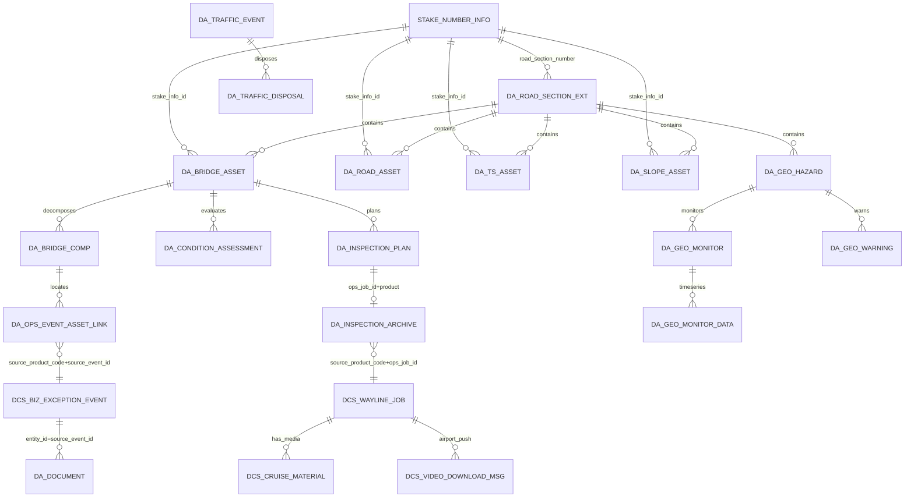
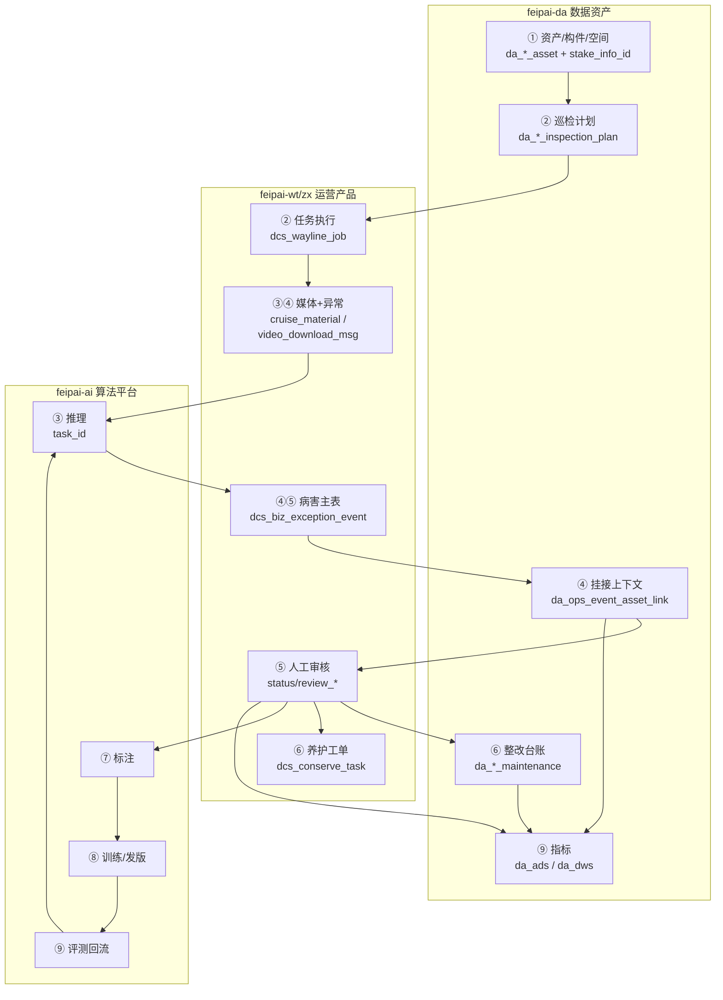
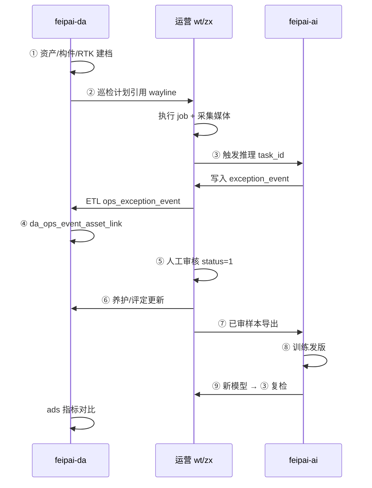

# 数据资产平台 — 详细设计说明书

> **文档版本**：3.8  
> **编写日期**：2026-05-27  
> **适用范围**：高速公路统一资产管理与数据资产平台全业务域  
> **关联文档**：[系统架构设计](./数据资产平台-系统架构设计.md)、[多租户多产品详细设计](../../多租户多产品-详细设计说明书.md)、[feipai-cloud-wt-server 详细设计](../sql/feipai-cloud-wt-server-详细设计.md)  
> **需求来源**：[../需求文档/](../需求文档/)  
> **技术基线**：Spring Boot 3、PostgreSQL 14+、PostGIS、xxl-job、MinIO、Redis  
> **状态**：待评审

---

## 修订记录

| 版本 | 日期 | 说明 |
|------|------|------|
| 1.0 | 2026-04-01 | 初稿 |
| 2.0~2.1 | 2026-05-20 | 领域模型、多租户、PG、桩号、卫瞳集成 |
| **3.0** | **2026-05-20** | 对照全部需求文档重写 |
| **3.1** | **2026-05-20** | **二次回归**：补全七层占位表、交通七类事件全字段、地灾/收费站/评定/日常巡查、MQI-BCI、质量与安全、回归矩阵 |
| **3.2** | **2026-05-22** | **病害复用卫瞳**：取消 `da_*_defect` 独立表，以 `dcs_biz_exception_event` 为权威源；`da_ops_event_asset_link` 挂接资产/构件；构件表增加 `parent_id` 层级 |
| **3.3** | **2026-05-22** | **部门数据权限**：资产及子表增加 `dept_id`，对接认证中心 `DeptDataPermissionRule` |
| **3.4** | **2026-05-22** | **运营产品统一集成（方案 A）**：`da_ods.ops_*` + `source_product_code`；支持卫瞳/智巡等同构 `dcs_*` 表 |
| **3.5** | **2026-05-27** | **行业维度**：业务表增加 `industry_id`，对齐认证中心 `system_industry`；与租户 `industry_ids` 联动过滤 |
| **3.6** | **2026-05-27** | **行业收窄**：`industry_id` 仅用于区分资产类型与检测算法配置；**不**纳入统一 Header 与数据权限过滤维度 |
| **3.7** | **2026-05-27** | **巡航多媒体**：补充 `dcs_video_download_msg` ODS 镜像；**空间服务**：资产主表 `stake_info_id` 关联 `stake_number_info` |
| **3.8** | **2026-05-27** | **九阶业务闭环**：数据资产→巡检→AI 检测→病害→审核→整改→标注→算法训练→精度提升（§13） |

---

## 1. 文档说明

### 1.1 目的

本说明书在架构设计基础上，按需求文档给出的**字段级清单**与**九阶业务闭环**（数据资产→巡检→AI 检测→病害→审核→整改→标注→算法训练→精度提升，见 §13），提供可直接指导建表、接口开发与验收的详细设计。

### 1.2 需求追溯矩阵

| 需求文档 | 设计章节 | 核心交付 |
|----------|----------|----------|
| 资产数据关系架构 | §4、§5 | L0~L5 分层、实体关系、关联汇总表 |
| 道路桥梁资产结构化数据说明 | §6.2 | 桥梁七层结构、病害/评定/养护/巡检全字段 |
| 轻量级解体式构件数据体系 | §7 | 构件编码、RTK 映射、病害-构件对照、三级定位 |
| 桥梁经常化巡检 | §6.2.5、§7.4、§12 | JTG 5120 检查等级/频率、经常检查记录表、低空巡检 |
| 高速公路资产结构化数据清单 | §6.1、§6.3、§6.4 | 道路 MQI/PQI/SCI、交安 TS-01~12、边坡 SP-01~12 |
| 交通状况管理数据结构 | §8 | 交通流、七类事件、服务评估、处置 |
| 地质灾害点管理结构化数据清单 | §9 | 一患一档、监测、预警、巡查、治理、应急 |
| feipai-cloud-wt-server 详细设计 | §10 | 航线/任务/异常/媒体复用，不重复建设 |

### 1.3 设计约束（与架构一致）

| 约束 | 说明 |
|------|------|
| 数据库 | **PostgreSQL**；ODS/DWD/DWS/ADS 为 schema，非 Doris |
| 桩号主数据 | 复用 `stake_number_info`、`stake_verification`，路段键为 `road_section_number` |
| 运营数据 | 航线库、航线任务、异常事件、巡航媒体以**各运营产品库 `dcs_*` 为权威源**（卫瞳/智巡等同构表，§10 方案 A 统一 ODS） |
| 空间三元组 | `route_code` + `stake_number`/`pile_number` + `direction`；坐标优先桩号表 |
| 主键 | 业务表 `varchar(50)` UUID 或 `bigserial`，与需求「全局唯一标识」一致 |

### 1.4 模块与 Schema 规划

```
feipai-module-da/
├── feipai-module-da-api/
└── feipai-module-da-server/

PostgreSQL schemas:
  public          — stake_number_info（已有，勿改语义）
  da_core         — 资产台账、构件（层级）、异常关联、巡检计划、养护、文档
  da_traffic      — 交通运行与事件
  da_geo          — 地质灾害
  da_ods/dwd/dws/ads — 汇总分析
```

---

## 2. 多租户、多产品与数据权限

### 2.1 租户与产品

| 产品 code | 职责 |
|-----------|------|
| `feipai-da` | 资产台账、交通/地灾、汇总报表 |
| `feipai-wt` | 飞派卫瞳：航线、任务、异常、媒体（已上线） |
| `feipai-zx` | 飞派智巡：航线、任务、异常、媒体（表结构与卫瞳一致） |
| `feipai-auth` | 认证、组织、权限 |

Token / Header：`tenant-id`（必填）、`product-id`（产品 API 必填）、`project-id`（可选，对齐 `stake_number_info.project_id`）。

**行业主数据（复用认证中心，不重复建设）**

| 表 | 说明 |
|----|------|
| `system_industry` | 平台级行业目录（`id`、`name`、`code`、`status`），`@TenantIgnore` |
| `system_tenant.industry_ids` | 租户所属行业集合（可多选），JSON/Set 存储 |

**行业字段用途（非 Header、非数据权限）**

`industry_id` **仅**用于区分**资产类型**与**检测算法配置**（构件模板、病害对照），对齐 `system_industry.id`；取值须 ∈ 当前租户 `industry_ids`，否则拒绝写入。查询侧通过业务参数（如资产列表筛选 `?industryId=`、按资产 `industry_id` 加载算法配置）使用，**不**作为网关统一 Header，**不**参与 `DeptDataPermissionRule` 等数据权限 AND 过滤。

### 2.2 数据权限

数据权限为**多维度叠加**（AND），查询时必须同时满足：

| 维度 | 实现 | 说明 |
|------|------|------|
| 租户 | `tenant_id` + MyBatis 租户插件 | 强制 |
| **部门** | **`dept_id` + `DeptDataPermissionRule`** | 对齐认证中心 `system_dept`；按角色 `dataScope` 过滤 |
| 路段 | `da_user_road_scope(user_id, road_section_number)` | 可选细粒度；未配置则仅按部门 |
| 项目 | `project_id` ∈ 用户授权项目列表 | Header `project-id` 或登录上下文 |

**部门权限（核心）**

- 资产主表及直接查询的子表（构件、评定、养护、巡检、文档、`da_ops_event_asset_link`）均含 **`dept_id BIGINT`**，与运营产品 `dcs_*` 表语义一致。
- 实现复用框架 `feipai-spring-boot-starter-biz-data-permission` 的 `DeptDataPermissionRule`：根据登录用户角色数据范围，自动拼接 `dept_id IN (...)` 或 `dept_id = ?`。
- 角色 `dataScope`（`system_data_scope`）：全部 / 指定部门 / 本部门 / 本部门及以下 / 仅本人（配合 `user_id` 可选扩展）。
- **`maintain_org_id`**：管养单位业务字段，可与 `dept_id` 相同或映射；**数据权限以 `dept_id` 为准**。

**`dept_id` 赋值规则**

| 场景 | 规则 |
|------|------|
| 新建路段扩展 | `da_road_section_ext.dept_id` = 管养部门（管理处/分处） |
| 新建资产 | 默认继承路段 `dept_id`；无路段时取当前登录用户 `dept_id` |
| 新建子记录（评定/养护/巡检/构件） | 冗余写入所属资产 `dept_id`（与 WT 一致，便于单表查询） |
| 运营异常挂接 | `da_ops_event_asset_link.dept_id` = 关联资产 `dept_id`；源库 `dcs_biz_exception_event.dept_id` 保持各产品权威 |
| 历史数据迁移 | 按 `maintain_org_id` → `system_dept` 映射回填 `dept_id` |

**`industry_id` 赋值规则（仅资产主表与检测算法配置表）**

| 场景 | 规则 |
|------|------|
| 新建路线 | `da_route.industry_id` = 请求体指定或租户主行业（`industry_ids` 首项） |
| 新建路段扩展 | 默认继承所属路线 `industry_id`；无路线时取请求指定或租户主行业 |
| 新建资产 | 默认继承路段 `industry_id` |
| 初始化/维护构件模板 | `da_comp_template.industry_id` = 目标行业；平台默认种子 `tenant_id=0` 时可空表示通用 |
| 初始化/维护病害对照 | `da_comp_defect_mapping.industry_id` = 与关联构件模板一致 |
| 按行业加载检测算法 | 推理/挂接时按关联资产 `industry_id` 选取 `da_comp_template`、`da_comp_defect_mapping` 与运营产品 `dcs_asset_exception_type` |
| 历史数据迁移 | 按租户 `industry_ids` 或业务域（如高速公路）映射回填资产主表 |

**生效 SQL 示例（本部门及以下，不含行业 Header 过滤）**

```sql
-- 框架/业务层追加（示意）
WHERE tenant_id = ?
  AND dept_id IN (10, 11, 12, ...)
  AND (road_section_number IN (...) OR 未配置路段授权)
```

**模块注册（`feipai-module-da-server`）**

```java
// DaDataPermissionConfiguration
rule.addDeptColumn(DaBridgeAssetDO.class);       // dept_id
rule.addDeptColumn(DaRoadAssetDO.class);
rule.addDeptColumn(DaBridgeCompDO.class);
rule.addDeptColumn(DaOpsEventAssetLinkDO.class);
// ... 其余含 dept_id 的 DO
```

### 2.3 配置示例

```yaml
feipai:
  da:
    product-id: 30                    # feipai-da 会话产品
    datasource:
      postgresql: da_master
    # 运营产品集成（方案 A）：表结构一致的 dcs_* 源，按 product-code 区分
    ops-integrations:
      - product-code: feipai-wt
        product-id: 21
        datasource: wt_slave            # 卫瞳 MySQL 只读
      - product-code: feipai-zx
        product-id: 2                 # 智巡 product_id 以 system_product 为准
        datasource: zx_slave            # 智巡 MySQL 只读
```

---

## 3. 统一数据底座（L0~L5）

### 3.1 分层定义

| 层级 | Schema/前缀 | 内容 |
|------|-------------|------|
| L0 | `public` + `da_core.da_route` 等 | 路线、路段扩展、桩号、字典 |
| L1 | `da_core.da_*_asset` | 道路/桥梁/边坡/交安实体 |
| L2 | `da_core.da_*_comp` | 构件实例 |
| L3 | `da_core` + `da_traffic` + `da_geo` + 运营产品 | 异常/病害（各产品 `dcs_biz_exception_event`）、评定、交通流/事件、地灾监测 |
| L4 | `da_core` + `da_traffic` + `da_geo` | 巡检、养护、应急、处置 |
| L5 | `da_core.da_document` + 运营产品媒体 | 文档影像；巡航媒体引用 `dcs_cruise_material` + `dcs_video_download_msg`（机场推送/POS） |

### 3.2 实体关系（Mermaid ER）



### 3.3 核心关联汇总（逻辑 FK）

| 源 | 目标 | 关联键 | 含义 |
|----|------|--------|------|
| 任意资产/事件 | 路段 | `road_section_number` | 与 `stake_number_info` 一致 |
| 任意点状业务 | 桩号 | `stake_number` 或 `pile_number` | 卫瞳用 `pile_number`，入库归一化 |
| 资产主表 | 空间服务桩号 | `stake_info_id` | 对齐 `stake_number_info.id`；与 `road_section_number`、起终点桩号一并维护 |
| 资产扩展几何 | 空间几何 | `da_*_geom` | PostGIS/GeoJSON；坐标须与 `stake_info_id` 解析结果一致 |
| 巡航任务 | 巡航素材 | `job_id` | `dcs_cruise_material`（业务素材）+ `dcs_video_download_msg`（机场推送/POS） |
| 构件 | 资产 | `asset_id` | |
| 构件 | 父构件 | `parent_comp_id` | 树形层级，根节点为空 |
| 构件模板 | 父模板 | `parent_id` | 四级树：部位→构件类→子类 |
| 异常/病害 | 运营产品库 | `(source_product_code, dcs_biz_exception_event.id)` | **唯一权威源，不建 `da_*_defect`** |
| 异常/病害 | 资产/构件 | `da_ops_event_asset_link` | `source_product_code` + `source_event_id` + `asset_id` + `comp_id` |
| 巡检归档 | 航线任务 | `source_product_code` + `ops_job_id` → `dcs_wayline_job.job_id` | |
| 交通处置 | 交通事件 | `event_id` + `event_type` | 多态父表 |
| 文档 | 任意实体 | `entity_type` + `entity_id` | |
| 任意业务实体 | 行业（资产/算法） | `industry_id` | 仅资产主表与检测算法配置表；对齐 `system_industry.id`，须 ∈ 租户 `industry_ids` |

### 3.4 公共字段规范

所有 `da_core` 业务表包含：

```text
tenant_id          BIGINT NOT NULL
dept_id            BIGINT               -- 数据权限部门，对齐 system_dept.id
project_id         VARCHAR(64)          -- 对齐 stake_number_info
road_section_number VARCHAR(50) NOT NULL -- 路段键（除纯路线表外）
creator, create_time, updater, update_time, deleted
```

资产主表（`da_route`、`da_road_section_ext`、四类 `da_*_asset`）额外含 **`industry_id BIGINT`**，用于区分资产所属行业；检测算法配置表（`da_comp_template`、`da_comp_defect_mapping`）含 **`industry_id`**，用于按行业加载构件编码与病害对照。其余业务子表（构件实例、评定/养护/巡检/文档、交通/地灾/ODS）**不含** `industry_id`，需要时 JOIN 资产主表。

**含 `dept_id` 的表范围**：`da_road_section_ext`、四类 `da_*_asset`、各类 `da_*_comp`、评定/养护/巡检/文档、`da_ops_event_asset_link`；`da_traffic.*` 业务表、`da_geo.da_geo_hazard` 及生命周期子表；`da_ods.ops_*` 与 `da_dwd.*` 汇总明细表。字典/规则种子表（`da_dict`、`da_bridge_inspection_rule`）不含 `dept_id`；`da_comp_template`、`da_comp_defect_mapping` 含 `industry_id` 但不含 `dept_id`。

资产实体额外：`asset_id VARCHAR(50) PK`、`start_stake_number`、`end_stake_number`、`direction`、`maintain_org_id`、`effective_date`、`expire_date`。

---

## 4. L0 基础参照系

### 4.1 存量表 `stake_number_info`（禁止重复建设）

| 列名 | 类型 | 说明 |
|------|------|------|
| id | VARCHAR PK | UUID |
| stake_number | VARCHAR | 桩号，如 K124+365 |
| lon, lat | NUMERIC | WGS84 |
| road_section_number | VARCHAR | **路段业务主键** |
| road_section_name | VARCHAR | |
| province | VARCHAR | |
| type | INT | |
| project_id | VARCHAR | 项目范围 |

服务：`StakeNumberService.resolve(stakeNumber, roadSectionNumber)` → 坐标与 `stake_info_id`；`normalizePileNumber()` 统一卫瞳 `pile_number` 格式。

### 4.2 `stake_verification`（桩号修订流水）

沿用现有 DDL；DA 只读或调用既有桩号管理接口写入。

### 4.3 空间服务与资产关联

**空间服务**指平台统一的桩号/坐标主数据（`public.stake_number_info`、`stake_verification`），由桩号管理服务维护，DA **禁止重复建设**，通过 Feign/只读 SQL 消费。

| 关联方式 | 字段/表 | 说明 |
|----------|---------|------|
| 路段级 | `road_section_number` | 资产主表、路段扩展、运营事件 ODS 与 `stake_number_info.road_section_number` 对齐 |
| 资产锚点 | `stake_info_id` | 四类 `da_*_asset` 主表；指向代表桩号/中心桩的 `stake_number_info.id` |
| 桩号文本 | `center_stake_number` / `start_stake_number` / `location_stake` 等 | 业务展示与检索；写入时须能解析到 `stake_info_id` |
| 扩展几何 | `da_road_geom` / `da_bridge_geom` / `da_ts_geom` / `da_slope_geom` | 线/面/点云 URL；`start_geom`/`end_geom` 等与桩号坐标校验一致 |
| 运营点位 | `pile_number`、经纬度 | ETL 归一化桩号后 JOIN `stake_number_info`；失败记入 `da_stake_unmatched` |

**`stake_info_id` 赋值规则**

| 资产类型 | 代表桩号来源 | 规则 |
|----------|--------------|------|
| 道路 | `start_stake_number` 或路段中心桩 | `StakeNumberService.resolve` → `stake_info_id` |
| 桥梁 | `center_stake_number` | 同上；已有字段，入库必填（可后补） |
| 交安 | `location_stake` | 同上 |
| 边坡 | `start_stake` 或范围中点桩 | 同上 |

查询资产空间信息时：**优先** `stake_info_id` 取 `lon/lat`；无锚点时回退 `da_*_geom`；仍无则按桩号文本解析。

### 4.4 `da_route`（路线）

| 字段 | 类型 | 说明 |
|------|------|------|
| route_id | VARCHAR(50) PK | |
| route_code | VARCHAR(20) UK | G50、S102 |
| route_name | VARCHAR(100) | |
| admin_level | VARCHAR(20) | 国道/省道 |
| industry_id | BIGINT | 所属行业，区分资产类型，对齐 `system_industry.id` |
| tenant_id | BIGINT | |

### 4.5 `da_road_section_ext`（路段扩展）

| 字段 | 类型 | 说明 |
|------|------|------|
| road_section_number | VARCHAR(50) PK | = stake_number_info |
| route_code | VARCHAR(20) | |
| start_stake_number | VARCHAR(20) | |
| end_stake_number | VARCHAR(20) | |
| direction | VARCHAR(10) | 上行/下行/双向 |
| length_km | DECIMAL(10,3) | |
| lane_count | INT | |
| design_speed | INT | |
| design_capacity_pcu | INT | 单方向设计通行能力 |
| speed_limit | VARCHAR(20) | 分车型限速描述 |
| maintain_org_id | BIGINT | 管养单位（业务） |
| dept_id | BIGINT | 路段归属部门（数据权限） |
| industry_id | BIGINT | 所属行业，区分资产类型，对齐 `system_industry.id` |
| tenant_id | BIGINT | |

### 4.6 `da_dict` / `da_dict_item`（业务字典）

| dict_type 示例 | 用途 |
|----------------|------|
| BRIDGE_STRUCTURE_TYPE | 梁式/拱/斜拉/悬索 |
| BRIDGE_CHECK_LEVEL | 养护检查等级 Ⅰ/Ⅱ/Ⅲ |
| INSPECT_CATEGORY | 日常巡查/经常检查/定期检查/特殊检查 |
| TRAFFIC_EVENT_TYPE | 对应 GB/T 44416 七类 + 其他 |
| GEO_HAZARD_TYPE | 滑坡/崩塌/泥石流/沉陷塌陷/水毁 |
| DEFECT_LEVEL | 1轻/2中/3重 |
| DIRECTION | 左幅/右幅/不区分 |

**病害/资产类型树**：优先映射卫瞳 `dcs_asset_exception_type`（type=0/1/2），DA 存 `wt_exception_type_id` 冗余字段便于关联。

---

## 5. 资产域通用七层结构

需求要求道路、桥梁、边坡、交安均采用统一七层：

```text
① 基础信息（资产主表）
② 空间与几何信息
③ 构件分解信息
④ 病害与评定信息
⑤ 养护与工程记录
⑥ 影像与文档索引
⑦ 巡检计划与执行记录
```

以下各域按此结构展开；表名前缀 `da_`，schema `da_core`（交通/地灾用独立 schema）。

---

## 6. 资产实体与构件（L1/L2）

### 6.1 道路（路基路面）资产

#### 6.1.1 `da_road_asset`（主表）

| 字段 | 类型 | 需求来源 |
|------|------|----------|
| asset_id | VARCHAR(50) PK | |
| road_section_number | VARCHAR(50) | 路段编码 |
| route_code | VARCHAR(20) | 路线编号 |
| start_stake_number, end_stake_number | VARCHAR(20) | 起终点桩号 |
| stake_info_id | VARCHAR(50) | 空间服务桩号主键，对齐 `stake_number_info.id` |
| length_km | DECIMAL(10,3) | |
| tech_level | VARCHAR(20) | 高速/一级/二级 |
| subgrade_width_m | DECIMAL(5,2) | 路基宽度 |
| pavement_width_m | DECIMAL(5,2) | 路面宽度 |
| lane_count | INT | |
| pavement_type | VARCHAR(20) | 沥青/水泥 |
| design_speed | INT | |
| open_date | DATE | 通车日期 |
| pavement_design_life_years | INT | |
| cumulative_esal | DECIMAL(12,2) | 累计当量轴次 |
| last_survey_date | DATE | 最近路况检测 |
| maintain_org_id | BIGINT | |
| dept_id | BIGINT | |
| industry_id | BIGINT | 所属行业，区分资产类型，对齐 `system_industry.id` |
| tenant_id | BIGINT | |

#### 6.1.2 `da_road_geom`（空间）

| 字段 | 类型 | 说明 |
|------|------|------|
| asset_id | VARCHAR(50) PK/FK | |
| route_trend | VARCHAR(20) | 东西/南北 |
| start_geom | GEOMETRY(POINT,4326) | |
| end_geom | GEOMETRY(POINT,4326) | |
| centerline_geojson | JSONB | 全线中心线 |
| stake_gps_mapping | JSONB | 每公里桩号-GPS（可引用 stake 表聚合） |
| lane_centerline_geojson | JSONB | 车道中心线 |
| service_area_stakes | JSONB | 服务区桩号 |

#### 6.1.3 `da_subgrade_comp` / `da_pavement_comp`（构件）

| comp_code | 名称 | 检查要点 |
|-----------|------|----------|
| RD-SB-01 | 路肩 | 整洁、稳定、杂草杂物 |
| RD-SB-02 | 路缘石 | 破损缺失位移 |
| RD-SB-04 | 排水设施 | 边沟/截水沟堵塞破损 |
| RD-SB-05 | 涵洞 | 进出口、洞身、基础 |
| RD-SB-06 | 砌体挡土墙/护坡 | 裂缝变形泄水孔 |
| RD-SB-07 | 路基沉降观测点 | 永久观测点 |
| RD-PM-01 | 沥青路面面层 | PCI/IRI/RDI/SRI/PWI/PBI |
| RD-PM-02 | 水泥路面面层 | PCI/IRI/板底脱空 |
| RD-PM-03~05 | 基层/垫层/上基层 | PSSI、弯沉 |

表结构：`comp_id, parent_comp_id, asset_id, comp_code, comp_name, material, quantity, unit, check_method, tenant_id`。`parent_comp_id` 为空表示根节点。

#### 6.1.4 路基/路面病害（复用 `dcs_biz_exception_event`）

**不在 DA 建 `da_road_defect`**。病害数据以卫瞳 `dcs_biz_exception_event` 为唯一权威源，字段映射：

| WT 字段 | 道路病害语义 |
|---------|-------------|
| `pile_number` | 桩号（入库归一化为 `stake_number`） |
| `exception_event_type` | 病害类型（对齐 `dcs_asset_exception_type` 三级树） |
| `event_description` / `disease_area` | 描述、尺寸 |
| `level` | 严重等级 1~3 |
| `report_time` | 发现时间 |
| `job_id` | 关联巡检任务 |
| `geom` / `longitude`+`latitude` | 空间位置 |

DA 侧通过 `da_ops_event_asset_link` 挂接 `asset_id`（`da_road_asset`）、`comp_id`（`da_subgrade_comp` / `da_pavement_comp`，可空表示路段级）。

#### 6.1.5 `da_road_condition_assessment`（技术状况评定）

| 字段 | 类型 | 说明 |
|------|------|------|
| eval_id | VARCHAR(50) PK | |
| asset_id | VARCHAR(50) | |
| eval_unit_stakes | VARCHAR(50) | 评定单元桩号范围，通常 1km |
| eval_date | DATE | |
| direction | VARCHAR(10) | 高速分上下行 |
| mqi, sci, pqi, pci, rqi, rdi, sri, pssi, pbi, pwi | DECIMAL(5,2) | JTG 5210 全套指标 |
| condition_level | CHAR(1) | 优/良/中/次/差 |
| pavement_performance | VARCHAR(20) | |
| maintain_strategy | TEXT | 养护对策建议 |
| tenant_id | BIGINT | |

#### 6.1.6 `da_road_maintenance`（养护工程，需求养护工程记录表）

| 字段 | 类型 | 说明 |
|------|------|------|
| maint_id | VARCHAR(50) PK | |
| asset_id | VARCHAR(50) | |
| start_stake_number, end_stake_number | VARCHAR(20) | |
| maint_category | VARCHAR(20) | 日常/预防/修复/专项/应急 |
| pavement_process | VARCHAR(50) | 铣刨重铺/微表处/灌缝等 |
| start_date, end_date | DATE | |
| work_content | TEXT | |
| cost_wan | DECIMAL(12,2) | |
| contractor | VARCHAR(200) | |
| accept_result | TEXT | |
| archive_index | VARCHAR(500) | 竣工资料 |
| tenant_id | BIGINT | |

#### 6.1.7 `da_road_inspection_plan` / `da_road_inspection_record`（⑦巡检）

| 字段 | 类型 | 说明 |
|------|------|------|
| plan_id | VARCHAR(50) PK | |
| asset_id | VARCHAR(50) | |
| inspect_category | VARCHAR(20) | 日常巡查/经常检查/定期检测 |
| plan_frequency | VARCHAR(20) | |
| plan_date, next_plan_date | DATE | |
| actual_date | DATE | 执行日期 |
| executor_org_id | BIGINT | |
| result_summary | TEXT | 是否重大病害 |
| wayline_file_index | VARCHAR(500) | 无人机航线文件 |
| source_product_code / ops_job_id | VARCHAR | 可选，关联运营任务 |
| tenant_id | BIGINT | |

#### 6.1.8 `da_road_document`（⑥影像）

| 字段 | 类型 | 说明 |
|------|------|------|
| doc_id | VARCHAR(50) PK | |
| asset_id | VARCHAR(50) | |
| related_maint_id / related_inspect_id | VARCHAR(50) | 可选 |
| file_type | VARCHAR(20) | 照片/视频/检测报告 |
| storage_path | VARCHAR(500) | |
| capture_date | DATE | |
| stake_number | VARCHAR(20) | |
| tenant_id | BIGINT | |

#### 6.1.9 水泥路面病害字典（需求注，补充 5.2）

| defect_type | 说明 |
|-------------|------|
| 破碎板 | |
| 板角断裂 | |
| 错台 | |
| 唧泥 | |
| 接缝料损坏 | |
| 露骨 | |

录入 `da_dict_item`，`dcs_asset_exception_type` / `exception_event_type` 引用。

#### 6.1.10 MQI 分项与桥隧/沿线设施关联

| 指标 | 数据来源 | 说明 |
|------|----------|------|
| SCI | `da_road_condition_assessment` | 路基，本域计算 |
| PQI | 同上 | 路面 |
| BCI | `da_bridge_condition_assessment` + 隧道扩展 | 桥隧构造物；隧道表预留 `da_tunnel_asset` |
| TCI | `da_ts_condition_assessment` | 沿线设施（交安） |
| MQI | 加权汇总 Job | `DwsMqiCalcJob`，权重可配置 |

---

### 6.2 桥梁资产

#### 6.2.1 `da_bridge_asset`（主表）

| 字段 | 类型 | 说明 |
|------|------|------|
| asset_id | VARCHAR(50) PK | |
| bridge_code | VARCHAR(50) UK | JTG/T H21 |
| bridge_name | VARCHAR(100) | |
| road_section_number | VARCHAR(50) | |
| route_code, route_name | VARCHAR | |
| center_stake_number | VARCHAR(100) | 桥位桩号 |
| stake_info_id | VARCHAR(50) | 空间服务桩号主键，对齐 `stake_number_info.id` |
| total_length_m | DECIMAL(10,2) | |
| deck_width_m | DECIMAL(10,2) | |
| span_combination | VARCHAR(100) | 3×30m+60m+3×30m |
| max_span_m | DECIMAL(10,2) | |
| structure_type | VARCHAR(50) | 梁式/拱/斜拉/悬索/刚构 |
| material_type | VARCHAR(50) | 混凝土/钢/钢混/圬工 |
| bridge_type_modifier | CHAR(1) | L/A/S/C/D/H |
| maintain_check_level | CHAR(1) | Ⅰ/Ⅱ/Ⅲ |
| condition_level | CHAR(1) | 1~5 类 |
| design_load | VARCHAR(50) | 公路-Ⅰ级等 |
| open_date | DATE | |
| last_regular_inspect_date | DATE | |
| default_wayline_id | VARCHAR(64) | WT 默认航线 |
| maintain_org_id | BIGINT | |
| dept_id | BIGINT | |
| industry_id | BIGINT | 所属行业，区分资产类型，对齐 `system_industry.id` |
| tenant_id | BIGINT | |

#### 6.2.2 `da_bridge_geom`（空间与几何）

| 字段 | 类型 | 说明 |
|------|------|------|
| asset_id | VARCHAR(50) PK/FK | |
| start_stake_number, end_stake_number | VARCHAR(20) | |
| span_stake_ranges | JSONB | [{spanNo,startPile,endPile}] |
| pier_center_gps | JSONB | 墩台中心坐标数组 |
| tower_top_gps | JSONB | 索塔塔顶 |
| control_point_gps | JSONB | 跨中/L/4 控制点 |
| wayline_keypoints_geojson | JSONB | 航线规划+构件映射区 |
| model_ortho_url | VARCHAR(500) | 正射 5cm/pixel |
| model_pointcloud_url | VARCHAR(500) | 点云 2cm/pixel |

#### 6.2.3 构件四级树 + 层级实例表

**模板表 `da_comp_template`**（初始化需求编码表，支持树形）：

| 字段 | 说明 |
|------|------|
| parent_id | 父节点 ID，根为 NULL（部位层） |
| comp_level | 1=部位(DECK/SPAN/SUB/ATTACH)，2=构件类，3=子类 |
| tree_path | 物化路径，如 `/SUB/SB/` |
| comp_code | L-SB-01、XMC-01、XJF-01 等 |
| bridge_type_modifier | L/A/S/C/D/H，桥面系为空 |
| part_code | DECK/SPAN/SUB/ATTACH → 桥面系/上部/下部/附属 |
| comp_name | |
| uav_visible | BOOLEAN | 无人机可见重点 |
| check_method | 目视+无人机 |
| industry_id | 所属行业，区分检测算法与构件编码配置 |

**实例表 `da_bridge_comp`**（支持父子层级）：

| 字段 | 类型 | 说明 |
|------|------|------|
| comp_id | VARCHAR(50) PK | |
| parent_comp_id | VARCHAR(50) | 父构件实例，根为 NULL |
| asset_id | VARCHAR(50) | |
| comp_code | VARCHAR(20) | |
| comp_level | SMALLINT | 实例层级，默认 3（叶子构件） |
| tree_path | VARCHAR(200) | 物化路径，便于树查询 |
| span_no | VARCHAR(10) | P1/P2 或桥跨编号 |
| direction_side | VARCHAR(10) | 左幅/右幅/不区分 |
| sequence_no | INT | 定向顺序码 1..n |
| position_desc | VARCHAR(255) | |
| material | VARCHAR(50) | |
| quantity, unit | | 片/道/座/m |
| rtk_zone_geojson | JSONB | 构件 GPS 区域，供自动映射 |
| tenant_id | BIGINT | |

**完整编码**：`{修饰码}-{部位}-{序号}-{顺序码}`，例 `S-SB-03-09`。交安 `da_ts_comp`、边坡 `da_slope_comp`、道路 `da_subgrade_comp`/`da_pavement_comp` 同样支持 `parent_comp_id`。

**树查询**：`GET /bridges/{id}/comps?tree=true` 按 `parent_comp_id` 组装；`CompCodeService` 校验编码时沿 `parent_id` 回溯模板链。

#### 6.2.4 `da_bridge_rtk_mapping`（构件-RTK 映射，一次性建档）

| 字段 | 类型 | 说明 |
|------|------|------|
| id | BIGSERIAL PK | |
| asset_id | VARCHAR(50) | |
| comp_id | VARCHAR(50) | |
| span_no | VARCHAR(10) | |
| control_points | JSONB | 特征点坐标数组 |
| zone_polygon | GEOMETRY(POLYGON,4326) | 归属判定区域 |
| tenant_id | BIGINT | |

算法：照片 RTK 点 → 点-in-多边形 → `comp_id`；长构件多区段；未命中 → `da_rtk_unmapped`。

#### 6.2.5 桥梁病害（复用 `dcs_biz_exception_event` + `da_ops_event_asset_link`）

**不在 DA 建 `da_bridge_defect`**。桥梁病害以卫瞳 `dcs_biz_exception_event` 为主表，DA 扩展表 `da_ops_event_asset_link` 挂接台账上下文：

| 字段 | 类型 | 说明 |
|------|------|------|
| source_product_code | VARCHAR(32) | `feipai-wt` / `feipai-zx` |
| source_event_id | BIGINT | = `dcs_biz_exception_event.id` |
| asset_domain | VARCHAR(20) | BRIDGE / ROAD / TS / SLOPE |
| asset_id | VARCHAR(50) | 如 `da_bridge_asset.asset_id` |
| comp_id | VARCHAR(50) | 构件实例，可空 |
| road_section_number | VARCHAR(50) | 路段键 |
| span_no | VARCHAR(10) | 桥跨 P3 |
| region_zone | VARCHAR(10) | 上/中/下 |
| inspect_category | VARCHAR(20) | 经常/定期/特殊/日常 |
| inspect_date | DATE | 检查日期（可冗余 WT `report_time`） |

运营产品源表承载：病害类型（`exception_event_type`）、等级（`level`）、描述、面积、位置、桩号、审核状态、任务、影像等。人工审核、处置在各运营产品库完成；DA 只读或 Feign 代理查询（按 `source_product_code` 路由数据源）。

#### 6.2.6 `da_bridge_condition_assessment`（评定）

| 字段 | 类型 |
|------|------|
| eval_id, asset_id, eval_date, eval_org | |
| score_upper, score_lower, score_deck, score_total | DECIMAL(5,2) |
| condition_level | CHAR(1) 1~5 类 |
| defect_summary, maintain_advice | TEXT |

#### 6.2.7 `da_bridge_maintenance`（养护工程）

含：工程类别（日常保养/小修/中修/大修/加固/改建）、实施日期范围、涉及构件编码列表、费用、施工单位、验收、竣工资料索引。

#### 6.2.8 巡检（计划 + 卫瞳执行 + 记录表）

**`da_bridge_inspection_plan`**

| 字段 | 说明 |
|------|------|
| plan_id, asset_id, inspect_category, plan_frequency | 按 JTG 5120：Ⅰ/Ⅱ 每月经常检查，Ⅲ 每季；汛期加密 |
| next_plan_date, wayline_id, conserve_task_no | |

**`da_bridge_inspection_record`**（纸质表数字化，对齐「桥梁经常检查记录表」）

| 字段 | 说明 |
|------|------|
| record_id | |
| asset_id, route_code, route_name, center_stake_number, bridge_code, bridge_name | 表头 |
| maintain_org, record_date, recorder, principal | 负责人/记录人 |
| check_items_json | JSONB，存 8~33 项：主梁/拱圈/桥面铺装/伸缩缝/支座… 每项含「缺损类型/范围/处治建议」 |
| has_major_defect | |
| source_product_code / ops_job_id | 关联运营产品无人机任务 |

**检查项枚举**（初始化 `da_dict`）：主梁、主拱圈、拱上建筑、桥（索）塔、主缆、斜拉索、吊杆、系杆、桥面铺装、伸缩缝、人行道、栏杆护栏、标志标线、排水、照明、桥台基础、桥墩基础、锚碇、支座、翼墙、锥坡、桥路连接处、航标防撞、调治构造物、减振装置、其他。

**`da_bridge_inspection_archive`**：运营任务完成镜像（`source_product_code`, `ops_job_id`, media_count, has_exception）。

#### 6.2.8b `da_bridge_daily_patrol`（日常巡查记录表，需求示例表）

与「经常检查记录表」分离；检查项为布尔+描述型（进水口、桥路连接处、铺装伸缩缝、栏杆、标志、线形、整体振动、安全保护区等）。

| 字段 | 类型 | 说明 |
|------|------|------|
| patrol_id | VARCHAR(50) PK | |
| asset_id | VARCHAR(50) | |
| route_code, route_name | VARCHAR | |
| center_stake_number, bridge_code, bridge_name | VARCHAR | |
| maintain_org | VARCHAR(200) | |
| patrol_date | DATE | |
| principal, recorder | VARCHAR(50) | |
| items_json | JSONB | [{itemCode,content,status,measure}] |
| tenant_id | BIGINT | |

#### 6.2.8c 检查类别与频率（JTG 5120-2021，`da_bridge_inspection_rule`）

| maintain_check_level | 经常检查 | 定期检查 | 汛期 |
|---------------------|----------|----------|------|
| Ⅰ | 每月≥1 | 每年1次 | 加密+雨后 |
| Ⅱ | 每月≥1 | 每年1次 | 同上；3类桥提高一级 |
| Ⅲ | 每季≥1 | ≤3年 | 同上 |
| 运营实践（云南交投） | 汛期每月1次，非汛期每两月1次 | | 雨后必查 |

`da_bridge_inspection_plan` 生成计划时读取规则表 + 桥梁 `condition_level`（3/4类提高一级）。

#### 6.2.9 低空巡检（需求：桥梁经常化巡检.docx）

| 能力 | 设计 |
|------|------|
| 桥梁建模 | `da_bridge_geom` 存正射/点云 URL；5cm/2cm 标准 |
| 桩号采集 | 伸缩缝起止桩号+GIS → 生成米级桩号点，地图微调 |
| 一桥一档 | 四级树：桥型→部位→构件→定向顺序 |
| 航点采集 | 关联构件；RC+ 记录起飞点 |
| 航线 | `default_wayline_id`；断点续飞由 WT 实现 |
| 采集策略 | 全局总览视频 + 定点拍照；初筛航线 + 复核航线 |

---

### 6.3 交通安全设施资产

#### 6.3.1 `da_ts_asset`（主表）

| 字段 | 类型 | 说明 |
|------|------|------|
| asset_id | VARCHAR(50) PK | |
| facility_code | VARCHAR(50) UK | 路段+桩号+类型 |
| road_section_number | VARCHAR(50) | |
| route_code | VARCHAR(20) | |
| facility_category | VARCHAR(30) | 标志/标线/护栏/隔离栅… |
| location_stake | VARCHAR(20) | |
| stake_info_id | VARCHAR(50) | 空间服务桩号主键，对齐 `stake_number_info.id` |
| direction | VARCHAR(10) | 上行/下行/中央 |
| install_date | DATE | |
| design_life_years | INT | |
| related_bridge_comp_code | VARCHAR(50) | 桥梁上设施关联构件 |
| maintain_org_id | BIGINT | |
| dept_id | BIGINT | |
| industry_id | BIGINT | 所属行业，区分资产类型，对齐 `system_industry.id` |
| tenant_id | BIGINT | |

#### 6.3.2 `da_ts_comp`（TS-01 ~ TS-12）

| comp_code | 名称 | 子类/检查 |
|-----------|------|-----------|
| TS-01 | 交通标志 | 版面/反光膜/倾斜 |
| TS-02 | 交通标线 | 磨损/逆反射 |
| TS-03 | 波形梁护栏（路基） | Gr-A/SB/SS |
| TS-04 | 中央分隔带护栏 | |
| TS-05 | 桥梁护栏 | |
| TS-06 | 隔离栅 | |
| TS-07 | 防眩设施 | |
| TS-08 | 视线诱导设施 | |
| TS-09 | 防落网 | |
| TS-10 | 避险车道 | |
| TS-11 | 其他设施 | 防风栅/限高架/凸面镜 |
| TS-12 | 突起路标 | |

#### 6.3.3 交安病害 + `da_ts_condition_assessment`

交安病害复用 `dcs_biz_exception_event`，经 `da_ops_event_asset_link` 关联 `da_ts_asset` / `da_ts_comp`。病害类型按需求 4.1~4.7 录入 `dcs_asset_exception_type` 字典（标志 7 类、标线 6 类、护栏 8 类等）。

评定表含：**TCI** 及分项完好率（标志/标线/护栏/隔离栅/防眩/视线诱导 %）。

#### 6.3.4 交安七层补充表

**`da_ts_maintenance`**：`facility_code, maint_category, work_content, cost_wan, contractor, accept_result`  
**`da_ts_inspection_plan/record`**：对齐桥梁巡检结构，`facility_code` 替代 `bridge_code`  
**`da_ts_document`**：`facility_code, related_inspect_id, file_type, storage_path, comp_code`

---

### 6.4 边坡资产

#### 6.4.1 `da_slope_asset`（主表）

| 字段 | 类型 | 说明 |
|------|------|------|
| asset_id | VARCHAR(50) PK | |
| slope_code | VARCHAR(50) UK | |
| road_section_number | VARCHAR(50) | |
| route_code | VARCHAR(20) | |
| start_stake, end_stake | VARCHAR(20) | |
| stake_info_id | VARCHAR(50) | 空间服务桩号主键，对齐 `stake_number_info.id` |
| slope_type | VARCHAR(20) | 路堑/路堤/隧道进出口仰坡 |
| slope_side | VARCHAR(10) | 左侧/右侧 |
| total_height_m, length_m | DECIMAL | |
| slope_ratio | VARCHAR(20) | 1:0.75 |
| rock_soil_type | VARCHAR(50) | |
| protection_form | VARCHAR(100) | 浆砌/锚杆/柔性网等 |
| risk_level | VARCHAR(10) | 一~四级/无风险 |
| maintain_grade | VARCHAR(10) | I/II/III |
| geology_summary | TEXT | |
| last_risk_eval_date | DATE | |
| maintain_org_id | BIGINT | |
| dept_id | BIGINT | |
| industry_id | BIGINT | 所属行业，区分资产类型，对齐 `system_industry.id` |
| tenant_id | BIGINT | |

#### 6.4.2 `da_slope_comp`（SP-01 ~ SP-12）

坡面、截水沟、排水沟、挡土墙、护坡、锚固、柔性防护网、平台、监测点、排水孔等，字段见需求构件表。

#### 6.4.3 边坡病害 / `da_slope_monitor` / `da_slope_risk_eval`

- 病害：复用 `dcs_biz_exception_event` + `da_ops_event_asset_link`（坡面裂缝/冲刷/崩塌、排水堵塞等，需求 4.1~4.3）
- 监测：监测点编号、类型、值、阈值、是否超限
- 风险评定：稳定性、养护等级、下次检查建议；一类二类重点巡查，四类 24h 观测

#### 6.4.4 边坡七层补充表

**`da_slope_maintenance`**：治理/修复加固/专项，含 `remedy_measures, cost_wan`  
**`da_slope_inspection_plan/record`**：日常/经常/定期/专项；汛期加密  
**`da_slope_document`**：正射/点云/巡查照片，`shoot_azimuth` 可选

---

## 7. 构件编码与病害对照（需求全覆盖）

### 7.1 编码解析服务 `CompCodeService`

```text
输入: "S-SB-03-09"
输出: {modifier:S, part:SB, seq:03, order:09, bridgeType:钢结构桥}
校验: da_comp_template 存在性 + 桥型匹配
```

### 7.2 `da_ops_event_asset_link`（异常事件 ↔ 资产挂接）

| 字段 | 说明 |
|------|------|
| source_product_code | `feipai-wt` / `feipai-zx` 等 |
| source_event_id | `dcs_biz_exception_event.id` |
| asset_domain | BRIDGE / ROAD / TS / SLOPE |
| asset_id | 台账资产主键 |
| comp_id | 构件实例（可空） |
| road_section_number | 路段键 |
| span_no / region_zone | 桥梁三级定位 |
| inspect_category / inspect_date | 检查上下文 |

创建时机：运营产品 ETL 同步后由规则/人工绑定；RTK 自动映射命中构件后写入 `comp_id`。

### 7.3 `da_comp_defect_mapping`（病害-构件对照表，需求第四章）

| 字段 | 说明 |
|------|------|
| bridge_type_modifier | L/A/S/C/D/H/通用 |
| comp_code | |
| defect_type | 无人机可见病害类型 |
| uav_detectable | BOOLEAN |
| industry_id | 所属行业，区分检测算法病害对照，对齐 `system_industry.id` |

初始化数据来自「病害与构件对照总表」：桥面系 6 类构件病害、梁式桥主梁/横隔板、拱桥拱圈/吊杆、钢结构焊缝、斜拉索 PE 护套、悬索桥主缆/吊索/索夹等。

### 7.4 三级定位策略（需求第五章）

| 层级 | 字段 | 来源 |
|------|------|------|
| 初定位 | span_no + 桩号段 | 航线规划航点 |
| 区域 | region_zone | 上/中/下 |
| 精定位 | comp_code + sequence_no | 编码表 |

写入/关联 `da_ops_event_asset_link` 时三项必填（经常检查至少 `span_no`/`region_zone` + `comp_id`）。

---

## 8. 交通状况域（`da_traffic` schema）

### 8.1 `da_traffic_section`（路段级主表，可视图关联 `da_road_section_ext`）

| 字段 | 类型 | 说明 |
|------|------|------|
| road_section_number | VARCHAR(50) PK | |
| route_code | VARCHAR(20) | |
| design_capacity_pcu | INT | |
| speed_limit | VARCHAR(20) | |
| stat_date | DATE | |
| stat_period | VARCHAR(10) | 日/月/季/年 |

### 8.2 `da_traffic_flow_gantry`（ETC 门架断面流量，需求 2.1）

| 字段 | 类型 |
|------|------|
| flow_id | VARCHAR(50) PK |
| gantry_code | VARCHAR(50) |
| road_section_number | VARCHAR(50) |
| section_stake | VARCHAR(20) |
| period_start, period_end | TIMESTAMP |
| up_total_pcu, down_total_pcu | INT |
| up_car1, up_bus, up_truck | INT |
| up_avg_speed, up_speed_p85 | DECIMAL |
| up_vc_ratio, up_congestion_status | |
| down_* | 镜像字段 |
| data_source | VARCHAR(50) |
| tenant_id | BIGINT |

### 8.3 `da_traffic_flow_toll`（收费站，需求 2.2）

| 字段 | 类型 | 说明 |
|------|------|------|
| flow_id | VARCHAR(50) PK | 流水ID |
| toll_station_code | VARCHAR(50) | 收费站编码 |
| road_section_number | VARCHAR(50) | |
| toll_stake | VARCHAR(20) | 收费站桩号 |
| period_start, period_end | TIMESTAMP | 统计时段 |
| entry_total_pcu, exit_total_pcu | INT | |
| entry_bus, entry_truck, exit_bus, exit_truck | INT | |
| entry_phf_pcu, exit_phf_pcu | INT | 高峰小时流量 |
| entry_avg_queue_m, exit_avg_queue_m | INT | 排队长度 |
| entry_avg_wait_s, exit_avg_wait_s | INT | 等待时间 |
| data_source | VARCHAR(50) | |
| tenant_id | BIGINT | |

### 8.4 `da_traffic_situation`（运行态势，需求 2.3）

| 字段 | 类型 | 说明 |
|------|------|------|
| situation_id | VARCHAR(50) PK | |
| road_section_number | VARCHAR(50) | |
| stat_time | TIMESTAMP | 统计时段 |
| total_flow_pcu_h | INT | 全网实时车流 |
| congestion_ratio | DECIMAL(5,2) | 拥堵路段占比 |
| severe_congestion_sections | JSONB | 重度拥堵路段列表 |
| avg_trip_speed | DECIMAL(6,2) | |
| tti | DECIMAL(5,2) | 出行时间指数 |
| congestion_index | DECIMAL(5,2) | 0-10 |
| network_saturation | DECIMAL(5,2) | 路网饱和度 V/C |
| data_source | VARCHAR(50) | 门架/收费站/视频/浮动车 |
| tenant_id | BIGINT | |

### 8.5 交通事件（GB/T 44416—2024 七类 + 其他）

采用**父表 + 扩展表**或**单表 + event_subtype**：

**`da_traffic_event`**（公共）

| 字段 | 类型 |
|------|------|
| event_id | VARCHAR(50) PK |
| event_subtype | VARCHAR(30) | ACCIDENT/ROADWORK/CONTROL/BLACK_SPOT/WEATHER/HIDDEN/OTHER |
| road_section_number | VARCHAR(50) |
| stake_number | VARCHAR(20) |
| direction | VARCHAR(10) |
| occur_time | TIMESTAMP |
| data_source | VARCHAR(50) |
| tenant_id | BIGINT |

七类事件采用 **`da_traffic_event` + 扩展表**（`event_id` PK/FK 一致）。扩展表字段见 **§18.3 附录：交通事件字段全集**。

| 扩展表 | 需求章节 |
|--------|----------|
| `da_traffic_event_accident` | 3.1 交通事故 |
| `da_traffic_event_roadwork` | 3.2 占掘路施工 |
| `da_traffic_event_control` | 3.3 交通管制 |
| `da_traffic_event_black_spot` | 3.4 事故多发点段 |
| `da_traffic_event_weather_spot` | 3.5 恶劣天气高影响点段 |
| `da_traffic_event_hidden_spot` | 3.6 安全隐患点段 |
| `da_traffic_event_other` | 3.7 其他事件 |

### 8.6 `da_traffic_section_report`（路段运行评估，需求 4.1）

| 字段 | 类型 | 说明 |
|------|------|------|
| report_id | VARCHAR(50) PK | |
| road_section_number | VARCHAR(50) | |
| stat_date | DATE | |
| daily_avg_flow_pcu | INT | 日均断面交通量 |
| peak_hour_flow_pcu | INT | |
| peak_hour_factor | DECIMAL(4,2) | PHF |
| daily_avg_speed | DECIMAL(6,2) | |
| congestion_mileage_ratio | DECIMAL(5,2) | |
| congestion_count_per_day | INT | |
| avg_congestion_duration_min | INT | |
| monthly_accident_count | INT | |
| monthly_injury_count, monthly_death_count | INT | |
| monthly_road_closure_count | INT | |
| avg_closure_duration_min | INT | |
| data_source | VARCHAR(50) | |
| tenant_id | BIGINT | |

### 8.7 `da_traffic_service_eval`（服务质量评价，需求 4.2）

| 字段 | 类型 | 说明 |
|------|------|------|
| eval_id | VARCHAR(50) PK | |
| road_section_number | VARCHAR(50) | |
| eval_unit_stakes | VARCHAR(50) | 评价单元桩号范围 |
| direction | VARCHAR(10) | 上行/下行 |
| eval_date | DATE | |
| los_level | CHAR(1) | A/B/C/D/E/F |
| avg_trip_speed | DECIMAL(6,2) | |
| reliability_index | DECIMAL(5,2) | 行程时间可靠性 |
| congestion_rank_monthly | INT | 省内/区域排名 |
| problem_summary | TEXT | |
| improve_advice | TEXT | |
| tenant_id | BIGINT | |

### 8.8 `da_traffic_disposal`（事件处置，需求末表）

| 字段 | 类型 | 说明 |
|------|------|------|
| disposal_id | VARCHAR(50) PK | |
| event_id | VARCHAR(50) | FK |
| report_time | TIMESTAMP | 接报 |
| arrive_time | TIMESTAMP | 到达现场 |
| confirm_time | TIMESTAMP | 现场确认完成 |
| disposal_measure | TEXT | 管制/清障/救援等 |
| personnel_count | INT | |
| equipment | VARCHAR(255) | 清障车/救护车等 |
| publish_channels | VARCHAR(100) | 情报板/App等 |
| publish_summary | TEXT | |
| end_time | TIMESTAMP | 交通恢复 |
| disposal_eval | TEXT | |
| data_source | VARCHAR(50) | |
| tenant_id | BIGINT | |

---

## 9. 地质灾害域（`da_geo` schema）

### 9.1 `da_geo_hazard`（主表，一点一卡）

| 字段 | 类型 | 说明 |
|------|------|------|
| hazard_id | VARCHAR(50) PK | 灾害点编码 |
| hazard_name | VARCHAR(100) | |
| road_section_number | VARCHAR(50) | |
| route_code | VARCHAR(20) | |
| start_stake, end_stake | VARCHAR(20) | |
| hazard_type | VARCHAR(20) | 滑坡/崩塌/泥石流/沉陷塌陷/水毁 |
| hazard_scale | VARCHAR(20) | 小型/中型/大型/特大型 |
| volume_m3 | DECIMAL(12,2) | |
| material_composition | VARCHAR(50) | 土质/岩质/土岩混合 |
| geology_summary | TEXT | |
| route_relation | VARCHAR(30) | 边坡左/右侧、桥基、隧道洞口 |
| impact_scope_desc | TEXT | |
| risk_level | VARCHAR(10) | 一级~四级/无风险 |
| last_risk_eval_date | DATE | |
| maintain_org_id | BIGINT | |
| dept_id | BIGINT | |
| survey_date | DATE | 排查日期 |
| survey_org | VARCHAR(200) | |
| tenant_id | BIGINT | |

### 9.2 `da_geo_hazard_geom`

| 字段 | 类型 | 说明 |
|------|------|------|
| hazard_id | VARCHAR(50) PK/FK | |
| center_geom | GEOMETRY(POINT,4326) | |
| range_polygon | GEOMETRY(POLYGON,4326) | |
| crest_line_geojson | JSONB | 坡顶线 |
| toe_line_geojson | JSONB | 坡脚线 |
| crack_line_geojson | JSONB | 裂缝带 |
| elevation_range | VARCHAR(50) | 坡顶~坡脚高程 |
| uav_waypoints_geojson | JSONB | 专属航线关键点 |
| photo_ref_points | JSONB | 典型断面参考点 |

### 9.3 `da_geo_risk_assessment`（评定历史）

| 字段 | 类型 | 说明 |
|------|------|------|
| eval_id | VARCHAR(50) PK | |
| hazard_id | VARCHAR(50) | |
| eval_date | DATE | |
| risk_level | VARCHAR(10) | |
| stability | VARCHAR(10) | 稳定/基本稳定/欠稳定/不稳定 |
| hazard_degree | VARCHAR(10) | 特大/重大/较大/一般 |
| susceptibility | VARCHAR(10) | 高/中/低易发 |
| main_factors | TEXT | |
| grading_basis | TEXT | |
| eval_org | VARCHAR(200) | |
| next_eval_date | DATE | |
| tenant_id | BIGINT | |

### 9.4 `da_geo_monitor`（监测设备）

| 字段 | 类型 | 说明 |
|------|------|------|
| monitor_id | VARCHAR(50) PK | 监测点编码 |
| hazard_id | VARCHAR(50) | |
| device_type | VARCHAR(30) | GNSS/测斜仪/裂缝计/雨量计等 |
| device_no | VARCHAR(50) | |
| monitor_param | VARCHAR(50) | |
| install_position | VARCHAR(255) | |
| install_geom | GEOMETRY(POINT,4326) | |
| install_date | DATE | |
| range_desc, precision_desc | VARCHAR | |
| sample_freq, upload_freq | VARCHAR(20) | |
| threshold_yellow, threshold_orange, threshold_red | DECIMAL(12,4) | |
| device_status | VARCHAR(20) | |
| comm_mode, power_mode | VARCHAR(20) | |
| last_maintain_date | DATE | |
| tenant_id | BIGINT | |

### 9.5 `da_geo_monitor_data`（时序，按月分区）

| 字段 | 类型 | 说明 |
|------|------|------|
| data_id | VARCHAR(50) PK | |
| monitor_id | VARCHAR(50) | |
| monitor_time | TIMESTAMP | 分区键 |
| monitor_value | DECIMAL(12,4) | |
| delta_value, cumulative_value, change_rate | DECIMAL(12,4) | |
| threshold_exceeded | VARCHAR(10) | 否/黄/橙/红 |
| warning_level | VARCHAR(10) | |
| warning_trigger_time | TIMESTAMP | |
| data_valid | BOOLEAN | |
| remark | VARCHAR(255) | |
| tenant_id | BIGINT | |

### 9.6 `da_geo_warning`（预警记录）

| 字段 | 类型 | 说明 |
|------|------|------|
| warning_id | VARCHAR(50) PK | |
| hazard_id | VARCHAR(50) | |
| warning_level | VARCHAR(10) | 黄/橙/红 |
| warning_time | TIMESTAMP | |
| warning_basis | TEXT | |
| affected_stake_range | VARCHAR(255) | |
| warning_measures | TEXT | |
| publish_channels | VARCHAR(100) | |
| publish_targets | VARCHAR(255) | |
| release_time | TIMESTAMP | 解除时间 |
| disaster_occurred | BOOLEAN | |
| response_eval | TEXT | |
| tenant_id | BIGINT | |

### 9.7 `da_geo_patrol`（巡查，一患一档）

| 字段 | 类型 | 说明 |
|------|------|------|
| patrol_id | VARCHAR(50) PK | |
| hazard_id | VARCHAR(50) | |
| patrol_type | VARCHAR(20) | 日常/经常/定期/专项/应急 |
| patrol_time | TIMESTAMP | |
| patrol_user | VARCHAR(50) | |
| patrol_org | VARCHAR(200) | |
| patrol_method | VARCHAR(30) | 地面/无人机/视频 |
| situation_desc | TEXT | |
| has_new_anomaly | BOOLEAN | |
| anomaly_types | VARCHAR(100) | |
| anomaly_degree | VARCHAR(10) | |
| measure_value | DECIMAL(12,4) | 裂缝/变形测量 |
| temp_measure_taken | BOOLEAN | |
| temp_measure_content | TEXT | |
| patrol_conclusion | TEXT | |
| next_patrol_date | DATE | |
| media_index | VARCHAR(500) | |
| tenant_id | BIGINT | |

### 9.8 `da_geo_remedy`（治理工程）

| 字段 | 类型 | 说明 |
|------|------|------|
| remedy_id | VARCHAR(50) PK | |
| hazard_id | VARCHAR(50) | |
| project_name | VARCHAR(200) | |
| remedy_type | VARCHAR(30) | 应急抢险/永久加固/综合整治 |
| remedy_measures | TEXT | |
| start_date, end_date | DATE | |
| contractor, designer, supervisor | VARCHAR(200) | |
| cost_wan | DECIMAL(12,2) | |
| accept_conclusion | TEXT | |
| post_risk_level | VARCHAR(10) | |
| monitor_requirement | TEXT | |
| archive_index | VARCHAR(500) | |
| tenant_id | BIGINT | |

### 9.9 `da_geo_emergency`（应急，JT/T 1570—2025）

| 字段 | 类型 | 说明 |
|------|------|------|
| emergency_id | VARCHAR(50) PK | |
| hazard_id | VARCHAR(50) | |
| start_time | TIMESTAMP | |
| disaster_situation | TEXT | |
| response_level | VARCHAR(10) | I~IV |
| traffic_control | TEXT | |
| rescue_team | VARCHAR(200) | |
| equipment_materials | TEXT | |
| rescue_measures | TEXT | |
| road_recovery_time | TIMESTAMP | |
| damage_info_record | TEXT | |
| end_time | TIMESTAMP | |
| post_assessment | TEXT | |
| tenant_id | BIGINT | |

### 9.10 `da_geo_inspection_plan`（检查计划与执行）

| 字段 | 类型 | 说明 |
|------|------|------|
| plan_id | VARCHAR(50) PK | |
| hazard_id | VARCHAR(50) | |
| inspect_type | VARCHAR(20) | |
| plan_frequency | VARCHAR(20) | 每日/每周/汛期加密/雨后立即 |
| plan_check_date | DATE | |
| actual_date | DATE | |
| executor_org | VARCHAR(200) | |
| executor_user | VARCHAR(50) | |
| result_summary | TEXT | |
| uav_route_file_index | VARCHAR(500) | |
| remark | TEXT | |
| tenant_id | BIGINT | |

### 9.11 `da_geo_document`（影像与文档，需求专表）

| 字段 | 类型 | 说明 |
|------|------|------|
| doc_id | VARCHAR(50) PK | |
| hazard_id | VARCHAR(50) | |
| related_record_id | VARCHAR(50) | 巡查/监测/治理/应急 |
| related_record_type | VARCHAR(30) | |
| file_type | VARCHAR(20) | 照片/视频/正射/点云/雷达/PDF/DWG |
| capture_date | DATE | |
| capture_method | VARCHAR(30) | |
| position_desc | VARCHAR(255) | |
| storage_path | VARCHAR(500) | |
| shoot_azimuth | DECIMAL(6,2) | 可选 |
| tenant_id | BIGINT | |

---

## 10. 运营产品集成（方案 A：统一 ODS + `source_product_code`）

### 10.1 设计原则

| 原则 | 说明 |
|------|------|
| 不重复建设运营表 | DA **不在 PostgreSQL 创建** `dcs_wayline*`、`dcs_biz_exception_event`、`dcs_cruise_material`、`dcs_video_download_msg` |
| 同构多产品 | **卫瞳（`feipai-wt`）**、**智巡（`feipai-zx`）** 等运营产品库内 `dcs_*` **表结构一致**，共用一套 ETL Handler 与 ODS 表结构 |
| 方案 A | ODS 统一为 `da_ods.ops_*`，用 **`source_product_code`**（如 `feipai-wt`、`feipai-zx`）+ **`source_id`**（源库主键）区分来源 |
| 唯一键 | `(tenant_id, source_product_code, job_id)` / `(tenant_id, source_product_code, source_event_id)`，避免跨库 `job_id` 冲突 |
| DA 会话产品 | 访问 DA API 时 Header `product-id` 仍为 **`feipai-da`**；查询运营数据时由参数或 BFF 指定 `source_product_code` |

### 10.2 已接入 / 规划运营产品

| source_product_code | 产品 | 业务库 | 核心同构表 |
|---------------------|------|--------|------------|
| `feipai-wt` | 飞派卫瞳 | `feipai_wt`（MySQL） | `dcs_wayline_job`、`dcs_biz_exception_event`、`dcs_cruise_material`、`dcs_video_download_msg` |
| `feipai-zx` | 飞派智巡 | `feipai_zx`（MySQL） | **同上**（表名与字段与卫瞳一致） |

新增运营产品时：在 `feipai.da.ops-integrations` 增加一项 + 注册同步 Job 实例，**无需新增 ODS 表**。

### 10.3 源库复用表（各运营产品只读）

| 表 | DA 用法 |
|----|---------|
| `dcs_wayline` / `dcs_wayline_wp` | 计划/桥梁默认航线 |
| `dcs_wayline_job` | `da_bridge_inspection_archive`：`source_product_code` + `ops_job_id` |
| `dcs_biz_exception_event` | **病害唯一主表**；`da_ops_event_asset_link` 挂接资产 |
| `dcs_cruise_material` | 巡航业务素材（图/视频）；`job_id` 关联 |
| `dcs_video_download_msg` | 机场/机库多媒体推送；含 `pos_url`/`pos_name`（RTK POS）；`job_id` 关联 |
| `dcs_fc_flight_log` | 归档详情（Feign 联邦查询） |
| `dcs_asset_exception_type` | 病害类型树（按产品库各自维护或租户级统一） |
| `dcs_conserve_task` | 养护任务关联 |

### 10.4 ODS 统一表（`da_ods`）

#### `da_ods.ops_wayline_job`

| 字段 | 类型 | 说明 |
|------|------|------|
| source_product_code | VARCHAR(32) PK¹ | `feipai-wt` / `feipai-zx` |
| source_id | BIGINT PK¹ | 源库 `dcs_wayline_job.id` |
| job_id | VARCHAR(50) | 飞控任务 ID，UK 组成部分 |
| status, execute_time, completed_time, has_exception, media_count, … | | 与卫瞳 DDL 一致 |
| dept_id, tenant_id, sync_time, deleted | | |

¹ 联合主键 `(source_product_code, source_id)`；唯一索引 `(tenant_id, source_product_code, job_id)`。

#### `da_ods.ops_exception_event`

| 字段 | 类型 | 说明 |
|------|------|------|
| source_product_code | VARCHAR(32) PK¹ | |
| source_id | BIGINT PK¹ | 源库 `dcs_biz_exception_event.id` |
| job_id, pile_number, road_section_number, exception_event_type, level, … | | 与卫瞳一致；ETL 回填 `road_section_number`（JOIN stake） |

#### `da_ods.ops_cruise_material`

结构同卫瞳 `dcs_cruise_material` 镜像字段 + `source_product_code`、`source_id`。

#### `da_ods.ops_video_download_msg`

| 字段 | 类型 | 说明 |
|------|------|------|
| source_product_code | VARCHAR(32) PK¹ | `feipai-wt` / `feipai-zx` |
| source_id | BIGINT PK¹ | 源库 `dcs_video_download_msg.id` |
| job_id | VARCHAR(50) | 飞控任务 ID |
| wayline_id | VARCHAR(50) | 航线 ID |
| uav_id | VARCHAR(50) | 无人机 ID |
| url | VARCHAR(1024) | 媒体文件地址 |
| notify_time | TIMESTAMP | 源表 `time` 通知时间 |
| file_name | VARCHAR(200) | 源表 `name` |
| file_type | VARCHAR(100) | 源表 `type`（文件格式） |
| size_mb | INT | 源表 `size`（MB） |
| video_duration_sec | INT | 源表 `video_duration`（秒） |
| pos_name | VARCHAR(255) | POS 文件名 |
| pos_url | VARCHAR(1024) | POS 文件地址（RTK 溯源） |
| tenant_id, sync_time, deleted | | |

¹ 联合主键 `(source_product_code, source_id)`；索引 `(source_product_code, job_id)`。

**与 `ops_cruise_material` 分工**：`ops_cruise_material` 为业务侧已整理的巡航素材；`ops_video_download_msg` 为机场推送原始多媒体及 POS，供 RTK 映射、算法推理输入与归档溯源；同一 `job_id` 下可并存，归档 API 合并返回。

### 10.5 DA 挂接与归档（`da_core`）

#### `da_ops_event_asset_link`

| 字段 | 说明 |
|------|------|
| source_product_code | 运营产品编码 |
| source_event_id | `dcs_biz_exception_event.id` |
| asset_id / comp_id / dept_id / span_no / region_zone | 台账上下文 |
| UK | `(tenant_id, source_product_code, source_event_id)` |

#### `da_bridge_inspection_archive`

| 字段 | 说明 |
|------|------|
| source_product_code | 任务来源产品 |
| ops_job_id | `dcs_wayline_job.job_id` |
| UK | `(tenant_id, source_product_code, ops_job_id)` |

### 10.6 同步任务（参数化，一套代码多数据源）

| Job | 入参 | 源表 | 目标 |
|-----|------|------|------|
| `OpsWaylineJobSyncHandler` | `productCode`, `DataSource` | `dcs_wayline_job`（status=3） | `da_ods.ops_wayline_job` + `da_bridge_inspection_archive` |
| `OpsExceptionSyncHandler` | 同上 | `dcs_biz_exception_event` | `da_ods.ops_exception_event` |
| `OpsMaterialSyncHandler` | 同上 | `dcs_cruise_material` | `da_ods.ops_cruise_material` |
| `OpsVideoDownloadSyncHandler` | 同上 | `dcs_video_download_msg` | `da_ods.ops_video_download_msg` |

调度示例：为 `feipai-wt`、`feipai-zx` 各注册 xxl-job，共用 Handler 实现类。

### 10.7 聚合 API

```
GET /da/api/v1/bridges/{assetId}/archive/{sourceProductCode}/{opsJobId}
→ { job, flightLog, materials[], videoDownloadMsgs[], exceptions[] }
```

- `sourceProductCode`：`feipai-wt` | `feipai-zx`
- 内部按 `ops-integrations` 路由对应只读数据源或查 `da_ods.ops_*`

### 10.8 跨产品查询约定

| 场景 | 做法 |
|------|------|
| 仅查卫瞳任务 | `WHERE source_product_code = 'feipai-wt'` |
| 智巡 + 卫瞳合并列表 | `da_ods.ops_exception_event` 不加产品过滤，或 `IN ('feipai-wt','feipai-zx')` |
| 挂接资产 | `PUT .../exceptions/{sourceProductCode}/{sourceEventId}/link` |
| 病害类型字典 | 按 `source_product_code` 读对应库的 `dcs_asset_exception_type` |

### 10.9 与卫瞳详细设计关系

- 卫瞳字段契约仍以 [feipai-cloud-wt-server 详细设计](../sql/feipai-cloud-wt-server-详细设计.md) 为准。
- 智巡复用同一契约；DA 侧**仅增加 `source_product_code` 维度**，不复制第二套 ODS 表（方案 A）。

---

## 11. L5 文档影像

### 11.1 巡航媒体

**不写入 `da_document`**；按 `source_product_code` + `ops_job_id`（或 `source_material_id` / `source_video_msg_id`）查询运营产品库或 ODS。

| 数据源 | 源表 | ODS | 典型用途 |
|--------|------|-----|----------|
| 业务巡航素材 | `dcs_cruise_material` | `da_ods.ops_cruise_material` | 列表展示、封面、拍摄时间、桩号 |
| 机场多媒体推送 | `dcs_video_download_msg` | `da_ods.ops_video_download_msg` | 原始影像 URL、POS 文件、时长与大小；**RTK 自动映射**优先读 `pos_url` |

同一任务 `job_id` 下两类记录通过 `(source_product_code, job_id)` 关联；DA 归档接口合并返回，不强制一一对应（推送条数可多于业务素材条数）。

### 11.2 `da_document`（DA 自有）

| 字段 | 说明 |
|------|------|
| doc_id, entity_type, entity_id | 多态：OpsException/Assessment/Maintenance/GeoHazard/TrafficEvent |
| file_type | 照片/视频/点云/PDF/DWG/正射 |
| storage_path, file_md5, capture_time | |
| comp_code, stake_number, shoot_azimuth | |
| tenant_id | |

---

## 12. 数据接入、清洗与 PostgreSQL 分层

### 12.1 接入源

| source_code | 源 | 目标 |
|-------------|-----|------|
| ops_wayline_job | 各运营产品 MySQL | da_ods.ops_wayline_job |
| ops_exception_event | 各运营产品 MySQL | da_ods.ops_exception_event |
| ops_cruise_material | 各运营产品 MySQL | da_ods.ops_cruise_material |
| ops_video_download_msg | 各运营产品 MySQL | da_ods.ops_video_download_msg |
| traffic_gantry | 外部 ETC | da_traffic_flow_gantry |
| geo_monitor_iot | 物联网平台 | da_geo_monitor_data |

### 12.2 清洗规则（必选）

- 桩号：必须能关联 `stake_number_info`，否则 `da_stake_unmatched`
- 事件/病害：国标代码表校验（GB/T 44416 附录 A）
- 构件编码：`CompCodeService.validate`
- 去重：biz_id + event_time + md5

### 12.3 Schema 分层

| Schema | 示例表 |
|--------|--------|
| da_ods | ops_wayline_job, ops_exception_event, ops_cruise_material, ops_video_download_msg, traffic_raw |
| da_dwd | asset_bridge, defect, traffic_event（标准化） |
| da_dws | bridge_defect_daily, traffic_congestion_hourly |
| da_ads | bridge_condition_dist, mqi_section_monthly |

---

## 13. 九阶业务闭环（平台总流程）

数据资产平台与运营产品（卫瞳/智巡）、算法平台（飞派算法）协同，形成**可度量、可回流**的完整闭环：

```text
①数据资产 → ②巡检 → ③AI检测 → ④病害 → ⑤审核 → ⑥整改 → ⑦标注 → ⑧算法训练 → ⑨精度提升 → ③…
```

### 13.1 闭环总览与系统分工



| 阶段 | 业务动作 | 权威系统 | 核心数据/状态 | DA 角色 |
|------|----------|----------|---------------|---------|
| **① 数据资产** | 路线/路段/资产/构件建档，RTK 映射，行业算法配置 | **feipai-da** | `da_*_asset`、`da_*_comp`、`da_comp_template`、`stake_info_id` | **权威** |
| **② 巡检** | 计划编制、航线任务下发、航拍执行 | 运营产品 + DA 计划 | `da_*_inspection_plan`、`dcs_wayline_job`、`da_bridge_inspection_archive` | 计划与归档；执行在运营库 |
| **③ AI 检测** | 媒体入队、模型推理、结果写回 | **feipai-ai** + 运营 | `task_id`、`dcs_wayline_job.ai_analysis_status` | 消费资产/构件/行业配置；不存模型 |
| **④ 病害** | 异常入库、桩号归一、资产/构件挂接 | 运营源库 + DA 挂接 | `dcs_biz_exception_event`、`da_ops_event_asset_link` | **不建** `da_*_defect`；挂接与 ODS 镜像 |
| **⑤ 审核** | 人工确认/驳回/升级 | **运营产品** | `status`（0 未审/1 已审）、`review_time`、`review_user` | 只读/Feign；审核后触发样本导出 |
| **⑥ 整改** | 养护工程、工单派发、验收闭合 | DA 台账 + 运营养护 | `da_*_maintenance`、`dcs_conserve_task`、`accept_result` | 工程记录权威；工单在运营库 |
| **⑦ 标注** | 正负样本、框选/语义标注 | **feipai-ai** | 标注任务、样本集（含 `source_event_id`、影像 URL、`comp_code`） | 提供已审样本清单与挂接上下文 |
| **⑧ 算法训练** | 增量训练、评测、模型发布 | **feipai-ai** | 模型版本、`industry_id`/场景标签 | 不参与训练计算 |
| **⑨ 精度提升** | 新模型上线、A/B 或全量切换、指标对比 | **feipai-ai** → ③ | 召回率/误报率/挂接率 | `da_ads` 汇总对比；闭环回到 ③ |

**设计原则**：病害主表、审核、巡航执行、标注训练**不双写**；DA 以台账 + 挂接 + 汇总支撑全链路可查、可统计、可回流。

### 13.2 分阶段数据流（桥梁域示例）

#### ① 数据资产

1. 维护 `da_route` / `da_road_section_ext` / `da_bridge_asset` / `da_bridge_comp`。
2. `StakeNumberService` 解析桩号 → 写入 `stake_info_id`；`da_bridge_rtk_mapping` 完成构件 GPS 区域。
3. 按 `industry_id` 加载 `da_comp_template`、`da_comp_defect_mapping`（检测算法配置）。

#### ② 巡检

1. `da_bridge_inspection_plan` 生成计划（JTG 5120 频率、检查等级）。
2. 运营产品创建/下发 `dcs_wayline_job`（`status` 1→7，完成=3）。
3. 任务完成 → ETL `da_ods.ops_wayline_job` + `da_bridge_inspection_archive`（`source_product_code` + `ops_job_id`）。

#### ③ AI 检测

1. 媒体就绪：`dcs_cruise_material` + `dcs_video_download_msg`（`pos_url` 供 RTK）。
2. `dcs_wayline_job.ai_analysis_status`：0 识别中 → 1 完成（或 4 失败重试）。
3. 算法平台推理：输入影像 + 场景/行业标签 → 输出写入 `dcs_biz_exception_event`（`task_id` 回溯推理任务）。

#### ④ 病害

1. 异常记录权威在 `dcs_biz_exception_event`（类型、等级、桩号、影像、几何）。
2. ETL → `da_ods.ops_exception_event`；自动/人工 → `da_ops_event_asset_link`（`asset_id`、`comp_id`、`span_no`、`region_zone`）。
3. 挂接失败：`da_stake_unmatched` / `da_rtk_unmapped` 运营看板补挂。

#### ⑤ 审核

1. 运营端列表：`status=0` 待审 → 人工确认 → `status=1`，写 `review_time`、`review_user`。
2. 可联动 `push_status`、`deal_status`、工单（`ticket_id`）。
3. **已审核**且已挂接资产的记录，作为标注样本候选（MQ/定时任务通知 feipai-ai）。

#### ⑥ 整改

1. **台账侧**：`da_bridge_maintenance` 记录养护类别、工艺、费用、`accept_result`。
2. **运营侧**：`dcs_conserve_task` 派发复查/养护航线（可关联 `job_id`、病害 ID）。
3. 整改后触发 `da_bridge_condition_assessment` 更新；重大病害闭环率进 `da_ads`。

#### ⑦ 标注

1. feipai-ai 拉取样本：`(source_product_code, source_event_id)` + 影像 URL + `comp_code` + 审核结论。
2. 标注类型：检出框/漏检标记/类型纠错/等级纠错。
3. 样本元数据保留 `asset_id`、`industry_id`，支持分行业分场景训练集。

#### ⑧ 算法训练

1. 训练集 = ⑦ 产出 + 历史已审样本（增量）。
2. 评测集：留出同路段同时段已审病害；指标：召回、精确率、F1、构件级命中率。
3. 模型发版：版本号 + 适用 `industry_id` / `exception_event_type` 范围。

#### ⑨ 精度提升（回流 ③）

1. 新模型部署 → 运营产品配置默认算法版本（或任务级指定）。
2. 对比周期内：`da_ads.bridge_defect_detect_rate`（检出率）、`da_rtk_unmapped` 积压、`人工审核通过率`。
3. 指标达标 → 全量切换；未达标 → 回到 ⑦ 增补难例样本。



### 13.3 跨系统关联键（闭环血缘）

| 关联键 | 贯穿阶段 | 说明 |
|--------|----------|------|
| `asset_id` + `comp_id` | ①④⑥⑦ | DA 台账锚点 |
| `source_product_code` + `ops_job_id` | ②③④ | 巡检任务与归档 |
| `source_product_code` + `source_event_id` | ③④⑤⑦ | 病害全生命周期 ID |
| `task_id` | ③④⑧⑨ | 算法推理与模型版本追溯 |
| `stake_info_id` / `road_section_number` | ①④ | 空间服务对齐 |
| `industry_id` | ①③⑦⑧ | 分行业算法与样本 |
| `job_id` | ②③④⑥ | 运营任务串联媒体与异常 |

### 13.4 同步任务与事件（闭环驱动）

| 触发 | Job / 事件 | 作用 |
|------|------------|------|
| `wayline_job.status=完成` | `OpsWaylineJobSyncHandler` | ②→DA 归档 |
| 任务完成 + 媒体就绪 | `OpsMaterialSyncHandler`、`OpsVideoDownloadSyncHandler` | ③ 输入 ODS |
| 异常增量 | `OpsExceptionSyncHandler` | ④ ODS |
| 异常写入后 | `AssetLinkAutoHandler`（RTK/规则） | ④ 自动挂接 |
| `exception.status=1` | `AiSampleExportHandler`（规划） | ⑤→⑦ 样本推送 |
| 养护验收 | `DwsBridgeDefectDailyJob` 等 | ⑥⑨→`da_ads` |
| 模型发版 | MQ `ai.model.published`（规划） | ⑧→⑨ 运营侧切换 |

消息主题（建议，最终命名以 feipai-ai 契约为准）：

| topic | 生产者 | 消费者 | 载荷要点 |
|-------|--------|--------|----------|
| `ops.wayline.job.completed` | 运营 | DA | `productCode`, `jobId`, `tenantId` |
| `ops.exception.reviewed` | 运营 | AI、DA | `sourceProductCode`, `sourceEventId`, `assetId`, `compId` |
| `ai.inference.completed` | AI | 运营 | `taskId`, `jobId`, 异常条数 |
| `ai.model.published` | AI | 运营 | `modelVersion`, `industryId` |

### 13.5 闭环验收指标（`da_ads` / 运营看板）

| 指标 | 计算口径 | 目标（建议） |
|------|----------|--------------|
| 资产挂接率 | 已挂接异常数 / ODS 异常总数 | ≥ 90% |
| RTK 自动映射命中率 | 自动命中 `comp_id` / 含 POS 媒体数 | ≥ 95% |
| 审核及时率 | 24h 内 `status=1` / 新增异常数 | ≥ 85% |
| 整改闭合率 | 已养护验收 / 已审重大病害 | ≥ 80% |
| 标注样本转化率 | 进入训练集 / 已审样本数 | 按 AI 平台统计 |
| 模型迭代增益 | 新模型召回率 − 旧模型（同评测集） | 每版本 ≥ +2% |
| 误报率下降 | 人工驳回(若记录) / 检出总数 | 逐版下降 |

### 13.6 其他业务闭环（摘要）

#### 地灾：监测—预警—应急

监测数据超阈值 → `da_geo_warning` → 应急 `da_geo_emergency` → 治理 `da_geo_remedy` → 风险重评 `da_geo_risk_assessment`。

#### 交通：事件—处置

外部/人工录入 `da_traffic_event_*` → `da_traffic_disposal` → 态势 `da_traffic_situation` 更新。

#### 道路/交安/边坡

与桥梁同构：**① 资产 → ② 巡检 → ③~⑤ 运营+AI → ⑥ `da_*_maintenance` → ⑦~⑨ 算法回流**；病害均复用 `dcs_biz_exception_event` + `da_ops_event_asset_link`。

---

## 14. 接口设计（REST 摘要）

统一前缀 `/da/api/v1`，Header：`tenant-id`、`product-id`。

| 模块 | 方法 | 路径 | 说明 |
|------|------|------|------|
| 桩号 | GET | /stakes | 分页查询 stake_number_info |
| 桩号 | GET | /stakes/resolve | stake→坐标 |
| 路段 | CRUD | /road-sections | ext 扩展 |
| 桥梁 | CRUD | /bridges | 含实例化构件 POST /bridges/{id}/comps/instantiate |
| 桥梁 | GET | /bridges/{id}/comps | 构件树 |
| 桥梁 | GET | /bridges/{id}/exceptions | 病害列表（`da_ods.ops_*` + link，可按 product 过滤） |
| 桥梁 | PUT | /bridges/exceptions/{sourceProductCode}/{sourceEventId}/link | 挂接资产/构件 |
| 桥梁 | CRUD | /bridges/inspections/plans | 计划 |
| 桥梁 | GET | /bridges/inspections/records | 经常检查记录表 |
| 桥梁 | GET | /bridges/{id}/archive/{sourceProductCode}/{opsJobId} | 运营任务聚合 |
| 道路 | CRUD | /roads | 含评定；病害查运营异常 |
| 交安 | CRUD | /traffic-safety | |
| 边坡 | CRUD | /slopes | 含监测、风险 |
| 交通 | CRUD | /traffic/flows | 门架/收费站 |
| 交通 | CRUD | /traffic/events | 按 subtype 路由 |
| 交通 | CRUD | /traffic/disposals | |
| 地灾 | CRUD | /geo/hazards | 一点一卡 |
| 地灾 | GET | /geo/hazards/{code}/monitors/data | 时序 |
| 指标 | GET | /metrics/{metricCode} | 读 da_ads |
| 闭环看板 | GET | /assets/{assetId}/closed-loop/summary | 九阶 KPI：挂接率、审核率、整改闭合率等（§13.5） |
| 文档 | POST | /documents/upload-url | 预签名 |

分页响应：`{ code, data: { pageNo, pageSize, total, list }, requestId }`。

---

## 15. 调度与 SLA

| 任务 | 频率 | SLA |
|------|------|-----|
| OpsWaylineJobSyncHandler（按 product 多实例） | 15min | 完成后 15min 内归档 |
| OpsExceptionSyncHandler（按 product 多实例） | 15min | |
| TrafficGantryIngestJob | 5min~1h | 门架 T+5min |
| GeoMonitorIngestJob | 1h | |
| DwsBridgeDefectDailyJob | 日 | T+1h |
| QualityCheckJob | 日 | 产出后 10min |

---

## 16. 验收标准（对照需求）

| 编号 | 需求要点 | 验收 |
|------|----------|------|
| R-01 | 七类交通事件字段 | §18.3 扩展表与需求 3.1~3.7 字段一致 |
| R-02 | 门架/收费站/态势流量 | §8.2~8.4 可写入查询 |
| R-03 | 地灾全生命周期 | §9.1~11 含影像专表 |
| R-04 | 桥梁构件编码 | §7 + 模板数据初始化 |
| R-05 | RTK 自动映射 | §6.2.4，命中率 ≥95% |
| R-06 | 经常检查 33 项 + 日常巡查 | §6.2.8、§6.2.8b |
| R-07 | MQI 含 BCI/TCI 汇总 | §6.1.10 + Job |
| R-08 | 交安 TS-01~12 + TCI | §6.3 |
| R-09 | 边坡 SP-01~12 | §6.4 |
| R-10 | stake_number_info | §4.1，无重复表 |
| R-11 | 运营产品复用（WT/智巡，方案 A） | §10 |
| R-12 | 病害三级定位 | §7.4 |
| R-13 | 七层结构四类资产 | §5、§6.1.6~8、§6.3.4、§6.4.4 |
| R-14 | 回归矩阵 18.2 全部 ✅ | 评审签字 |
| R-15 | 资产按 dept_id 部门数据权限 | §2.2、§3.4 | 待实现模块注册 |
| R-16 | 资产/算法按 industry_id 区分 | §2.1、§3.4、§7.3 | 资产主表 + 检测配置表；非 Header 过滤 |
| R-17 | 九阶业务闭环可追溯 | §13 | 资产→巡检→AI→病害→审核→整改→标注→训练→精度提升 |

---

## 17. 数据质量、安全与非功能

### 17.1 数据质量（`da_quality_rule` / `da_quality_audit`）

| 维度 | 规则示例 |
|------|----------|
| 完整性 | 桥梁 `bridge_code`、`road_section_number` 非空；病害发现时间非空 |
| 一致性 | `pile_number` 可解析到 `stake_number_info`；`comp_code` 存在于模板表 |
| 唯一性 | 同租户 `bridge_code` UK |
| 及时性 | WT 任务完成后 24h 内 `da_inspection_archive` 有记录 |

### 17.2 安全

- HTTPS + OAuth2；导出审批 `da_export_approval`
- 坐标脱敏策略（公众地图降精度）
- 审计：`da_audit_log`（查询/导出/台账变更）

### 17.3 非功能指标

| 指标 | 目标 |
|------|------|
| 台账 API P95 | < 500ms |
| 指标 API P95 | < 2s |
| 批处理成功率 | ≥ 99.5% |
| PG 分区保留 | ODS/监测 3 年，可归档 |

---

## 18. 需求回归检查（二次回归专章）

### 18.1 回归结论摘要

| 状态 | 说明 |
|------|------|
| 已覆盖 | 七份需求文档核心业务域、字段、闭环、桩号兼容、卫瞳复用 |
| 本期实现 | 全部 `da_*` 表与接口 |
| 预留扩展 | `da_tunnel_asset`（架构 L1 扩展）、跨产品 2PC |

### 18.2 分文档回归矩阵

| 需求文档 | 检查项 | 设计落点 | 状态 |
|----------|--------|----------|------|
| 资产数据关系架构 | L0~L5 五层 | §3、§5 | ✅ |
| 资产数据关系架构 | 关联汇总表 16 行 | §3.3 | ✅ |
| 资产数据关系架构 | 多态文档 entity_type+id | §11.2 | ✅ |
| 资产数据关系架构 | 时间有效性 effective/expire | §3.4、资产基类 | ✅ |
| 道路桥梁结构化 | 桥梁主表 15 项 | §6.2.1 | ✅ |
| 道路桥梁结构化 | 空间几何 7 项 | §6.2.2 | ✅ |
| 道路桥梁结构化 | 病害复用运营产品库含 RTK/AI/任务ID | §6.2.5、§10 | ✅ |
| 道路桥梁结构化 | 评定 上部/下部/桥面系 | §6.2.6 | ✅ |
| 道路桥梁结构化 | 巡检计划与执行 | §6.2.8 | ✅ |
| 构件数据体系 | XMC/XJF/XMF 四类编码 | §7、§6.2.3 | ✅ |
| 构件数据体系 | L/A/S/C/D/H 上部构件 | `da_comp_template` | ✅ |
| 构件数据体系 | RTK 映射算法 | §6.2.4、§7 | ✅ |
| 构件数据体系 | 病害-构件对照 4.1~4.3 | §7.2 | ✅ |
| 构件数据体系 | 三级定位 桥跨/区域/构件 | §7.4 | ✅ |
| 构件数据体系 | 构件层级 parent_comp_id | §6.2.3 | ✅ |
| 构件数据体系 | 病害记录 12 字段规范 | §6.2.5（运营主表+link） | ✅ |
| 桥梁经常化巡检 | JTG 5120 三级频率 | §6.2.8c | ✅ |
| 桥梁经常化巡检 | 经常检查记录表 33 项 | §6.2.8 `check_items_json` | ✅ |
| 桥梁经常化巡检 | 日常巡查记录表 | §6.2.8b | ✅ |
| 桥梁经常化巡检 | 低空巡检/一桥一档/四级树 | §6.2.9 | ✅ |
| 高速公路资产清单-道路 | 七层结构 | §5、§6.1.6~8 | ✅ |
| 高速公路资产清单-道路 | MQI/SCI/PQI 全套 | §6.1.5、§6.1.10 | ✅ |
| 高速公路资产清单-道路 | 水泥路面病害 | §6.1.9 | ✅ |
| 高速公路资产清单-交安 | TS-01~12 | §6.3.2 | ✅ |
| 高速公路资产清单-交安 | TCI 评定 | §6.3.3 | ✅ |
| 高速公路资产清单-边坡 | SP-01~12 | §6.4.2 | ✅ |
| 高速公路资产清单-边坡 | 风险四级+监测 | §6.4.3、§9.4~5 | ✅ |
| 交通状况 | 门架 2.1 上下行镜像 | §8.2 | ✅ |
| 交通状况 | 收费站 2.2 | §8.3 | ✅ |
| 交通状况 | 态势 2.3 | §8.4 | ✅ |
| 交通状况 | 事件 3.1~3.7 七类 | §8.5、§18.3 | ✅ |
| 交通状况 | 评估 4.1/4.2 | §8.6、§8.7 | ✅ |
| 交通状况 | 处置记录 | §8.8 | ✅ |
| 地质灾害 | 主表+空间+评定 | §9.1~3 | ✅ |
| 地质灾害 | 监测设备+时序 | §9.4~5 | ✅ |
| 地质灾害 | 预警/巡查/治理/应急 | §9.6~9 | ✅ |
| 地质灾害 | 检查计划+影像专表 | §9.10~11 | ✅ |
| WT/智巡 | 同构 dcs_* + 方案 A ODS | §10 | ✅ |
| WT/智巡 | 巡航多媒体 dcs_video_download_msg | §10、§11.1 | ✅ |
| stake_number_info | 路段键兼容 | §4.1、全文 | ✅ |
| 空间服务 | 资产 stake_info_id 关联 | §4.3 | ✅ |
| 九阶业务闭环 | 资产→巡检→AI→病害→审核→整改→标注→训练 | §13 | ✅ |
| 多租户多产品 | 部门数据权限 dept_id | §2.2 | ✅ |
| 多行业租户 | 行业维度 industry_id（资产/算法，非 Header） | §2.1 | ✅ |
| 智巡 feipai-zx | 同构 dcs_* + 方案 A 与卫瞳共用 ODS | §10 | ✅ |

### 18.3 附录：交通事件扩展表字段全集

#### `da_traffic_event_accident`（3.1）

| 字段 | 类型 |
|------|------|
| event_id | VARCHAR(50) PK/FK |
| accident_no | VARCHAR(50) |
| accident_form | VARCHAR(20) |
| accident_type | VARCHAR(20) |
| traffic_impact_level | VARCHAR(10) |
| position_desc | VARCHAR(255) |
| affected_lanes | INT |
| lane_closure_scope | VARCHAR(50) |
| casualty_count, death_count, injury_count | INT |
| property_loss_wan | DECIMAL(10,2) |
| vehicle_count | INT |
| vehicle_types | VARCHAR(100) |
| accident_reason, road_condition | VARCHAR(255) |
| clearance_time | TIMESTAMP |
| impact_duration_min | INT |

#### `da_traffic_event_roadwork`（3.2）

| 字段 | 类型 |
|------|------|
| event_id | PK/FK |
| permit_no | VARCHAR(50) |
| contractor | VARCHAR(200) |
| work_type | VARCHAR(20) |
| start_stake, end_stake | VARCHAR(20) |
| work_direction | VARCHAR(10) |
| occupied_lanes | VARCHAR(100) |
| plan_start_time, plan_end_time | TIMESTAMP |
| night_work | BOOLEAN |
| speed_limit | INT |
| traffic_org_plan | TEXT |
| actual_start_time, actual_end_time | TIMESTAMP |
| safety_officer | VARCHAR(50) |

#### `da_traffic_event_control`（3.3）

| 字段 | 类型 |
|------|------|
| event_id | PK/FK |
| control_reason | VARCHAR(20) |
| control_mode | VARCHAR(20) |
| control_vehicle_types | VARCHAR(50) |
| start_stake, end_stake | VARCHAR(20) |
| control_direction | VARCHAR(10) |
| control_start_time, control_end_time | TIMESTAMP |
| notice_no | VARCHAR(50) |
| detour_advice | TEXT |

#### `da_traffic_event_black_spot`（3.4）

| 字段 | 类型 |
|------|------|
| event_id | PK/FK → 点段可独立 spot_id |
| spot_start_stake, spot_end_stake | VARCHAR(20) |
| spot_length_m | INT |
| frequent_accident_types | VARCHAR(50) |
| accidents_last_year | INT |
| deaths_last_year, injuries_last_year | INT |
| risk_level | VARCHAR(10) |
| main_cause | TEXT |
| remedy_measures | TEXT |
| remedy_status | VARCHAR(20) |
| remedy_finish_date | DATE |

#### `da_traffic_event_weather_spot`（3.5）

| 字段 | 类型 |
|------|------|
| event_id | PK/FK |
| weather_type | VARCHAR(20) |
| affected_days_last_year | INT |
| impact_mode | VARCHAR(100) |
| warning_threshold | VARCHAR(100) |
| control_measures | TEXT |
| monitor_device_types | VARCHAR(100) |

#### `da_traffic_event_hidden_spot`（3.6）

| 字段 | 类型 |
|------|------|
| event_id | PK/FK |
| hidden_start_stake, hidden_end_stake | VARCHAR(20) |
| hidden_type | VARCHAR(30) |
| hidden_level | VARCHAR(10) |
| hidden_desc | TEXT |
| survey_org | VARCHAR(200) |
| survey_date | DATE |
| remedy_measures | TEXT |
| remedy_org | VARCHAR(200) |
| remedy_deadline | DATE |
| remedy_status | VARCHAR(20) |

#### `da_traffic_event_other`（3.7）

| 字段 | 类型 |
|------|------|
| event_id | PK/FK |
| other_event_type | VARCHAR(30) |
| impact_scope_desc | VARCHAR(255) |
| handling_situation | TEXT |
| handled_time | TIMESTAMP |

---

## 19. 附录

### 19.1 表清单速查（按 schema）

| Schema | 表数量级 | 代表表 |
|--------|----------|--------|
| public | 2（已有） | stake_number_info |
| da_core | ~42 | 四类资产七层+构件（层级）+异常关联+巡检 |
| da_traffic | ~15 | 流量+七类事件扩展+评估+处置 |
| da_geo | ~12 | 一点一卡全生命周期 |
| da_ods/dwd/dws/ads | 按主题 | 见 §12.3 |

### 19.2 SQL 脚本规划

```
sql/postgresql/da/
  000_da_init.sql
  001_da_core_assets.sql      -- §6 资产主表（含 industry_id）+ 构件实例
  002_da_core_defect_inspect.sql -- 检测算法病害对照含 industry_id
  003_da_traffic.sql          -- §8
  004_da_geo.sql              -- §9
  005_da_comp_template_data.sql -- 构件与病害对照初始化
  006_da_ods_dws_ads.sql
  007_da_comments.sql
  008_da_industry.sql         -- 增量：资产主表与检测算法配置表追加 industry_id
  009_da_ops_video_spatial.sql -- 增量：ops_video_download_msg + 资产 stake_info_id
```

### 19.3 后续配套文档

- 《PostgreSQL 建表 DDL 全集》
- 《构件编码与病害对照初始化数据》
- 《GB/T 44416 代码表映射说明》
- 《卫瞳字段与 DA 字段映射表》

---

*本文档 V3.8：九阶业务闭环见 §13（数据资产→巡检→AI 检测→病害→审核→整改→标注→算法训练→精度提升）。巡航媒体含 `dcs_cruise_material` 与 `dcs_video_download_msg`；资产通过 `stake_info_id` 关联空间服务。运营集成方案 A（`source_product_code`）。若与卫瞳/智巡/桩号存量冲突，以「桩号表 + 各产品 `dcs_*` 运营表不改动」为准，DA 侧映射适配。*
